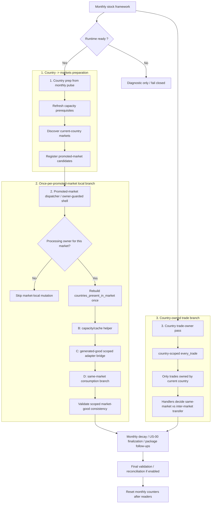

# AGENTS.md — ModeU5 Country Stocks Within Markets

## Project mission

ModeU5 adds a double-accounting layer for goods inside EU5 markets.

The mod does **not** replace the vanilla economy or vanilla markets. It adds a stock, control, debug, and consistency layer so that goods only generate effective ModeU5 economic value when they enter a stock that can actually be consumed, transferred, or lost.

The two stock levels are:

```txt
country_market_good_stock
market_good_stock
```

The central invariant is:

```txt
market_good_stock = sum(country_market_good_stock)
```

The country-level stock is the source of truth. The market-level stock is an aggregate/cache.

If the two diverge, rebuild `market_good_stock` from country stocks. Never rebuild country stocks from market stock.

## Module/package contract

ModeU5 is a suite:

```txt
No Void Economy
  required; cannot be disabled while ModeU5 is active

Rebalance Economy
  optional; US-04, US-05, US-08, US-09 and their UI stories

Rebalance Estate Power
  optional; US-07 and US-07-UI

Rebalance Early Blobbing
  optional; US-13
```

All other CORE and US stories belong to the required Core package.

Companion-package presence is the source of truth for optional static overrides. Do not claim that a runtime game rule disables US-07 or US-08 while their static files remain loaded.

Package selection occurs before campaign load. Adding or removing a package mid-campaign is unsupported without an explicit migration. Follow `docs/technical/MODULE_OPTION_MODEL.md`.

The default supported playset enables Core, Rebalance Economy, Rebalance Estate Power, and Rebalance Early Blobbing together. Optional means removable before campaign start, not disabled by default. Core must never synthesize a companion package marker when that package is absent.

ModeU5 configuration is pre-campaign. Optional packages are selected in the launcher/mod playset. Script-safe settings such as `cbp_debug_level`, audit mode, and save mode use the Community Mod Manager and are fixed when the campaign starts. Do not create an in-game configuration panel or custom ModeU5 game rules.

## Variable-map storage rule

Follow:

```txt
docs/technical/VARIABLE_MAP_STORAGE_MODEL.md
```

Use persistent variable maps for durable multidimensional state and counters. Use local variables and saved scopes for one operation's temporary values.

Canonical logical storage:

```txt
country × market × good:
  one country_market_good_record with named fields
  owner = country
  tuple = market × good

market × good aggregate:
  one market_good_record/cache
  logical owner = market
  confirmed physical owner = global variable system
  tuple = good

location × good:
  one location_good_record with named fields
  owner = location
  tuple = good
```

EU5 variable maps are documented as one `key -> value` association, not as inline structs or nested maps. Until TECH-01 `088` confirms a unique persistent record scope or nested-map value, represent each logical record with a synchronized map family:

```txt
same owner
same tuple key
one static physical map per persistent field
centralized helpers enforcing record-level consistency
```

Map names are static identifiers. Do not assume runtime map-name construction. Existing keys must be removed before their replacement is re-added. Missing numeric entries require an explicit safe default.

Controlled CORE-01 testing confirmed that Market scope does not support
variables in the tested build. Store the logical `market × good` cache in a
global per-good map keyed by market scope. Generated per-good adapters must
contain complete literal map identifiers; scripted-effect parameters may select
an adapter but must never carry a map name.

US-02 storage capacity is the explicit exception to per-good record storage:
capacity is identical for every good in one country-market relation, so persist
it once in country-scoped `cbp_stock_cap_by_market` and related breakdown
maps keyed by market. Generated per-good adapters read that shared capacity and
must not recreate `cbp_<good>_stock_cap_by_market`.

US-02 capacity is derived from one country-level location pool plus the current
market's own trade capacity. Sum the country's owned-location rank contribution
once, divide that location pool by the number of markets where the country is
present, then add the target market's merchant-capacity contribution. The
persisted country-market capacity record is:

```txt
country_market_capacity
= target_market_trade_capacity
  + country_location_pool / count(markets present in country)
```

The monthly capacity refresh must not scan owned locations once per market or
once per good. The country location pool is rebuilt at campaign
initialization, after permanent location owner changes, after location-rank
changes, and after capital moves. Ordinary monthly refreshes read the cached
country location pool and rewrite market shares with current market trade
capacity.

## Non-negotiable stock rule

No user story may directly mutate stock variables.

All stock mutations must go through centralized scripted effects:

```txt
cbp_add_stock
cbp_remove_stock
cbp_transfer_stock
cbp_decay_stock
cbp_rebuild_market_stock_from_country_stocks
cbp_validate_stock_consistency
```

If an implementation writes directly to `country_market_good_stock` or `market_good_stock` outside these effects, stop and refactor.

## Runtime order is normative

The implementation roadmap is only a safe delivery order. The runtime order is the economic contract.

A monthly economic cycle must follow this logical sequence:

```txt
1. Recalculate stock capacities for every affected country/market before any stock admission, demand resolution, transfer, decay, or void-economy calculation.
2. Apply previous-month production penalties.
3. If the Rebalance Economy package is loaded, apply its global ModeU5 modifiers, including the +5% Production Efficiency compensation.
4. Read or estimate vanilla production.
5. Calculate ModeU5-recognized production.
6. Add stockable production through cbp_add_stock.
7. Update market stock through the centralized operation.
8. Update US-00.1 production / added / rejected ledger.
9. Resolve Pop and Estate consumption through US-10.1.
10. Track satisfied and unsatisfied quantities through US-10.3.
11. Resolve inter-market transfers through US-10.2 when applicable.
12. Apply monthly decay through cbp_decay_stock.
13. Calculate US-00.2 overproduction ratios.
14. Calculate US-00.4 void wealth.
15. Calculate US-00.3 next-month production penalties.
16. If the Rebalance Economy package is loaded, calculate the US-05 Economic Base.
17. If the Rebalance Economy package is loaded, display the US-05 formula inputs and result when exposure permits.
18. Validate stock consistency through cbp_validate_stock_consistency.
19. Reset monthly counters only after every consumer has read them.
```

Capacity recalculation is the first monthly data refresh because production,
capacity enforcement, demand resolution, lifecycle follow-ups, and diagnostics
all depend on the latest storage-capacity snapshot. It is a capacity-map update,
not a stock mutation, and must not itself add, remove, reject, decay, transfer,
or rebuild stock.

A yearly economic cycle must validate/rebuild stock aggregates, read annual satisfaction counters, apply US-04 demand adaptation only when the Rebalance Economy package is loaded, reset annual counters, and run diagnostics if enabled.

The monthly and yearly stock cycles must not mutate ModeU5 stock until CORE-02 has set the current schema version and marked initialization complete. A missing, failed, older unsupported, or newer incompatible initialization state fails closed and remains diagnostic-only.
## Target monthly orchestration architecture

The target monthly stock orchestration is ownership-driven. New monthly stock work should converge toward three execution surfaces, not one monolithic pulse:

```txt
1. on_monthly_pulse(country) — country -> markets preparation
   - refresh country-owned prerequisites and work caches
   - discover/register promoted-market candidates
   - do not execute the full market-local branch for every country present

2. promoted-market dispatcher / owner-guarded shell — market-local branch
   - process each promoted market once per month
   - rebuild countries_present_in_market once for that market
   - run local US-00, same-market US-10, and scoped validation from that once-per-market owner surface

3. on_monthly_pulse(country) — country trade-owner pass
   - run country-scoped every_trade only from country scope
   - process trades owned by the current country once
   - delegate stock effects to the existing stock handlers
```



### Architecture contract

- `country_market_good_stock` remains the source of truth.
- `market_good_stock` remains a derived aggregate/cache.
- `countries_present_in_market` is a rebuilt work cache, not durable stock truth.
- Candidate discovery may happen from country pulse, but market-local stock mutation must be once per promoted market.
- If the promoted-market shell is launched from country pulse, a deterministic processing-owner guard or equivalent test-only restriction must prevent every country present from mutating the same market-local branch.
- Same-market consumption and inter-market trade are separate ownership phases.
- Same-market consumption must not create trade income, transport cost, trade capacity usage, or trade profit.
- Inter-market transfer must go through `cbp_resolve_inter_market_stock_transfer` and `cbp_transfer_stock`.
- `every_trade` is confirmed only as a country-scope iterator; do not call it from market scope or treat it as the promoted-market iterator.
- The country trade-owner pass should consider trades owned by the current country once and delegate stock consequences to handlers.
- The new promoted-market dispatcher must remain test-only or feature-gated until comparative Normal / Performance / Audit / Debug probes pass.

### US-17 import/selling efficiency contract

US-17 must use the native country modifier stack so Vanilla route selection,
AI, UI, and treasury accounting all observe the same trade-profit formula. Do
not apply a parallel per-route `add_gold` correction.

Let the non-CBP baselines be `I = import_efficiency`,
`S = selling_efficiency`, `M = merchant_maintenance_efficiency`, and
`D = define:NCountry|MERCHANT_MAINTENANCE_COST`. Compute:

```txt
C = min(I + S, 1)
selling correction = -S
import correction = -I
maintenance correction = C - M
```

This produces effective selling and import efficiencies of zero and an
effective merchant-maintenance efficiency of `C`, hence a maintenance factor of
`1 - C`. The native baseline `M` is replaced, not compounded with `C`. Do not
divide the sum and do not apply a lower clamp. Negative `C` therefore remains
meaningful and increases maintenance. Repeated refreshes must first remove the
previous CBP corrections from effective values so monthly and on-action
execution cannot drift. Historical route-money fixtures may retain old variable
names, but they must not define or execute the live business rule.

The literal `1` is the dimensionless 100% maintenance factor, not `D`. Let `B`
be the native pre-efficiency merchant-maintenance amount, including `D`. Vanilla
charges `B * (1 - M)`; CBP targets `B * (1 - C)`. Solving through the native
modifier therefore requires `maintenance correction = C - M`. Never substitute
the ducat-denominated define for the unitless `1` or for that correction.

### Native modifier before reconciliation

When Vanilla exposes the relevant economic behavior through a native modifier,
prefer cancelling or transforming that modifier in the native stack. This lets
Vanilla AI, UI, route selection, ledgers, and treasury accounting consume the
same result.

Do not leave the native modifier active and compensate later with `add_gold`,
stock mutation, or a parallel accounting ledger. Post-processing reconciliation
is a last resort for a confirmed missing native endpoint and must document the
missing exposure, ownership boundary, idempotence rule, and diagnostic probe.

### Shared on-action registration contract

CBP owns one custom top-level registration for `on_policy_changed` and one for
`on_reform_change` across Core and companion-package source files. Both hooks
currently dispatch through `cbp_country_governance_changed` because they share
the same country-scope follow-up contract.

Do not add a feature-specific duplicate declaration or duplicate callback for
either hook. Add a guarded operation to the shared dispatcher instead. If an
optional package needs a follow-up, keep the dispatch target available from
Core and gate its behavior on the package-presence marker so an absent package
cannot leave an unresolved effect call.

Generated or copied Vanilla `_hardcoded.txt` sources are not CBP registrations
and are excluded from this uniqueness rule.

### Anti-spaghetti rule

Do not add new monthly broad scans as a shortcut.

Before adding a monthly loop, identify which target layer owns it:

```txt
A. readiness / fail-closed guard
B. country -> markets preparation
C. promoted-market candidate registration
D. once-per-promoted-market local branch
E. same-market consumption
F. country trade-owner pass
G. validation / reconciliation
H. debug / audit capture
I. monthly reset after all readers
```

If the new code does not clearly belong to one of these layers, stop and update the architecture documentation before implementing it.
## Stock succession rule

After initialization, permanent location ownership changes conserve stock and reassign the capacity-proportional share:

```txt
old_owner / old_market stock decreases
new_owner / new_market stock increases
market aggregate is rebuilt/validated from country stocks
```

Topology changes must never invent stock. Stock is transferred through an allowed successor, decayed through a documented loss rule, or left under its previous owner/market until a confirmed migration hook exists.
