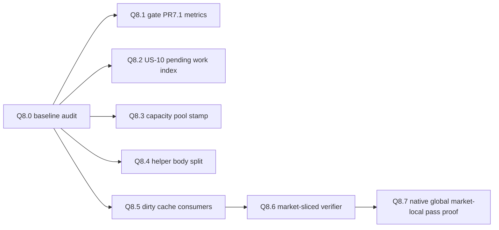
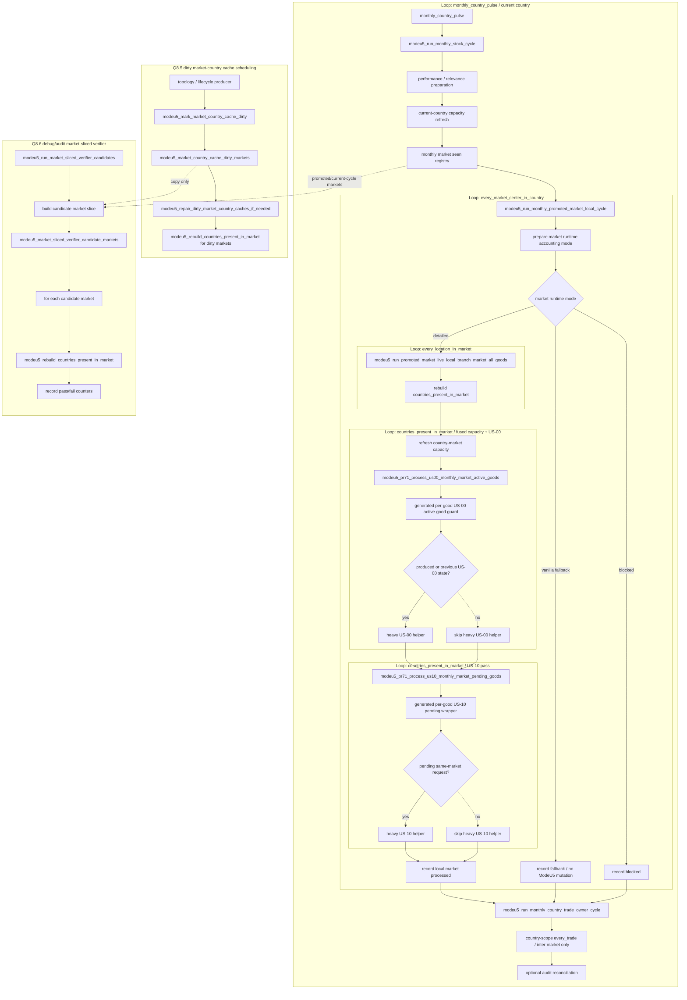

# Contributing to ModeU5

This guide is for local development and PR validation on the Q8 master branch and stacked PRs.

It explains:

```txt
- how to install the local environment file;
- how ModeU5 debug options relate to EU5 engine debug mode;
- how to generate, validate, install, and check the local packages;
- how to work when the development repository is not the same directory as the installed game mod;
- how Q8 and Q5 currently structure the refactor flow.
```

## Branch and PR model

Q8 is a stacked refactor and optimisation programme.

Use `master/q8-audit-and-implementation-plan` as the base branch for small Q8 PRs unless a PR explicitly says it must stack on another Q8 implementation branch.

Keep PRs narrow:

```txt
one problem
one branch
one validation comment
no unrelated generated-file churn
```

Do not use Q8 PRs to rewrite unrelated user stories, rebalance data, or change vanilla files directly.

## First-time local setup

Clone the repository wherever you want to develop. The repository does not need to live inside the EU5 mod directory.

```bash
git clone https://github.com/eu5mod/eu5-no-void-economy.git
cd eu5-no-void-economy
```

Create your local environment file:

```bash
cp .modeu5.local.env.template .modeu5.local.env
```

Edit `.modeu5.local.env` for your machine.

Minimal example:

```bash
# Path to the vanilla EU5 game common directory.
EU5_GAME_COMMON_DIR="/path/to/Europa Universalis V/game/in_game/common"

# Keep false for normal performance comparisons.
MODEU5_ENABLE_DEBUG_RUNTIME=false

# Optional local mod install target. If omitted, tools use the default Paradox user mod directory.
MODEU5_MOD_DIR="$HOME/Documents/Paradox Interactive/Europa Universalis V/mod"
```

Never commit `.modeu5.local.env`. It can contain local install paths and developer-only runtime preferences.

## Environment file options

### `EU5_GAME_COMMON_DIR`

Points to the vanilla EU5 `game/in_game/common` directory.

Use it when generators need to read vanilla static files, for example goods, prices, or building definitions.

Example:

```bash
EU5_GAME_COMMON_DIR="/Users/<you>/Library/Application Support/Steam/steamapps/common/Europa Universalis V/game/in_game/common"
```

If this path is missing, generators that need vanilla source data should either use safe defaults or skip the optional output. Do not hard-code personal paths in scripts or generated files.

### `MODEU5_MOD_DIR`

Optional install target for the local ModeU5 package set.

Use it when the development repository is outside the EU5 user mod directory.

Example:

```bash
MODEU5_MOD_DIR="$HOME/Documents/Paradox Interactive/Europa Universalis V/mod"
```

You can also pass the target directly to the installer:

```bash
./tools/install_local_packages.sh --target "$HOME/Documents/Paradox Interactive/Europa Universalis V/mod"
```

### `MODEU5_ENABLE_DEBUG_RUNTIME`

Controls ModeU5 runtime debug behaviour independently from the EU5 engine `--debug_mode` launch argument.

```txt
false = generated local runtime config enters ModeU5 normal runtime
true  = generated local runtime config enters ModeU5 debug runtime
```

Recommended defaults:

```txt
normal play / performance comparison: false
focused debug capture:               true
deterministic test event:             false is acceptable; test events enter their own test/audit mode when needed
```

Use EU5 `--debug_mode` for engine console and tooling access. Do not assume EU5 `--debug_mode` enables ModeU5 debug runtime; ModeU5 debug runtime is controlled by `.modeu5.local.env` and generated local config.

### US-09 static override options

The environment template may expose US-09 options such as:

```bash
MODEU5_ENABLE_US09_STATIC_OVERRIDES=true
MODEU5_US09_BONUS_PERCENT=10
```

For Q8 performance and runtime-flow validation, keep US-09 static overrides out of the test unless the PR explicitly targets US-09.

Reason:

```txt
US-09 static override generation touches duplicate static-definition loading.
That topic is separate from Q8 and must stay isolated until the override design is confirmed or redesigned.
```

If a branch supports disabling static override generation, prefer:

```bash
MODEU5_ENABLE_US09_STATIC_OVERRIDES=false
```

Do not edit installed vanilla files in place. Do not manually edit generated `zzzz_modeu5_us09_*.txt` files.

## Generation commands

Regenerate every local generated artifact:

```bash
./tools/generate_all.sh
```

This currently regenerates:

```txt
- local runtime config;
- per-good stock adapters;
- PR7.1 active-good dispatch helpers;
- transport-cost helpers;
- US-10 UI helpers;
- optional US-09 static override outputs when enabled and source paths exist.
```

Regenerate only local runtime config:

```bash
bash ./tools/generate_local_runtime_config.sh
```

Regenerate only stock-good helpers:

```bash
./tools/generate_stock_good_helpers.sh
```

Regenerate only transport-cost helpers:

```bash
./tools/generate_good_transport_helpers.sh
```

Regenerate only US-10 UI helpers:

```bash
./tools/generate_us10_ui_helpers.sh
```

Generated files are ignored by Git. Do not manually edit generated `modeu5_*_generated.txt`, `modeu5_*_generated.gui`, or generated localization files.

## Validation commands

Run these before opening or updating a PR when your change touches scripts, generated surfaces, packages, tests, or Q8 runtime flow:

```bash
./tools/generate_all.sh
./tools/validate_generators.sh
./tools/validate_module_packages.sh
./tools/audit_modeu5_persistent_state.sh
git diff --check
```

Useful focused audits:

```bash
./tools/audit_modeu5_per_good_loops.sh
./tools/validate_modeu5_script_safety.sh
./tools/normalize_cmm_value_links.sh --check
```

If a validator fails, fix the cause. Do not weaken the validator to make the PR pass unless the PR is explicitly about changing the validation contract.

## Installing local packages

The installer publishes the repository package roots as sibling local mods.

Default target:

```txt
$HOME/Documents/Paradox Interactive/Europa Universalis V/mod
```

Install to the default target:

```bash
./tools/install_local_packages.sh
```

Install to an explicit target:

```bash
./tools/install_local_packages.sh --target "$HOME/Documents/Paradox Interactive/Europa Universalis V/mod"
```

Check the installed packages:

```bash
./tools/install_local_packages.sh --check
```

The installer runs generation before installing. It also writes `MODEU5_SOURCE.txt` into each installed package. Before trusting runtime logs, inspect this file to confirm EU5 loaded the expected branch and commit.

The installed package set is:

```txt
modeu5_core
modeu5_economy_rebalance
modeu5_trade_rebalance
modeu5_war_rebalance
modeu5_core_tests
```

Enable the four campaign packages for normal testing:

```txt
modeu5_core
modeu5_economy_rebalance
modeu5_trade_rebalance
modeu5_war_rebalance
```

Enable `modeu5_core_tests` only for deterministic validation sessions.

## Recommended local development loop

```bash
./tools/generate_all.sh
./tools/validate_generators.sh
./tools/validate_module_packages.sh
./tools/audit_modeu5_persistent_state.sh
git diff --check
./tools/install_local_packages.sh
./tools/install_local_packages.sh --check
./tools/clear_eu5_logs.sh
```

Then launch EU5, run the relevant console event, and summarize logs.

## Logs and runtime evidence

The default EU5 log directory is:

```txt
$HOME/Documents/Paradox Interactive/Europa Universalis V/logs
```

Override it with:

```bash
MODEU5_LOG_DIR="/path/to/logs"
```

Clear logs before a focused validation run:

```bash
./tools/clear_eu5_logs.sh
```

Use dry-run first when needed:

```bash
./tools/clear_eu5_logs.sh --dry-run
```

Summarize ModeU5 test logs:

```bash
./tools/summarize_modeu5_test_logs.sh
```

Focus on a fresh time window:

```bash
./tools/summarize_modeu5_test_logs.sh --since 16:15:00
```

For PR126-only dispatcher checks:

```bash
./tools/summarize_modeu5_test_logs.sh --expected pr126
```

For a focused probe whose scenario set is not part of the full revalidation list:

```bash
./tools/summarize_modeu5_test_logs.sh --expected none
```

PR validation comments should include the exact commit SHA, the commands run, the console events run, and the relevant PASS/FAIL log markers.

## Debug options

### EU5 engine debug mode

Use EU5 `--debug_mode` when you need console access, script logs, or engine tooling.

This is not the same as ModeU5 debug runtime.

### ModeU5 local debug runtime

Controlled by `.modeu5.local.env`:

```bash
MODEU5_ENABLE_DEBUG_RUNTIME=false
MODEU5_ENABLE_DEBUG_RUNTIME=true
```

The generated local config applies one of:

```txt
modeu5_enter_normal_runtime_mode = yes
modeu5_enter_debug_runtime_mode = yes
```

### CMM debug level

The pre-campaign Community Mod Manager debug level controls diagnostic verbosity:

```txt
Off     = 0
Basic   = 1
Verbose = 2
```

Use CMM debug levels for campaign-facing diagnostics. Use deterministic test events for validation fixtures.

### Runtime mode flags

ModeU5 uses explicit runtime flags:

```txt
modeu5_runtime_mode_normal
modeu5_runtime_mode_debug
modeu5_runtime_mode_audit
```

Contract:

```txt
normal = no persistent debug captures during ordinary gameplay
debug  = targeted debug captures are allowed
audit  = automatic reconciliation / validation cadence is allowed
test   = deterministic test fixtures may enable debug and audit for the fixture only
```

`audit` does not mean `debug`. Keep these paths separate.

## Common console events

Full deterministic revalidation:

```txt
event modeu5_revalidate_debug.1
```

Choose:

```txt
Revalidate main operations
```

Q8 remaining-candidate probes:

```txt
event modeu5_q8_probe_debug.1
```

Q8.7 native market-local pass proof, when present on the branch:

```txt
event modeu5_q8_probe_debug.1
-> q87 option
```

Expected focused marker:

```txt
ModeU5 TEST PASS scenario=q87_global_market_local_pass
```

## Q8 stack map



Q8 rule:

```txt
Add probes before live behaviour changes.
Convert only proven probes into runtime changes.
Keep every Q8 implementation PR small, reversible, and independently validated.
```

## Q5 current flow map

This is the current Q8/Q5 live-flow contract after Q8.6.



## Q8 non-negotiable guardrails

```txt
1. No stock mutation outside central stock operators.
2. No market-scope variable dependency unless TECH-01 confirms it.
3. No runtime-built map names or helper names.
4. No broad monthly world scan unless an audit/probe proves it replaces more work than it adds.
5. No verifier may mutate stock.
6. Preserve the two-pass invariant: all US-00 admission facts before US-10 same-market consumption.
7. Performance Mode should verify candidate/promoted/relevant markets, not the whole world, unless explicitly debug-only.
8. Every new cache must define owner, rebuild/write trigger, reset policy, and persistent-state audit classification.
```

## PR checklist

Before requesting review:

```txt
- The branch is based on the correct stacked PR or #147 branch.
- Generated files were regenerated locally but not committed unless intentionally tracked.
- Local env paths were not committed.
- Static validators pass.
- Runtime evidence is attached as a PR comment when runtime behaviour is affected.
- Q8 Q-docs are updated when file ownership, cache ownership, loop shape, or global flow changes.
- The PR body states explicit non-goals.
```
