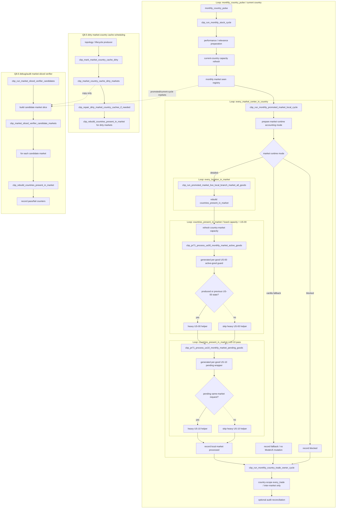

# Development Summary

## Table of Contents

- [Installation](#installation)
  - [`EU5_GAME_COMMON_DIR`](#eu5_game_common_dir)
  - [`MODEU5_MOD_DIR`](#cbp_mod_dir)
  - [`MODEU5_ENABLE_DEBUG_RUNTIME`](#cbp_enable_debug_runtime)
  - [US-09 Static Override Options](#us-09-static-override-options)
- [Deployments](#deployments)
- [Pre-test Command](#pre-test-command)
- [Testing Tools](#testing-tools)
  - [Summarize Tests](#summarize-tests)
  - [Focus on a Fresh Time Window](#focus-on-a-fresh-time-window)
  - [Focused Probe](#focused-probe)
- [Testing Events](#testing-events)
  - [Full Deterministic Revalidation](#full-deterministic-revalidation)
- [Current Flow Map](#current-flow-map)

---

## Installation

Clone the repository wherever you want to develop. The repository does not need to live inside the EU5 mod directory.

```bash
git clone https://github.com/eu5mod/eu5-no-void-economy.git
cd eu5-no-void-economy
```

Create your local environment file:

```bash
cp .cbp.local.env.template .cbp.local.env
```

Edit `.cbp.local.env` for your machine.

Minimal example:

```bash
# Path to the vanilla EU5 game common directory.
EU5_GAME_COMMON_DIR="/path/to/Europa Universalis V/game/in_game/common"

# Keep false for normal performance comparisons.
MODEU5_ENABLE_DEBUG_RUNTIME=false

# Optional local mod install target. If omitted, tools use the default Paradox user mod directory.
MODEU5_MOD_DIR="$HOME/Documents/Paradox Interactive/Europa Universalis V/mod"
```

Never commit `.cbp.local.env`. It can contain local install paths and developer-only runtime preferences.


### `EU5_GAME_COMMON_DIR`

Points to the vanilla EU5 `game/in_game/common` directory.

Use it when generators need to read vanilla static files, for example goods, prices, or building definitions.

Example:

```bash
EU5_GAME_COMMON_DIR="/Users/<you>/Library/Application Support/Steam/steamapps/common/Europa Universalis V/game/in_game/common"
```

If this path is missing, generators that need vanilla source data should either use safe defaults or skip the optional output. Do not hard-code personal paths in scripts or generated files.

### `MODEU5_MOD_DIR`

Optional install target for the local ModeU5 package set. Use it when the development repository is outside the EU5 user mod directory.

Example:
```bash
MODEU5_MOD_DIR="$HOME/Documents/Paradox Interactive/Europa Universalis V/mod"
```

### `MODEU5_ENABLE_DEBUG_RUNTIME`

Allow you to generate a **verbodse audit trail** during your game. It overrite the CMM logging option. **⚠️ increase your monthly thick by 5 seconds**.

### US-09 static override options

Overide default production methods. You should not have to touch it.

## Deployments

Regenerate every local generated artifact:

```bash
./tools/generate_all.sh
```

## Pre-test command (recommanded)
```
./tools/generate_all.sh
./tools/validate_generators.sh
./tools/validate_module_packages.sh
./tools/audit_cbp_persistent_state.sh
git diff --check
./tools/install_local_packages.sh
./tools/install_local_packages.sh --check
./tools/clear_eu5_logs.sh
```

## Testing tools 

### Summarize tests

```bash
./tools/summarize_test_cbp_logs.sh
```

### Focus on a fresh time window:

```bash
./tools/summarize_test_cbp_logs.sh --since 16:15:00
```

### For a focused probe

```bash
./tools/summarize_test_cbp_logs.sh --expected none
```

⚠️ PR validation comments should include the exact commit SHA, the commands run, the console events run, and the relevant PASS/FAIL log markers.

## Testing events

### Full deterministic revalidation:

```txt
event cbp_revalidate_debug.1
```

## Current flow map



