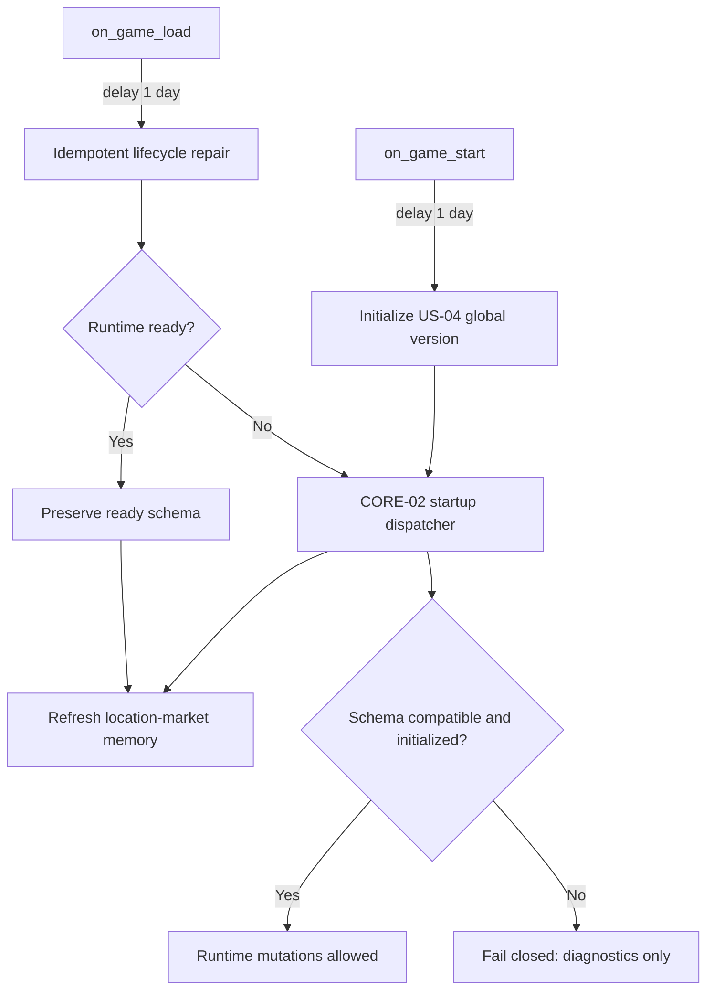
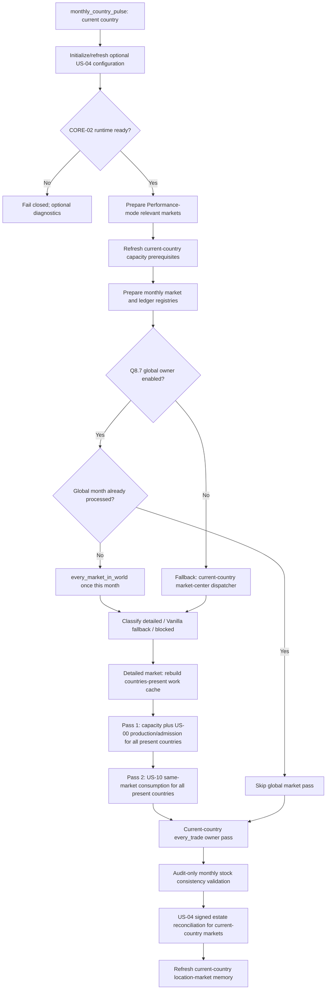
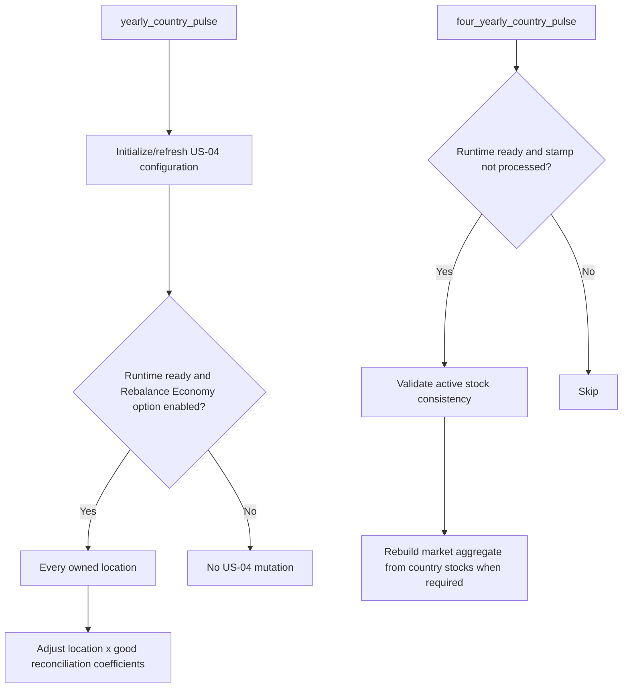

# ModeU5 Runtime Flow

## Status and precedence

This document is the **only normative global diagram** of the current ModeU5
runtime orchestration. It describes the code that is loaded today, including
the Q8.7 owner switch and its fallback.

Use the following precedence when documents disagree:

1. `AGENTS.md` defines non-negotiable economic, storage, and package contracts.
2. This document defines current global orchestration and phase ownership.
3. `docs/technical/` defines detailed storage and engine-exposure contracts.
4. Feature specifications define their business rules within this flow.
5. `docs/audits/` preserves evidence and historical decisions; it is not a
   global runtime authority.

## Startup and load repair

The durable schema and initialization markers are the authority. Monthly and
yearly stock mutations remain blocked until `cbp_stock_runtime_ready_trigger`
passes. Load repair may fill missing startup markers, but must not overwrite an
incompatible or failed schema.

## Monthly country pulse

The engine invokes `monthly_country_pulse` once per country. The first country
reaching the Q8.7 dispatcher in a month owns the global market pass; a global
month stamp makes later country invocations skip that pass. Each country still
owns its capacity preparation, `every_trade` pass, and US-04 reconciliation.

### Monthly ownership contract

| Surface | Owner | Notes |
|---|---|---|
| Capacity prerequisites | Current country | Refreshed before admission or demand work. |
| Market-local US-00 and US-10 | Q8.7 once-per-month global market owner | Fallback uses the guarded market-center path. |
| `countries_present_in_market` | Current detailed market | Rebuilt work cache, never durable stock truth. |
| Inter-market trade | Current country through `every_trade` | Never moved into market scope. |
| US-04 monthly reconciliation | Current country after the main cycle | Optional Rebalance Economy package behavior. |
| Consistency reconciliation | Audit mode or four-year pulse | Country stock remains source of truth. |

Within each detailed market, all US-00 production/admission facts are completed
for all present countries before US-10 starts consuming stock. Stock mutations
must use the centralized stock operators.

## Yearly and periodic pulses

Annual US-04 adaptation owns coefficient evolution. Monthly US-04 owns the
signed stock/supply reconciliation and estate charge/refund. The four-year
cycle is a safety validation surface, not a replacement for centralized stock
mutation.

## Source map

| Responsibility | Runtime source |
|---|---|
| Engine hooks and pulse order | `in_game/common/on_action/cbp_stock_on_actions.txt` |
| Q8.7 global owner and fallback switch | `in_game/common/scripted_effects/cbp_q8_7_global_owner_effects.txt` |
| Market-local US-00 then US-10 passes | `in_game/common/scripted_effects/cbp_promoted_market_cycle_effects.txt` |
| Country-owned trade pass | `in_game/common/scripted_effects/cbp_country_trade_owner_effects.txt` |
| Lifecycle readiness and reconciliation | `in_game/common/scripted_effects/cbp_stock_effects.txt` |
| US-04 monthly/yearly entry points | `in_game/common/scripted_effects/cbp_us04_pop_demand_effects.txt` |

## Change rule

Any PR that changes a pulse, phase owner, runtime gate, or relative economic
order must update this document in the same change. Audit diagrams may explain
the proof or history, but must link here rather than declare themselves the
global current source of truth.
