# Q5 - Current End-to-End Runtime Flow

## Status and precedence

This document is the **only normative global diagram** of the current ModeU5
runtime orchestration. It describes loaded code, not a target architecture or
historical PR checkpoint. Technical names are kept deliberately so a reader can
move directly from a diagram node to `rg` and the owning scripted effect.

Use this precedence when documents disagree:

1. `AGENTS.md` defines non-negotiable economic, storage, and package contracts.
2. This document defines current global orchestration and phase ownership.
3. `docs/technical/` defines durable storage and engine-exposure contracts.
4. Feature specifications define business rules within this flow.
5. `docs/audits/` preserves historical evidence and feature projections.

## Global invariants

```txt
country_market_good_stock = source of truth
market_good_stock         = aggregate/cache

market_good_stock = sum(country_market_good_stock)
```

All stock mutations use `cbp_add_stock`, `cbp_remove_stock`,
`cbp_transfer_stock`, or `cbp_decay_stock`. A consistency repair rebuilds the
market aggregate from country records, never the reverse. Monthly and yearly
mutations fail closed until `cbp_stock_runtime_ready_trigger` confirms CORE-02.

## End-to-end flow

```mermaid
flowchart TB
    subgraph LIFECYCLE["Campaign start and save load"]
        direction TB
        GS["on_game_start"] -->|delay 1 day| GSP["cbp_start_game_stock_initialization_pulse"]
        GSP --> US04INIT["cbp_initialize_pop_demand_multipliers_once"]
        US04INIT --> CORE02["cbp_start_game_stock_initialization_dispatcher"]
        CORE02 --> SCHEMA{"schema compatible and initialization complete?"}
        SCHEMA -->|yes| OPEN["cbp_stock_runtime_ready_trigger = yes"]
        SCHEMA -->|no| CLOSED["fail closed / diagnostics only"]
        GSP --> MEM0["cbp_core04_refresh_all_location_market_memory"]

        GL["on_game_load"] -->|delay 1 day| GLP["cbp_load_game_stock_initialization_pulse"]
        GLP --> REPAIR["cbp_repair_stock_lifecycle_on_game_load"]
        REPAIR --> RREADY{"runtime already ready?"}
        RREADY -->|yes| KEEP["preserve current schema and state"]
        RREADY -->|no| CORE02
        KEEP --> MEM0
    end

    subgraph MONTHLY["Monthly country pulse"]
        direction TB
        M0["monthly_country_pulse"] --> MP["cbp_monthly_stock_cycle_pulse"]
        MP --> MCFG["initialize US-04 country state + refresh CMM marker"]
        MCFG --> SWITCH["cbp_run_monthly_stock_cycle_q8_7_owner_switch"]
        SWITCH --> READY{"cbp_stock_runtime_ready_trigger?"}
        READY -->|no| MCLOSED["fail closed / optional debug gate marker"]
        READY -->|yes| PREP["prepare relevance + current-country capacity + monthly registries"]
        PREP --> OWNER{"cbp_q8_7_live_global_market_owner_enabled_trigger?"}
        OWNER -->|no: rollback path| LEGACY["cbp_run_monthly_promoted_market_local_cycle<br/>every_market_center_in_country"]
        OWNER -->|yes| ONCE["cbp_run_monthly_q8_7_global_market_local_cycle_once"]
        ONCE --> STAMP{"global month stamp already processed?"}
        STAMP -->|yes| SKIP["skip global market-local pass for this country pulse"]
        STAMP -->|no| WORLD["every_market_in_world"]

        subgraph MARKET["Once-per-market local accounting"]
            direction TB
            WORLD --> MARKETOWNER["cbp_q8_7_run_global_market_local_owner_market"]
            LEGACY --> MODE["cbp_prepare_market_runtime_accounting_mode"]
            MARKETOWNER --> MODE
            MODE --> KIND{"detailed / Vanilla fallback / blocked?"}
            KIND -->|fallback| FALLBACK["note US-00 and US-10 Vanilla fallback<br/>no ModeU5 market mutation"]
            KIND -->|blocked| BLOCKED["note runtime blocked<br/>no ModeU5 market mutation"]
            KIND -->|detailed| LOCAL["cbp_run_promoted_market_live_local_branch_market_all_goods"]
            LOCAL --> ACTIVE["cbp_pr71_prepare_active_good_metrics"]
            ACTIVE --> CACHE["cbp_prepare_promoted_market_country_cache<br/>rebuild cbp_countries_present_in_market"]
            CACHE --> PASS1["every_in_global_list: present countries - pass 1"]
            PASS1 --> CAP["cbp_prepare_promoted_country_market_capacity"]
            CAP --> US00["cbp_pr71_process_us00_monthly_market_active_goods"]
            US00 --> ADMIT["read production -> cbp_add_stock -> record added/rejected facts"]
            ADMIT --> FREEZE["all present-country US-00 facts complete before consumption"]
            FREEZE --> PASS2["every_in_global_list: present countries - pass 2"]
            PASS2 --> US10["cbp_pr71_process_us10_monthly_market_pending_goods"]
            US10 --> CONSUME["US-10 same-market demand -> cbp_remove_stock"]
            CONSUME --> OUTCOME["record requested / satisfied / unsatisfied outcomes"]
            OUTCOME --> MDONE["finish detailed market"]
            FALLBACK --> MDONE
            BLOCKED --> MDONE
        end

        MDONE --> WORLDEND["global/fallback market iterator exhausted"]
        SKIP --> TRADE0["cbp_run_monthly_country_trade_owner_cycle"]
        WORLDEND --> TRADE0

        subgraph TRADE["Current-country trade-owner pass"]
            direction TB
            TRADE0 --> US17REFRESH["refresh US-17 native country modifiers once"]
            US17REFRESH --> TLOOP["every_trade - confirmed country-scope iterator"]
            TLOOP --> TSCOPE["save trade, owner, source market, target market, traded good"]
            TSCOPE --> TQTY["cbp_capture_country_trade_owner_trade_quantity"]
            TQTY --> TGATE{"cbp_trade_rework_enabled_trigger?"}
            TGATE -->|no| TMETRIC["record normal trade-owner metrics"]
            TGATE -->|yes| US20["US-20 route-loss / received-goods reconciliation"]
            US20 --> TMETRIC
        end

        TMETRIC --> US04M0["cbp_run_monthly_us04_reconciliation_for_current_country"]

        subgraph US04MONTH["Monthly US-04 signed Estate reconciliation"]
            direction TB
            US04M0 --> US04MGATE{"runtime ready + offer/demand option enabled?"}
            US04MGATE -->|no| US04MSKIP["skip US-04 mutation"]
            US04MGATE -->|yes| US04MARKETS["cbp_run_monthly_us04_estate_accounting_for_current_country<br/>every_market_present_in_country"]
            US04MARKETS --> US04GOODS["cbp_monthly_assess_country_market_estate_consumption_all_goods"]
            US04GOODS --> PROXY["per good: location coefficient x proxy Estate size"]
            PROXY --> DELTA["signed delta = coefficient - 1"]
            DELTA --> SIGN{"delta sign?"}
            SIGN -->|positive| REMOVE["cbp_remove_stock(actual satisfiable delta)<br/>country + market aggregate + negative goods supply"]
            REMOVE --> CHARGE["market price x actual removed<br/>add_gold_to_estate negative by Estate share"]
            SIGN -->|negative| RESTORE["cbp_add_stock(restored delta)<br/>country + market aggregate + positive goods supply"]
            RESTORE --> REFUND["market price x actual restored<br/>add_gold_to_estate positive by Estate share"]
            SIGN -->|zero/missing proxy| NOOP["no mutation / diagnostic record"]
            CHARGE --> US04STORE["store monthly reconciliation record"]
            REFUND --> US04STORE
            NOOP --> US04STORE
        end

        US04STORE --> AUDIT{"cbp_audit_enabled_trigger?"}
        US04MSKIP --> AUDIT
        AUDIT -->|yes| STOCKREC["cbp_run_monthly_stock_reconciliation_once"]
        AUDIT -->|no| MAINEND["main monthly stock cycle complete"]
        STOCKREC --> MAINEND
        MAINEND --> MEMORY["cbp_core04_refresh_current_country_location_market_memory"]
        MEMORY --> MEND["end monthly_country_pulse"]
    end

    subgraph YEARLY["Yearly US-04 adaptation"]
        direction TB
        Y0["yearly_country_pulse"] --> YP["cbp_yearly_pop_demand_adaptation_pulse"]
        YP --> YINIT["initialize country state + refresh CMM marker"]
        YINIT --> YRUN["cbp_run_yearly_pop_demand_adaptation_for_current_country"]
        YRUN --> YGATE{"runtime ready + offer/demand option enabled?"}
        YGATE -->|no| YSKIP["skip yearly adaptation"]
        YGATE -->|yes| YLOC["every_owned_location"]
        YLOC --> YGOOD["cbp_annual_adjust_location_pop_demand_all_goods"]
        YGOOD --> YREAD["per good: read annual satisfied and unsatisfied month counters"]
        YREAD --> YCOEF["read persisted cbp_us04_reconciliation_coefficient"]
        YCOEF --> YCASE{"annual outcome?"}
        YCASE -->|12 satisfied / 0 shortage| YUP["coefficient x 1.01"]
        YCASE -->|0 satisfied / 12 shortage| YDOWN["coefficient x 0.99"]
        YCASE -->|mixed / no observation| YSAME["coefficient unchanged"]
        YUP --> YWRITE["persist location x good coefficient"]
        YDOWN --> YWRITE
        YSAME --> YWRITE
        YWRITE --> YRESET["reset annual counters after all readers"]
    end

    subgraph PERIODIC["Periodic consistency safety net"]
        direction TB
        F0["four_yearly_country_pulse"] --> FP["cbp_four_yearly_stock_reconciliation_pulse"]
        FP --> FRUN["cbp_run_four_yearly_stock_reconciliation_once"]
        FRUN --> FSTAMP{"runtime ready + year stamp not processed?"}
        FSTAMP -->|yes| FVALID["cbp_validate_active_stock_consistency"]
        FVALID --> FREBUILD["if inconsistent: rebuild market aggregate from country stocks"]
        FSTAMP -->|no| FSKIP["skip"]
    end
```



## Economic ordering contract

| Order | Owner/effect | Economic responsibility |
|---|---|---|
| 1 | `cbp_run_monthly_capacity_refresh_for_current_country` and market capacity pass | Refresh capacity before admission, demand, transfer, or decay. |
| 2 | US-00 generated active-good pass | Apply prior penalty, read production, admit through `cbp_add_stock`, and freeze production facts. |
| 3 | US-10 generated pending-good pass | Resolve same-market consumption after every present country's US-00 pass. |
| 4 | `cbp_run_monthly_country_trade_owner_cycle` | Refresh native US-17 country modifiers once, then read each current-country-owned trade once for US-20 reconciliation. |
| 5 | Monthly US-04 reconciliation | Apply only the signed coefficient delta; US-10 already owns base consumption. |
| 6 | Audit reconciliation | Validate aggregate consistency after every monthly stock mutation, including US-04. |
| 7 | Yearly US-04 pulse | Evolve coefficients only after reading annual outcomes, then reset counters. |

### Why US-04 runs here

Monthly US-04 reconciliation deliberately runs after the current-country
trade-owner pass and immediately before `cbp_audit_enabled_trigger`. It cannot
run before US-10 because US-10 owns base consumption and produces the accounting
facts used by US-04. It must not run after the audit gate because its signed
delta can mutate both country stock and the derived market aggregate through the
central stock operators. The audit therefore observes the complete monthly
mutation set rather than a pre-US-04 snapshot.

## Monthly ownership contract

| Surface | Owner | Durable or temporary |
|---|---|---|
| Country-market-good stock | Country | Durable source of truth |
| Market-good stock | Global per-good map keyed by market | Derived aggregate/cache |
| Capacity prerequisites | Current country and current detailed market | Derived capacity records |
| `cbp_countries_present_in_market` | Current detailed market branch | Rebuilt work cache |
| Market-local US-00 and US-10 | Q8.7 once-per-month global market owner | Runtime work |
| Inter-market trade | Current country through `every_trade` | Country-owned runtime pass |
| US-04 coefficient | Location x good | Durable Rebalance Economy state |
| US-04 monthly Estate totals | Current country x market x good | Monthly ledger/diagnostic state |

## Governance hook aggregation

CBP extends each hardcoded governance hook once:

```txt
on_policy_changed  -> cbp_country_governance_changed
on_reform_change   -> cbp_country_governance_changed
```

The shared dispatcher verifies country scope and runs all Core follow-ups. New
features must extend this dispatcher rather than creating another top-level
`on_policy_changed`, `on_reform_change`, or an identical feature callback.
Copied Vanilla `_hardcoded.txt` files are overrides of Vanilla content, not CBP
hook registrations, and are excluded from this rule.

When a native modifier exposes the intended economic lever, change or cancel it
inside the native modifier stack. A later `add_gold` or ledger reconciliation is
allowed only when the missing native endpoint is confirmed and documented.

## Package and mode boundaries

- Core owns initialization, stocks, capacity, US-00, US-10, trade ownership,
  lifecycle repair, and consistency validation.
- Rebalance Economy owns US-04. Its absence or disabled CMM option makes both
  monthly reconciliation and yearly coefficient adaptation no-ops.
- Performance Mode changes accounting detail and market relevance, not the
  business rule applied to a market selected for detailed accounting.
- Vanilla fallback and blocked markets record diagnostics but do not receive
  detailed ModeU5 stock mutation from the market-local branch.

## Source map

| Responsibility | Runtime source |
|---|---|
| Engine hooks and pulse order | `in_game/common/on_action/cbp_stock_on_actions.txt` |
| Policy/reform hook aggregation | `in_game/common/on_action/cbp_country_governance_on_actions.txt` |
| Q8.7 global owner and fallback switch | `in_game/common/scripted_effects/cbp_q8_7_global_owner_effects.txt` |
| Market-local US-00 then US-10 passes | `in_game/common/scripted_effects/cbp_promoted_market_cycle_effects.txt` |
| Country-owned trade pass | `in_game/common/scripted_effects/cbp_country_trade_owner_effects.txt` |
| Lifecycle readiness and reconciliation | `in_game/common/scripted_effects/cbp_stock_effects.txt` |
| US-04 monthly/yearly entry points | `in_game/common/scripted_effects/cbp_us04_pop_demand_effects.txt` |
| Generated US-04 per-good accounting | `tools/templates/cbp_us04_pop_demand_good.template.txt` |

## Change rule

Any PR that changes a pulse, phase owner, runtime gate, relative economic order,
or central stock mutation contract must update this document in the same
change. Audit diagrams may preserve proof and history, but must be archived and
link here once their implementation track is complete.
