# Current End-to-End Runtime Flow

## Status and precedence

This document is the **only normative global diagram** of the current CBP runtime
orchestration. It describes loaded code, not a target architecture or a historical
PR checkpoint. Technical names are retained so each node can be located directly
in the runtime sources.

Reviewed against the branch stacked on PR #211 on 2026-07-21.

Use this precedence when documents disagree:

1. `AGENTS.md` defines non-negotiable economic, storage, and package contracts.
2. This document defines current global orchestration and phase ownership.
3. `docs/technical/` defines durable storage and engine-exposure contracts.
4. Feature specifications define business rules within this flow.
5. `docs/audits/` preserves historical evidence and superseded checkpoints.

The current static performance analysis is maintained in
[`docs/performance/FULL_RUNTIME_PERFORMANCE_ANALYSIS.md`](../performance/FULL_RUNTIME_PERFORMANCE_ANALYSIS.md).

## Global invariants

```txt
country_market_good_stock = source of truth
market_good_stock         = aggregate/cache

market_good_stock = sum(country_market_good_stock)
```

All stock mutations use `cbp_add_stock`, `cbp_remove_stock`,
`cbp_transfer_stock`, or `cbp_decay_stock`. A consistency repair rebuilds the
market aggregate from country records, never the reverse. Monthly and yearly
mutations fail closed until `cbp_stock_runtime_ready_trigger` confirms CORE-02.

## End-to-end flow

```mermaid
flowchart TB
    subgraph LIFECYCLE["Campaign start and save load"]
        direction TB
        GS["on_game_start"] -->|delay 1 day| GSP["cbp_start_game_stock_initialization_pulse"]
        GSP --> US04INIT["Initialize demand multipliers once<br/>cbp_initialize_pop_demand_multipliers_once"]
        GSP --> CORE02["cbp_start_game_stock_initialization_dispatcher"]
        CORE02 --> SCHEMA{"schema compatible and initialization complete?"}
        SCHEMA -->|yes| OPEN["cbp_stock_runtime_ready_trigger = yes"]
        SCHEMA -->|no| CLOSED["fail closed / diagnostics only"]
        GSP --> MEM0["cbp_core04_refresh_all_location_market_memory"]

        GL["on_game_load"] -->|delay 1 day| GLP["cbp_load_game_stock_initialization_pulse"]
        GLP --> LOADREPAIR["Repair lifecycle and missing demand-adaptation state<br/>cbp_repair_stock_lifecycle_on_game_load"]
        LOADREPAIR --> LREADY{"runtime ready after repair?"}
        LREADY -->|no| CORE02
        LREADY -->|yes| KEEP["preserve current stock schema/state"]
        CORE02 --> LOADMEM["refresh all location-market memory"]
        KEEP --> LOADMEM
    end

    M0["Start monthly country pulse<br/>monthly_country_pulse"] --> MP["Run monthly stock cycle<br/>cbp_monthly_stock_cycle_pulse"]

    subgraph COUNTRYPRE["Monthly country preparation"]
        direction TB
        MP --> MINIT["Initialize current-country demand multipliers once<br/>cbp_initialize_pop_demand_multipliers_for_current_country_once"]
        MINIT --> CMMREFRESH["Refresh live demand integration marker<br/>cbp_refresh_pop_demand_live_integration_from_cmm_country_scope"]
        CMMREFRESH --> SWITCH["Select market-local owner<br/>cbp_run_monthly_stock_cycle_q8_7_owner_switch"]
        SWITCH --> READY{"Stock runtime ready?<br/>cbp_stock_runtime_ready_trigger"}
        READY -->|no| MCLOSED["Skip monthly economic work<br/>cbp_run_monthly_stock_cycle_q8_7_owner_switch"]
        READY -->|yes| PREP0["Prepare human-relevant markets in Performance Mode<br/>cbp_prepare_performance_mode_human_relevant_markets"]
        PREP0 --> PREP1["Refresh current-country capacity<br/>cbp_run_monthly_capacity_refresh_for_current_country"]
        PREP1 --> PREP2["Prepare monthly market registries<br/>cbp_prepare_monthly_market_seen_registry<br/>cbp_prepare_human_relevant_full_ledger_markets"]
    end

    subgraph MARKETPHASE["Once-per-month market-local accounting (Q8.7)"]
        direction TB
        PREP2 --> OWNER{"Global once-per-month market owner enabled? (Q8.7)<br/>cbp_q8_7_live_global_market_owner_enabled_trigger<br/>default: yes"}

        OWNER -->|no: explicit fallback flag| LEGACY["Run market-center fallback cycle<br/>cbp_run_monthly_promoted_market_local_cycle"]
        LEGACY --> CENTERITER["Iterate country-owned market centers<br/>every_market_center_in_country"]

        OWNER -->|yes| ONCE["Run global market-local cycle once<br/>cbp_run_monthly_q8_7_global_market_local_cycle_once"]
        ONCE --> STAMP{"Global market pass already processed this month?<br/>cbp_q8_7_live_global_market_owner_month_stamp"}
        STAMP -->|yes: later country pulse| SKIP["Bypass global market traversal<br/>cbp_run_monthly_q8_7_global_market_local_cycle_once"]
        STAMP -->|no: first eligible country pulse| WORLD["Iterate every world market<br/>every_market_in_world"]
        WORLD --> MARKETOWNER["Dispatch one market through global owner<br/>cbp_q8_7_run_global_market_local_owner_market"]

        subgraph MARKET["Shared once-per-market local accounting"]
            direction TB
            MODE["cbp_prepare_market_runtime_accounting_mode"]
            MODE --> KIND{"detailed / Vanilla fallback / blocked?"}
            KIND -->|fallback| FALLBACK["record US-00 and US-10 Vanilla fallback<br/>no CBP market mutation"]
            KIND -->|blocked| BLOCKED["record runtime blocked<br/>no CBP market mutation"]
            KIND -->|detailed| LOCAL["cbp_run_promoted_market_live_local_branch_market_all_goods"]
            LOCAL --> ACTIVE["prepare active-good work metrics"]
            ACTIVE --> CACHE["rebuild cbp_countries_present_in_market<br/>every_location_in_market + owner deduplication"]
            CACHE --> PASS1["present countries - pass 1"]
            PASS1 --> CAP["ensure country monthly capacity pool<br/>recalculate this country-market capacity"]
            CAP --> US00["process US-00 active goods"]
            US00 --> ADMIT["read production -> cbp_add_stock<br/>record added/rejected facts"]
            ADMIT --> FREEZE["all present-country US-00 facts complete"]
            FREEZE --> PASS2["present countries - pass 2"]
            PASS2 --> US10["process US-10 pending goods"]
            US10 --> CONSUME["same-market demand -> cbp_remove_stock"]
            CONSUME --> OUTCOME["record requested / satisfied / unsatisfied outcomes"]
            OUTCOME --> MDONE["finish detailed market"]
            FALLBACK --> MDONE
            BLOCKED --> MDONE
        end

        CENTERITER --> MODE
        MARKETOWNER --> MODE
        MDONE --> MARKETEND["Selected market iterator exhausted"]
        SKIP --> MARKETEND
    end

    subgraph COUNTRYPOST["Monthly country completion"]
        direction TB
        MARKETEND --> TRADE0["Process country-owned trades<br/>cbp_run_monthly_country_trade_owner_cycle"]

        subgraph TRADE["Current-country trade-owner pass"]
            direction TB
            TRADE0 --> US17REFRESH["refresh US-17 native country modifiers once"]
            US17REFRESH --> TLOOP["every_trade<br/>confirmed country-scope iterator"]
            TLOOP --> TSCOPE["capture trade owner, source market,<br/>target market, good and trade_volume"]
            TSCOPE --> OWNEROK{"trade owner exists?"}
            OWNEROK -->|yes| US17ROUTE["US-17 operation-aware route-profit reconciliation"]
            OWNEROK -->|no| TNEXT["record blocked/diagnostic outcome"]
            US17ROUTE --> TGATE{"trade rework enabled?"}
            TGATE -->|yes| US20["US-20 destination route-loss / goods reconciliation"]
            TGATE -->|no| TNEXT
            US20 --> TNEXT
        end

        TNEXT --> US04M0["Run monthly Estate-demand reconciliation<br/>cbp_run_monthly_us04_reconciliation_for_current_country"]

        subgraph US04MONTH["Monthly Estate-demand reconciliation (US-04)"]
            direction TB
            US04M0 --> US04MGATE{"Runtime ready and demand rebalance enabled?<br/>cbp_stock_runtime_ready_trigger<br/>cbp_pop_consumption_offer_demand_enabled_trigger"}
            US04MGATE -->|no| US04MSKIP["Exit without Estate-demand mutation<br/>cbp_run_monthly_us04_estate_accounting_for_current_country"]
            US04MGATE -->|yes| US04MARKETS["Iterate markets present in country<br/>every_market_present_in_country"]
            US04MARKETS --> US04GOODS["Assess Estate consumption for supported goods<br/>cbp_monthly_assess_country_market_estate_consumption_all_goods"]
            US04GOODS --> PROXY["per owned location in market:<br/>coefficient x proxy Estate size"]
            PROXY --> DELTA["signed delta = coefficient - 1"]
            DELTA --> SIGN{"delta sign?"}
            SIGN -->|positive| REMOVE["cbp_remove_stock(actual satisfiable delta)<br/>country + market aggregate + negative goods supply"]
            REMOVE --> CHARGE["market price x actual removed<br/>negative add_gold_to_estate by Estate share"]
            SIGN -->|negative| RESTORE["cbp_add_stock(restored delta)<br/>country + market aggregate + positive goods supply"]
            RESTORE --> REFUND["market price x actual restored<br/>positive add_gold_to_estate by Estate share"]
            SIGN -->|zero / missing proxy| NOOP["no mutation / diagnostic record"]
            CHARGE --> US04STORE["clear and store monthly per-good reconciliation record"]
            REFUND --> US04STORE
            NOOP --> US04STORE
        end

        US04STORE --> AUDIT{"cbp_audit_enabled_trigger?"}
        US04MSKIP --> AUDIT
        AUDIT -->|yes| STOCKREC["cbp_run_monthly_stock_reconciliation_once<br/>global month stamp"]
        AUDIT -->|no| MAINEND["main monthly stock cycle complete"]
        STOCKREC --> MAINEND
        MAINEND --> MEMORY["Refresh current-country location-market memory<br/>cbp_core04_refresh_current_country_location_market_memory<br/>every_owned_location"]
        MCLOSED --> MEMORY
        MEMORY --> MEND["Complete monthly country pulse<br/>monthly_country_pulse"]
    end

    subgraph YEARLY["Yearly demand-coefficient adaptation (US-04)"]
        direction TB
        Y0["yearly_country_pulse"] --> YP["Run yearly demand-adaptation pulse<br/>cbp_yearly_pop_demand_adaptation_pulse"]
        YP --> YINIT["Initialize current-country demand multipliers once<br/>cbp_initialize_pop_demand_multipliers_for_current_country_once"]
        YINIT --> YCMM["Refresh live demand integration marker<br/>cbp_refresh_pop_demand_live_integration_from_cmm_country_scope"]
        YCMM --> YRUN["Adapt yearly demand coefficients<br/>cbp_run_yearly_pop_demand_adaptation_for_current_country"]
        YRUN --> YGATE{"Runtime ready and demand rebalance enabled?<br/>cbp_stock_runtime_ready_trigger<br/>cbp_pop_consumption_offer_demand_enabled_trigger"}
        YGATE -->|no| YSKIP["Exit without coefficient mutation<br/>cbp_run_yearly_pop_demand_adaptation_for_current_country"]
        YGATE -->|yes| YLOC["Iterate owned locations<br/>every_owned_location"]
        YLOC --> YGOOD["Adjust all supported goods<br/>cbp_annual_adjust_location_pop_demand_all_goods"]
        YGOOD --> YREAD["read annual satisfied and unsatisfied counters"]
        YREAD --> YCASE{"annual outcome?"}
        YCASE -->|12 satisfied / 0 shortage| YUP["coefficient x 1.01"]
        YCASE -->|0 satisfied / 12 shortage| YDOWN["coefficient x 0.99"]
        YCASE -->|mixed / no observation| YSAME["coefficient unchanged"]
        YUP --> YWRITE["persist location x good coefficient"]
        YDOWN --> YWRITE
        YSAME --> YWRITE
        YWRITE --> YRESET["reset annual counters"]
    end

    subgraph PERIODIC["Periodic consistency safety net"]
        direction TB
        F0["four_yearly_country_pulse"] --> FP["cbp_four_yearly_stock_reconciliation_pulse"]
        FP --> FRUN["cbp_run_four_yearly_stock_reconciliation_once"]
        FRUN --> FSTAMP{"runtime ready + year stamp not processed?"}
        FSTAMP -->|yes| FVALID["cbp_validate_active_stock_consistency"]
        FVALID --> FREBUILD["if inconsistent: rebuild market aggregate from country stocks"]
        FSTAMP -->|no| FSKIP["skip"]
    end
```



The engine still invokes `monthly_country_pulse` once per country. The diagram
separates that call into country preparation, a globally month-stamped market
phase, and country completion. Only the first eligible country pulse executes
`every_market_in_world`; later country pulses bypass that middle traversal and
continue with their own country-owned trade, demand-reconciliation, audit, and
location-memory work.

This removes repeated **market-local economic execution per country pulse**. It
does not remove every country x market operation: the preparation phase still
refreshes current-country markets, and each detailed market still iterates the
countries present in that market for capacity, US-00, and US-10.

## Economic ordering contract

| Order | Owner/effect | Economic responsibility |
|---|---|---|
| 1 | Monthly country preparation | Prepare accounting boundaries and current-country capacity before market-local work. |
| 2 | Once-per-month global market owner (Q8.7), or explicit market-center fallback | Select each market's accounting mode and own market-local execution. |
| 3 | US-00 first present-country pass | Apply prior penalty, read production, admit through `cbp_add_stock`, and freeze production facts. |
| 4 | US-10 second present-country pass | Resolve same-market consumption only after all US-00 facts for the market exist. |
| 5 | Monthly country completion through `cbp_run_monthly_country_trade_owner_cycle` | Refresh US-17 country modifiers, process every owned trade, then apply optional US-20 route reconciliation. |
| 6 | Monthly US-04 reconciliation | Apply only the signed coefficient delta; US-10 already owns base consumption. |
| 7 | Audit reconciliation | Validate aggregate consistency after every monthly stock mutation, including US-04. |
| 8 | CORE-04 location-market memory | Snapshot the current market of every owned location after monthly economic work. |
| 9 | Yearly US-04 pulse | Evolve coefficients after reading annual outcomes, then reset counters. |

## Monthly ownership contract

| Surface | Owner | Durable or temporary |
|---|---|---|
| Country-market-good stock | Country | Durable source of truth |
| Market-good stock | Global per-good map keyed by market | Derived aggregate/cache |
| Country-wide capacity pool | Country, monthly stamped | Derived monthly cache |
| Country-market capacity record | Country x market | Derived record; currently refreshed by more than one caller |
| `cbp_countries_present_in_market` | Current detailed market branch | Rebuilt work cache, not persistent market storage |
| Market-local US-00 and US-10 | Q8.7 once-per-month global owner by default | Runtime work |
| Explicit Q8.7 fallback | Current country through `every_market_center_in_country` | Debug/recovery runtime path |
| Inter-market trade | Current country through `every_trade` | Country-owned runtime pass |
| US-04 coefficient | Location x good | Durable Rebalance Economy state |
| US-04 monthly Estate totals | Current country x market x good | Monthly ledger/diagnostic state |
| CORE-04 last-known market | Location | Durable topology memory |

## Package and mode boundaries

- Core owns initialization, stocks, capacity, US-00, US-10, trade ownership,
  lifecycle repair, location-market memory, and consistency validation.
- Rebalance Economy owns US-04. Its absence or disabled CMM option makes both
  monthly reconciliation and yearly coefficient adaptation no-ops.
- Performance Mode changes accounting detail and market relevance, not the
  business rule applied to a market selected for detailed accounting.
- The Q8.7 global market owner is enabled by default. The older market-center
  owner remains only behind `cbp_q8_7_live_global_market_owner_disabled`.
- Vanilla fallback and blocked markets record diagnostics but do not receive
  detailed CBP stock mutation from the market-local branch.

## Source map

| Responsibility | Runtime source |
|---|---|
| Engine hooks and pulse order | `in_game/common/on_action/cbp_stock_on_actions.txt` |
| Runtime modes and market accounting decisions | `in_game/common/scripted_effects/cbp_configuration_effects.txt` |
| Q8.7 global owner and fallback switch | `in_game/common/scripted_effects/cbp_q8_7_global_owner_effects.txt` |
| Q8.7 default-enabled trigger | `in_game/common/scripted_triggers/cbp_q8_7_global_owner_triggers.txt` |
| Market-local US-00 then US-10 passes | `in_game/common/scripted_effects/cbp_promoted_market_cycle_effects.txt` |
| Market-to-country work-cache rebuild | `in_game/common/scripted_effects/cbp_market_country_cache_effects.txt` |
| Country and country-market capacity | `in_game/common/scripted_effects/cbp_capacity_effects.txt` |
| Country-owned trade pass | `in_game/common/scripted_effects/cbp_country_trade_owner_effects.txt` |
| Lifecycle readiness and reconciliation | `in_game/common/scripted_effects/cbp_stock_effects.txt` |
| CORE-04 location-market memory | `in_game/common/scripted_effects/cbp_core04_market_entry_effects.txt` |
| US-04 monthly/yearly entry points | `in_game/common/scripted_effects/cbp_us04_pop_demand_effects.txt` |
| Generated US-04 per-good accounting | `tools/templates/cbp_us04_pop_demand_good.template.txt` |
| Canonical supported-goods registry | `tools/cbp_goods.sh` |

## Change rule

Any PR that changes a pulse, phase owner, runtime gate, relative economic order,
central stock mutation contract, or hot-path iterator must update this document
in the same change. Audit diagrams may preserve proof and history, but must link
here once their implementation track is complete.
