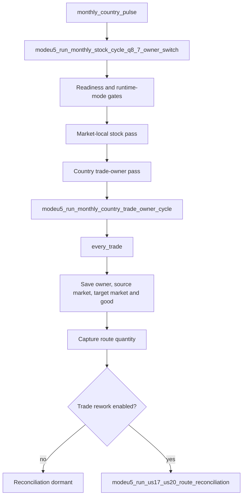
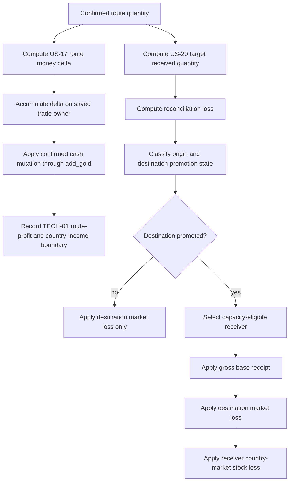
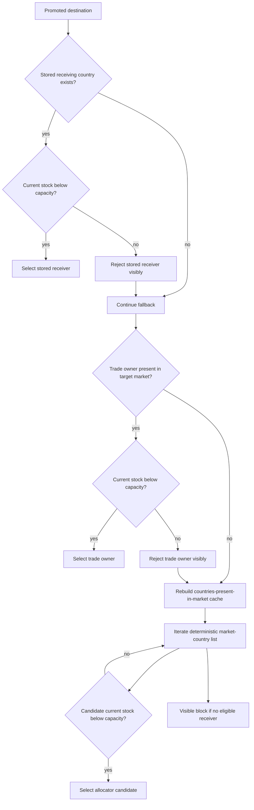
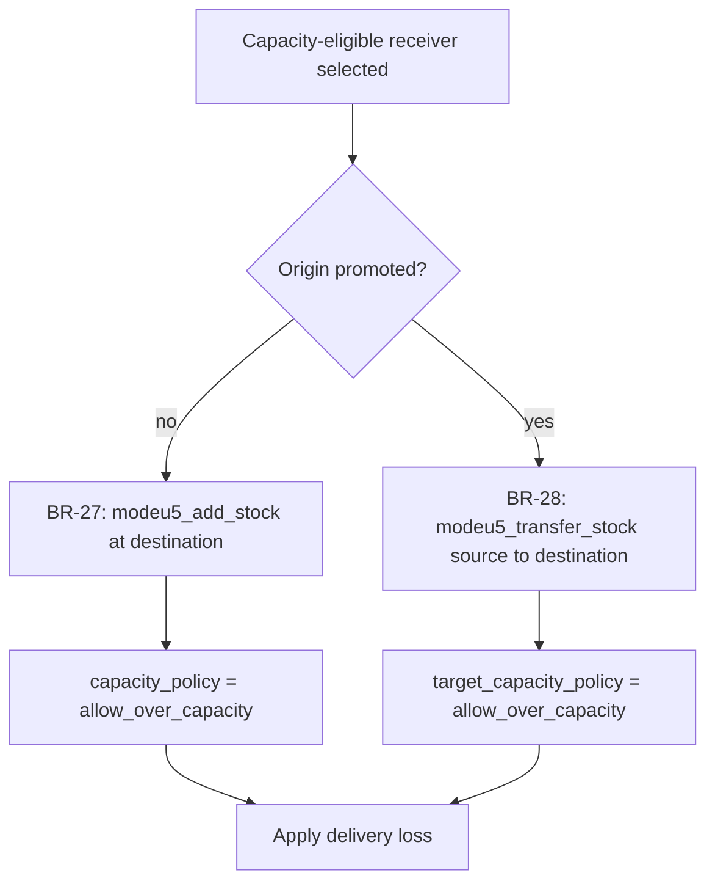
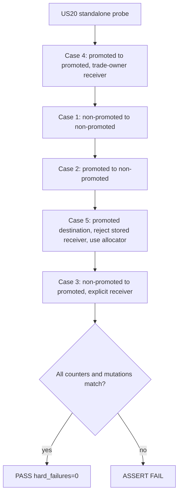
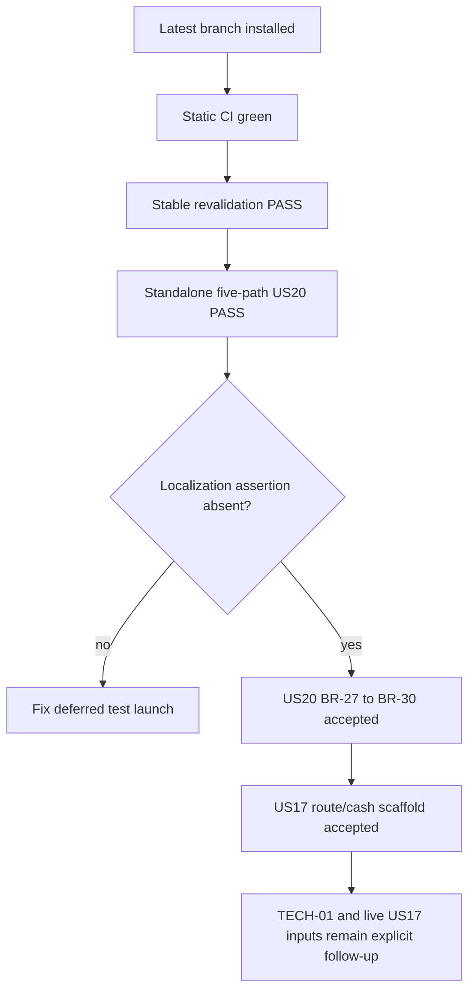

# Q5 — PR107 workflow state

## Purpose

This document records the current PR #107 workflow for US-17 and US-20. It
supersedes the earlier checkpoint that described the receiver allocator and base
receipt operators as follow-up work.

The runtime evidence below was captured on 2026-07-10 from the installed PR
branch. The standalone probe passed twice after the receiver fixture was made
repeatable; the latest run passed on its first execution.

## Source mapping

```txt
#105 = trade-maintenance-efficiency model
#120 = buying/selling-efficiency model
#161 = Q8.7 route-loop placement
US-17 = money-side route reconciliation
US-20 = received-goods/base-receipt/loss reconciliation
```

#105 and #120 are complementary. #120 does not replace #105.

## Inherited Q8.7 placement



PR #107 does not add a second route-discovery loop and does not run route
reconciliation inside the market-local `every_market_in_world` body.

## Current route workflow



For a promoted destination, the operation order is deliberate:

```txt
receiver selection
→ gross base receipt
→ market-stockpile delivery loss
→ receiver country×market delivery loss
```

## Promoted-destination receiver workflow



The allocator is now implemented. It uses the existing countries-present-in-
market cache, deterministic list order, and per-good `current_stock < capacity`
eligibility. It is not a scored US-10 bucket/tie-break optimiser; it is the
implemented deterministic MVP allocator required by BR-29/BR-30.

## Base receipt workflow



The literal-good receipt/capacity dispatchers are generated for the canonical
ModeU5 goods registry. The runtime probe exercises wheat; generator validation
protects all-goods coverage statically.

## Five-path deterministic probe

The four origin/destination combinations remain the business matrix. The probe
adds a fifth path to validate allocator fallback independently.



Latest runtime evidence:

```txt
ModeU5 TEST PASS scenario=main_revalidation_summary
ModeU5 TEST PASS scenario=us17_us20_route_reconciliation expected_probe_blocked=yes hard_failures=0
ModeU5 TEST PASS scenario=us20_case12_market_loss_probe hard_failures=0 matrix=case1_case2_case3_case4_case5 receivers=explicit_plus_trade_owner_plus_allocator
```

Validated receiver markers:

```txt
selected=trade_owner
rejected=stored_receiver reason=capacity_not_eligible
selected=allocator_candidate
selected=stored_receiver
```

Validated base-receipt markers:

```txt
BASE_RECEIPT applied=country_market_transfer capacity_policy=allow_over_capacity
BASE_RECEIPT applied=add_at_destination capacity_policy=allow_over_capacity
```

## Current implementation and validation state

| Surface | Implementation | Runtime evidence | Interpretation |
| --- | --- | --- | --- |
| Q8.7 route placement | Complete | PASS | Existing country-owned `every_trade` loop; no duplicate route discovery. |
| CMM trade-rework gate | Complete | PASS fixture | Reconciliation stays dormant when disabled. |
| US-17 route formula orchestration | Complete scaffold | PASS deterministic fixture | Formula components and delta sequencing are exercised with seeded values. |
| US-17 treasury application | Complete | PASS | Signed delta reaches saved trade owner through `add_gold`. |
| US-17 live route-safe economic inputs | Fail-closed | Not production-proven | Script values remain zero until route-safe engine reads are confirmed. |
| US-17 visible route profit/country trade income | TECH-01 blocked | Expected-blocked PASS | `add_gold` proves cash only, not the displayed accounting ledger. |
| US-20 received-goods formula | Complete | PASS | Target received quantity and loss are calculated. |
| Cases 1 and 2 market-only loss | Complete | PASS | Negative `add_goods_supply`; no country receiver required. |
| BR-27 add-at-destination receipt | Complete | PASS | Explicit and allocator promoted-destination paths exercise `modeu5_add_stock`. |
| BR-28 country-market transfer receipt | Complete | PASS | Promoted-to-promoted path exercises `modeu5_transfer_stock`. |
| BR-29 receiver fallback | Complete MVP | PASS | Stored receiver, trade owner and allocator candidate paths are exercised. |
| BR-30 capacity eligibility | Complete MVP | PASS | Ineligible stored receiver is rejected; eligible allocator candidate is selected. |
| Destination market loss | Complete | PASS | Five routes record market loss. |
| Receiver country-stock loss | Complete | PASS | Three promoted-destination routes record country loss. |
| Generic goods dispatch | Generated | Static validation required | Runtime probe is wheat; generator covers canonical goods. |
| Standalone probe repeatability | Complete | PASS on repeated runs | Fixture explicitly poisons and cleans inherited receiver capacity state. |
| Console localization assertion | Patched | Rerun required | Probe execution is deferred to a hidden event outside console command context. |

## Coverage conclusion

### US-20

US-20 is covered for the route-level MVP business rules implemented by this PR:

```txt
four market-accounting combinations
+ explicit receiver
+ trade-owner receiver
+ allocator fallback
+ capacity rejection/eligibility
+ add-at-destination receipt
+ country-market transfer receipt
+ market loss
+ receiver country-stock loss
```

This is full deterministic coverage of BR-27 through BR-30 and the five probe
paths. It is not proof of every live-world topology or every good at runtime;
all-goods support is generator/static coverage with wheat as the runtime fixture.

### US-17

US-17 is not fully production-complete. The route placement, formula scaffold,
deterministic calculation, accumulation, and treasury `add_gold` mutation are
covered. Two boundaries remain:

```txt
1. live route-safe reads for the economic inputs still fail closed to zero;
2. visible trade-route profit and country trade-income accounting remain TECH-01 expected-blocked.
```

Therefore PR #107 can close the tested US-17 route/cash scaffold, but it must not
claim full visible-income accounting or fully live #105/#120 economics.

## Probe-hygiene practices learned

1. A console launcher should schedule a hidden continuation before any verbose
   test logging. Running the logging effect directly from the console-launched
   option can trigger `Tried to localize with localization disabled`.
2. Temporary named scopes may remain visible within or across chained test
   effects. A test must not assume that the absence of a new assignment clears a
   previous named scope.
3. Fallback tests must make higher-priority candidates explicitly ineligible,
   not merely omit their setup. The allocator fixture assigns a known stored
   receiver and pushes its stock above capacity before testing fallback.
4. Every destructive fixture needs symmetric cleanup, including deliberately
   over-capacity poison stock.
5. Run the fallback/allocator path before the explicit-receiver path when scope
   leakage could otherwise satisfy the fallback accidentally.
6. Clear logs before the final acceptance run. A grep across old runs can show an
   earlier FAIL next to a later PASS and obscure the status of the tested commit.
7. Separate static all-goods proof from runtime representative-good proof. Do not
   describe generated dispatcher coverage as runtime coverage for every good.
8. Keep expected TECH-01 blocks visible. A green probe must not hide an unresolved
   engine-exposure boundary.

## Test protocol

Static validation:

```sh
./tools/generate_all.sh
./tools/validate_generators.sh
./tools/validate_module_packages.sh
./tools/audit_modeu5_persistent_state.sh
./tools/normalize_cmm_value_links.sh --check
python3 ./tools/validate_cmm_configuration.py
git diff --check
```

Install and clear logs:

```sh
./tools/install_local_packages.sh
./tools/clear_eu5_logs.sh
```

Run the stable baseline:

```txt
event modeu5_revalidate_debug.1
```

Run the standalone US-20 probe:

```txt
event modeu5_us20_probe.1
```

Post-run grep:

```sh
grep -R -E "main_revalidation_summary|us17_us20_route_reconciliation|us20_case12_market_loss_probe|US20 CASE12|BASE_RECEIPT|RECEIVER_SELECTION|rejected=stored_receiver|allocator_candidate|RECEIVER_CAPACITY_DISPATCH|BASE_RECEIPT_DISPATCH|COUNTRY_LOSS_DISPATCH|ASSERT FAIL|Failed to fetch variable for .modeu5_us20|global_var returned an unset scope|Tried to localize with localization disabled" \
"$HOME/Documents/Paradox Interactive/Europa Universalis V/logs" || true
```

Expected absence on the post-localization-fix rerun:

```txt
ASSERT FAIL
RECEIVER_CAPACITY_DISPATCH blocked
BASE_RECEIPT_DISPATCH blocked
COUNTRY_LOSS_DISPATCH blocked
Failed to fetch variable for 'modeu5_us20...
global_var returned an unset scope
Tried to localize with localization disabled
```

## Merge decision


