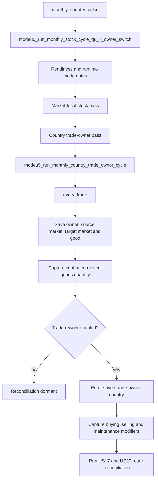
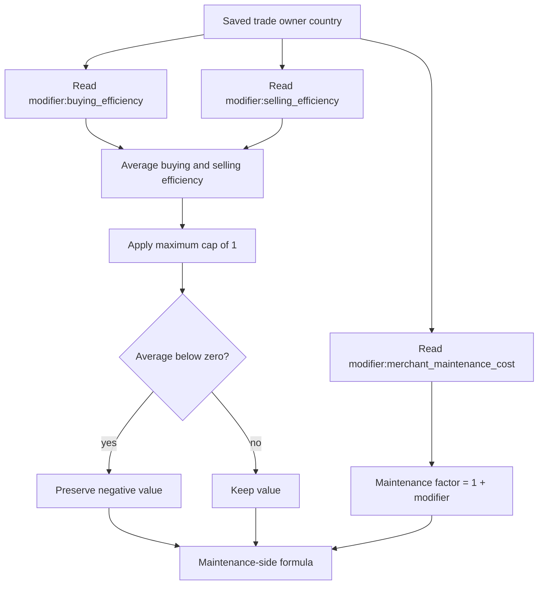
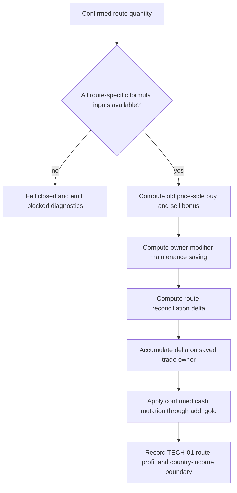
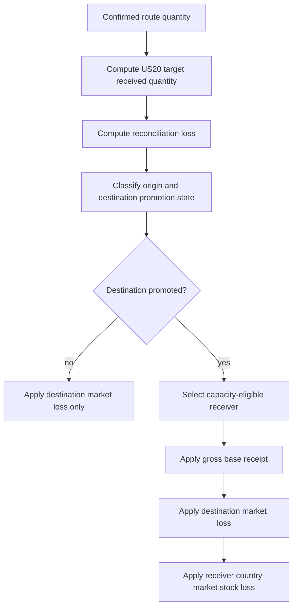
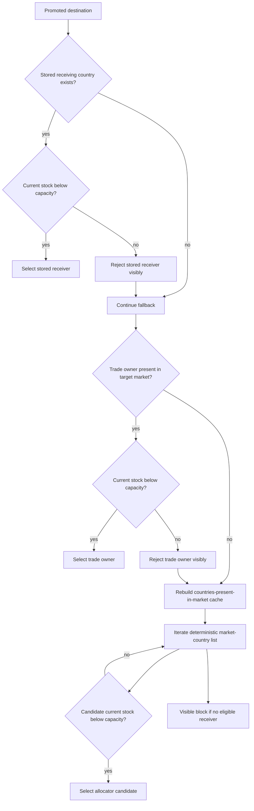
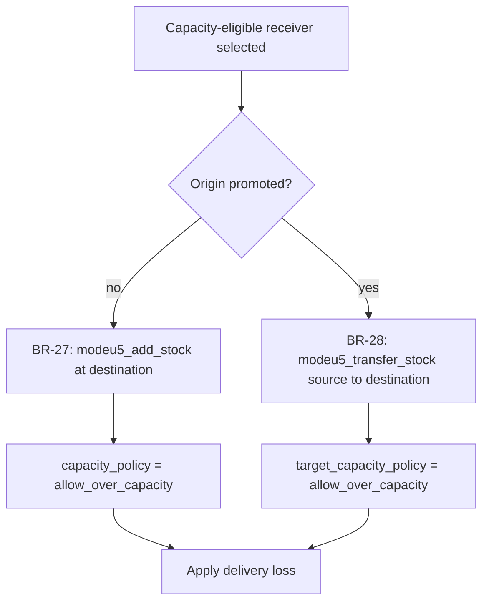
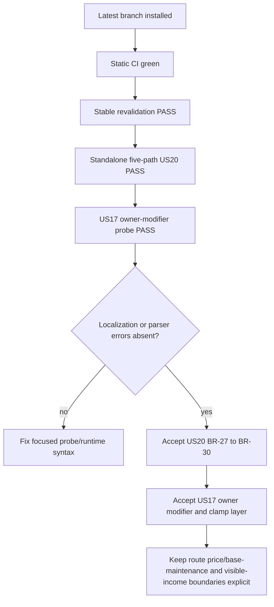

# Q5 — PR107 workflow state

## Purpose

This document records the current PR #107 workflow for US-17 and US-20.

The US-20 runtime evidence below was captured on 2026-07-10 from the installed PR
branch. The new US-17 trade-owner modifier path was implemented afterward and has
a dedicated focused probe that still requires an in-game rerun on the new head.

## Source mapping

```txt
#105 = trade-maintenance-efficiency model
#120 = buying/selling-efficiency model
#161 = Q8.7 route-loop placement
US-17 = money-side route reconciliation
US-20 = received-goods/base-receipt/loss reconciliation
```

## Global placement



PR #107 does not add a second route-discovery loop and does not run route
reconciliation inside the market-local `every_market_in_world` body.

## US-17 owner-modifier workflow



The buying/selling average now follows:

```txt
capped_average = min((buying_efficiency + selling_efficiency) / 2, 1)
```

There is no lower clamp. Negative efficiency remains negative and creates a
negative maintenance saving, which means additional maintenance cost.

The country maintenance modifier participates through:

```txt
maintenance_factor = 1 + merchant_maintenance_cost

adjusted_base_maintenance =
    base_maintenance_amount * maintenance_factor

maintenance_saving =
    adjusted_base_maintenance * capped_average
```

## US-17 route-money workflow



Country modifier inputs are no longer part of the fail-closed set. The remaining
route-specific boundaries are:

```txt
sell price
buy price
export cost modifier
base maintenance amount
trade-route profit read/write surface
country trade-income accounting surface
```

## US-20 route workflow



For a promoted destination, the order remains:

```txt
receiver selection
→ gross base receipt
→ market-stockpile delivery loss
→ receiver country×market delivery loss
```

## Promoted-destination receiver workflow



The allocator uses the existing countries-present-in-market cache, deterministic
list order, and per-good `current_stock < capacity` eligibility.

## Base receipt workflow



Literal-good receipt/capacity dispatchers are generated from the canonical ModeU5
goods registry. Runtime evidence uses wheat; generator validation protects all-
goods coverage statically.

## Existing runtime evidence — US-20 and route scaffold

```txt
ModeU5 TEST PASS scenario=main_revalidation_summary
ModeU5 TEST PASS scenario=us17_us20_route_reconciliation expected_probe_blocked=yes hard_failures=0
ModeU5 TEST PASS scenario=us20_case12_market_loss_probe hard_failures=0 matrix=case1_case2_case3_case4_case5 receivers=explicit_plus_trade_owner_plus_allocator
```

Validated receiver markers:

```txt
selected=trade_owner
rejected=stored_receiver reason=capacity_not_eligible
selected=allocator_candidate
selected=stored_receiver
```

Validated base-receipt markers:

```txt
BASE_RECEIPT applied=country_market_transfer capacity_policy=allow_over_capacity
BASE_RECEIPT applied=add_at_destination capacity_policy=allow_over_capacity
```

## New focused US-17 owner-modifier probe

Run:

```txt
event modeu5_us17_owner_modifiers.1
```

Expected PASS marker:

```txt
ModeU5 TEST PASS scenario=us17_trade_owner_modifiers hard_failures=0 owner_inputs=buying_selling_merchant_maintenance clamp=maximum_only
```

The probe checks:

```txt
- buying efficiency comes from the trade-owner country modifier;
- selling efficiency comes from the trade-owner country modifier;
- merchant maintenance cost comes from the trade-owner country modifier;
- a -0.30 average remains -0.30;
- a 1.30 average is capped at 1;
- merchant maintenance cost changes the maintenance factor;
- the seeded combined formula produces the expected route delta.
```

This probe is implemented but not yet runtime-confirmed on the new branch head.

## Current implementation and validation state

| Surface | Implementation | Runtime evidence | Interpretation |
| --- | --- | --- | --- |
| Q8.7 route placement | Complete | PASS | Existing country-owned `every_trade` loop; no duplicate discovery. |
| CMM trade-rework gate | Complete | PASS fixture | Reconciliation remains dormant when disabled. |
| Trade-owner buying modifier read | Complete | Focused rerun required | Read in saved trade-owner country scope. |
| Trade-owner selling modifier read | Complete | Focused rerun required | Read in saved trade-owner country scope. |
| Trade-owner maintenance modifier read | Complete | Focused rerun required | Uses `modifier:merchant_maintenance_cost`. |
| Maximum-only average cap | Complete | Focused rerun required | `max = 1`; negative values preserved. |
| US-17 formula orchestration | Complete scaffold | Existing fixture PASS; new probe pending | New owner-modifier formula is separate from the historical seeded fixture. |
| US-17 treasury application | Complete | Existing fixture PASS | Signed delta reaches saved trade owner through `add_gold`. |
| US-17 live route prices/base maintenance | Fail-closed | Not production-proven | Country modifiers are live; remaining route values are not. |
| US-17 route profit/country trade income | TECH-01 blocked | Expected-blocked PASS | `add_gold` proves cash only, not displayed accounting. |
| US-20 received-goods formula | Complete | PASS | Target received quantity and loss are calculated. |
| Cases 1 and 2 market-only loss | Complete | PASS | Negative `add_goods_supply`; no receiver required. |
| BR-27 add-at-destination receipt | Complete | PASS | Explicit and allocator paths exercise `modeu5_add_stock`. |
| BR-28 country-market transfer receipt | Complete | PASS | Promoted-to-promoted path exercises `modeu5_transfer_stock`. |
| BR-29 receiver fallback | Complete MVP | PASS | Stored, trade-owner and allocator receiver paths. |
| BR-30 capacity eligibility | Complete MVP | PASS | Ineligible stored receiver rejected; allocator selected. |
| Console localization deferral | Implemented | Existing US20 rerun clean; new probe pending | Hidden continuation avoids console localization context. |

## Coverage conclusion

### US-20

US-20 remains fully covered for the route-level MVP business rules implemented by
this PR: BR-27 through BR-30, all four market combinations, the allocator path,
base receipt, market loss, and receiver country-stock loss.

### US-17

US-17 coverage is now more precise:

```txt
Implemented:
  route placement
  trade-owner attribution
  live country modifier reads
  maximum-only buying/selling cap
  maintenance-factor arithmetic
  formula scaffold
  accumulation
  add_gold test surface

Still blocked or unconfirmed:
  live route prices
  live export cost
  live base maintenance amount
  visible route-profit mutation
  visible country trade-income accounting
```

The former statement that buying, selling, and maintenance modifiers fail closed
to zero is no longer correct.

## Probe-hygiene practices

1. Console launchers schedule hidden continuations before verbose logging.
2. Temporary named scopes are treated as potentially persistent within chained
   effects; fallback tests explicitly poison higher-priority candidates.
3. Destructive fixtures use symmetric cleanup.
4. Static all-goods proof is kept separate from representative runtime proof.
5. Expected TECH-01 blocks remain visible rather than being hidden by green tests.
6. Country-owned modifier inputs and route-owned economic inputs are tracked as
   separate exposure classes; one must not block or impersonate the other.
7. Formula clamps must state their intended direction explicitly. `max = 1` means
   an upper cap; adding `min = 0` would change the business rule.

## Test protocol

Static validation:

```sh
./tools/generate_all.sh
./tools/validate_generators.sh
./tools/validate_module_packages.sh
./tools/audit_modeu5_persistent_state.sh
./tools/normalize_cmm_value_links.sh --check
python3 ./tools/validate_cmm_configuration.py
git diff --check
```

Install and clear logs:

```sh
./tools/install_local_packages.sh
./tools/clear_eu5_logs.sh
```

Run:

```txt
event modeu5_revalidate_debug.1
event modeu5_us20_probe.1
event modeu5_us17_owner_modifiers.1
```

Post-run grep:

```sh
grep -R -E "main_revalidation_summary|us17_us20_route_reconciliation|us20_case12_market_loss_probe|us17_trade_owner_modifiers|US17 OWNER_MODIFIERS|BASE_RECEIPT|RECEIVER_SELECTION|ASSERT FAIL|Failed to fetch variable|Cannot read|Tried to localize with localization disabled" \
"$HOME/Documents/Paradox Interactive/Europa Universalis V/logs" || true
```

Expected absence:

```txt
ASSERT FAIL
Failed to fetch variable
Cannot read
Tried to localize with localization disabled
```

## Merge decision


