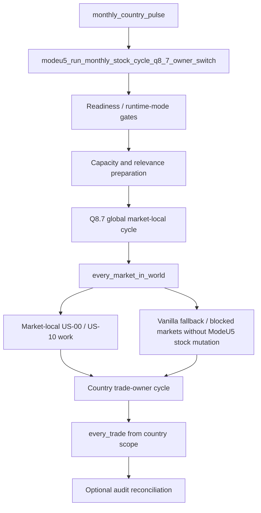
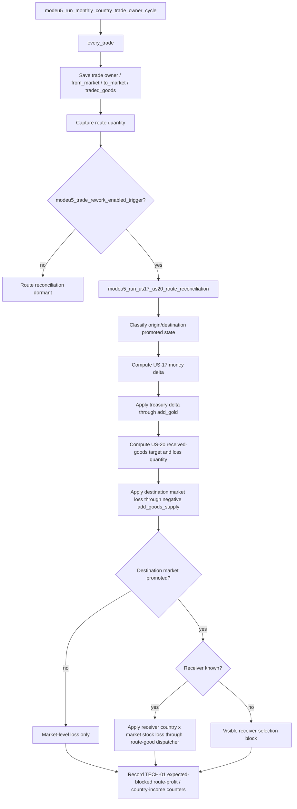
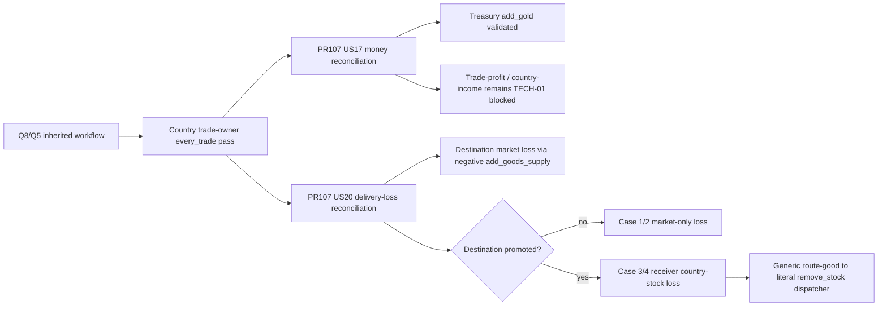
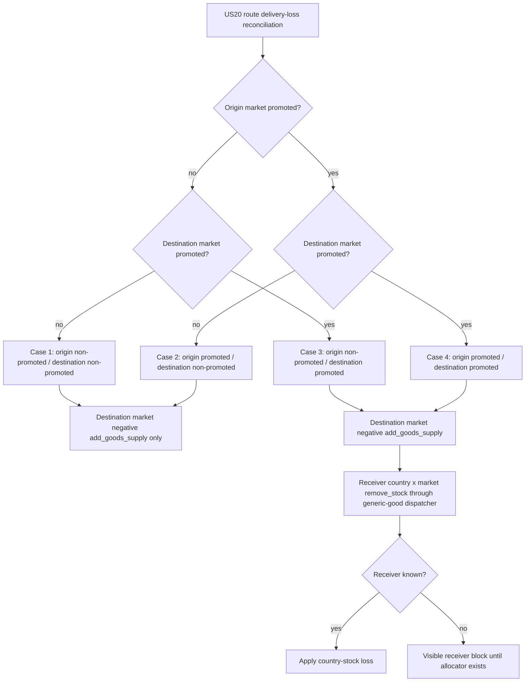
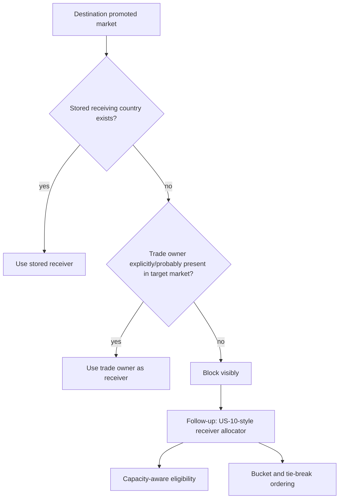
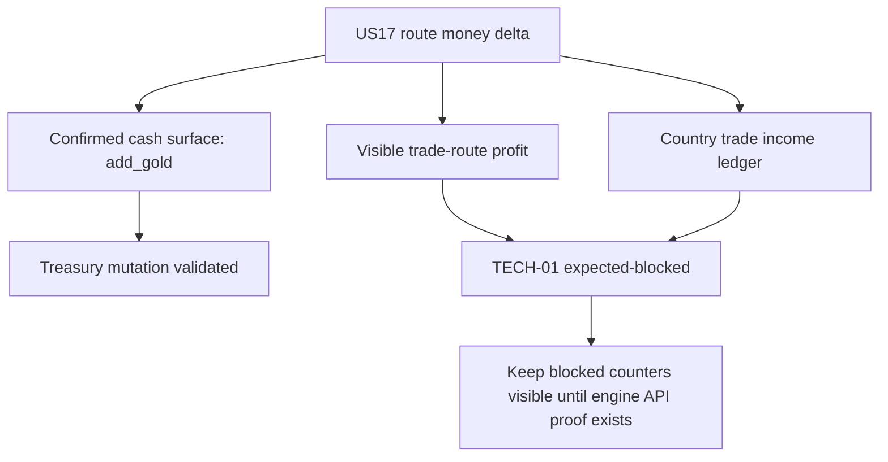
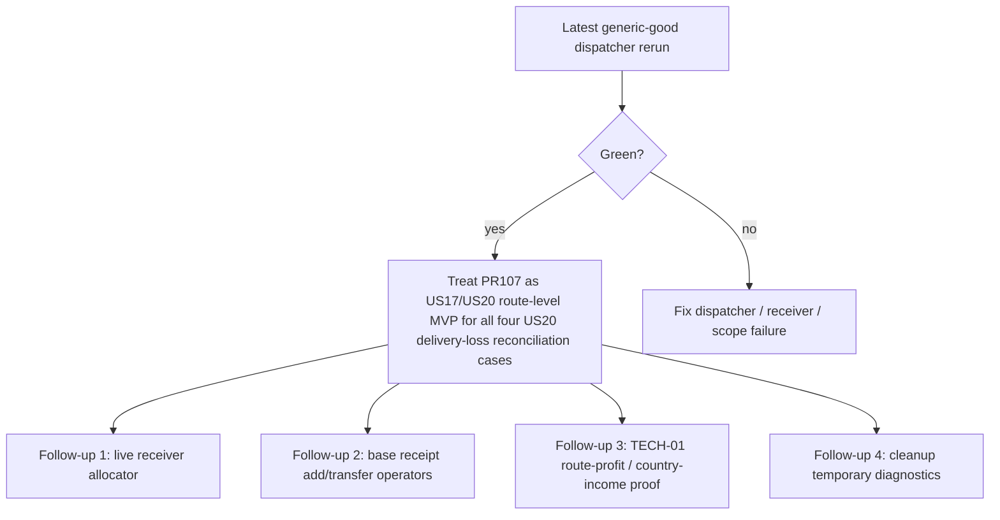

# Q5 — PR107 workflow state

## Purpose

This document records the workflow state of PR #107 as a historical checkpoint.

It is intentionally PR-owned. It does not rewrite the inherited Q8/Q5 flow. Instead, it records how PR #107 plugs US-17 and US-20 into that flow, what is already validated, what is implemented but requires rerun, and what remains blocked or out of scope.

## Historical baseline

PR #107 inherits the Q8.7 runtime flow:



The inherited ordering rule is:


PR #107 must therefore attach to the country-owned trade pass. It must not add a second route-discovery pass and must not run trade reconciliation inside the market-local `every_market_in_world` body.

## Current PR107 objective

PR #107 wires US-17 and US-20 route-level reconciliation into the existing Q8.7 country trade-owner route loop.

Correct source mapping:

```txt
#105 = new trade maintenance efficiency model
#120 = buying/selling trade efficiency model
#161 = route-loop placement / Q8.7 owner split
US-17 = money-side route reconciliation
US-20 = trade maintenance as received-goods loss factor
```

#105 and #120 are complementary. #120 does not replace #105.

## Current live workflow state



## Historical flow delta introduced by PR107



## Implemented surfaces

| Surface | State | Notes |
| --- | --- | --- |
| Q8.7 placement | Implemented | Hook is in the existing country trade-owner `every_trade` loop. |
| Second route loop avoidance | Implemented | No new `every_market_center_in_country -> every_trade` route-discovery pass is introduced. |
| CMM trade-rework gate | Implemented | Runtime path is gated by `modeu5_trade_rework_enabled_trigger`. |
| US-17 old price-side bonus removal | Implemented | Old buy/sell efficiency effect is computed and removed from the route delta. |
| US-17 route money delta | Implemented | Route delta keeps #105 and #120 as separate terms. |
| Treasury application | Implemented | Signed money delta is applied to the saved trade owner through `add_gold`. |
| US-20 received-goods formula | Implemented | Trade maintenance reduces received goods through the US-20 target formula. |
| US-20 market-level loss | Implemented | Destination loss uses negative `add_goods_supply` on the target market. |
| Four-case classification | Implemented | Case 1–4 promoted/non-promoted matrix is classified and probed. |
| Promoted-destination country loss | Implemented | Destination-promoted receiver stock loss now uses `modeu5_apply_us20_promoted_destination_country_loss_by_route_good`. |
| Generic route-good dispatcher | Implemented | Saved route-good scope is mapped to literal central-stock good tokens before `modeu5_remove_stock`. |
| Blocked diagnostics | Implemented | Missing receiver/good/scope paths record visible block counters/logs instead of silently passing. |

## Validation state

Runtime evidence captured on 2026-07-09 before the latest generic route-good dispatcher patch:

```txt
Expected scenario set: full
Entered: 19
Passed:  18
Failed:  0
Blocked: 0
Pending: 0
Missing expected full-revalidation scenarios: 0

ModeU5 TEST PASS scenario=us17_us20_route_reconciliation expected_probe_blocked=yes hard_failures=0
ModeU5 TEST PASS scenario=us20_case12_market_loss_probe hard_fail...
```

Interpretation:

```txt
Stable full baseline before generic dispatcher: green
US17/US20 route reconciliation before generic dispatcher: green
US20 case12 promoted/non-promoted E2E probe before generic dispatcher: green
Latest generic-good promoted-destination dispatcher: implemented, pending CI/runtime rerun
```

The pasted US20 PASS line was truncated after `hard_fail`, but the summarizer reported zero failed, blocked, pending, and missing expected scenarios. This is accepted as green evidence for the pre-dispatcher deterministic probe.

## Four-case US-20 state



| Case | Origin market | Destination market | Expected behavior | Current state |
| --- | --- | --- | --- | --- |
| 1 | non-promoted | non-promoted | Destination market loss only through negative `add_goods_supply`. | Validated in deterministic E2E probe. |
| 2 | promoted | non-promoted | Destination market loss only through negative `add_goods_supply`. | Validated in deterministic E2E probe. |
| 3 | non-promoted | promoted | Market loss plus receiver country×market stock loss. | Implemented with generic-good dispatcher; previously validated for wheat/test path; rerun required. |
| 4 | promoted | promoted | Market loss plus receiver country×market stock loss. | Implemented with explicit/trade-owner receiver path and generic-good dispatcher; previously validated for wheat/test path; rerun required. |

## Receiver workflow state



Current state:

```txt
stored receiver path: covered by deterministic probe
trade-owner forced-present path: covered by deterministic probe
live generic receiver allocator: not implemented in PR107
capacity-aware receiver eligibility: not implemented in PR107
US-10-style receiver ordering: not implemented in PR107
```

Receiver allocation must remain a follow-up because it is not just a route-loss patch; it requires a generated candidate-selection mode with US-10-style bucket/tie-break ordering and receiver-specific eligibility.

## Money/display-accounting workflow state



Treasury mutation is confirmed only at cash level:

```txt
scope:modeu5_trade_owner_country = {
  add_gold = scope:modeu5_trade_efficiency_route_money_delta
}
```

TECH-01 remains unresolved for:

```txt
- reading route profit;
- mutating visible route profit;
- reading country trade income;
- proving whether route profit feeds country income;
- proving whether treasury mutation is equivalent to visible trade-income accounting.
```

Expected-blocked counters must remain visible until TECH-01 confirms a safe engine surface. Do not hide them just to make tests look cleaner.

## Out-of-scope for PR107

PR107 does not implement:

```txt
- full base receipt add/transfer accounting;
- live generic receiver allocation;
- capacity-aware receiver selection;
- US-10-style receiver sorting/tie-break generation;
- visible trade-route profit mutation;
- country-income ledger mutation;
- TECH-01 engine exposure proof;
- broad US-09/economy rebalance warning cleanup.
```

## Merge decision checklist

PR107 can be considered merge-ready on latest head only when:

```txt
- static generators/package/persistent-state checks pass;
- full deterministic revalidation has Failed=0 and Blocked=0;
- main_revalidation_summary is present;
- CORE-04 remains PASS;
- US-10 remains PASS for demand, issue109, and UI visibility;
- US17/US20 fixture passes with hard_failures=0;
- US20 case12 deterministic E2E probe reaches PASS;
- no COUNTRY_LOSS_DISPATCH blocked line appears;
- trade_profit/country_income remains explicitly reported as EXPECTED_PROBE_BLOCKED / TECH-01;
- no known US17/US20 hard runtime failure remains in the stable path.
```

## Testing protocol

Static validation:

```sh
./tools/generate_all.sh
./tools/validate_generators.sh
./tools/validate_module_packages.sh
./tools/audit_modeu5_persistent_state.sh
./tools/normalize_cmm_value_links.sh --check
python3 ./tools/validate_cmm_configuration.py
git diff --check
```

Install and clear logs:

```sh
./tools/install_local_packages.sh
./tools/clear_eu5_logs.sh
```

In-game baseline:

```txt
event modeu5_revalidate_debug.1
```

Optional US20 probe after the baseline is green:

```txt
event modeu5_us20_probe.1
```

Post-run grep:

```sh
grep -E "main_revalidation_summary|us17_us20_route_reconciliation|us20_case12_market_loss_probe|US20 CASE12|RECEIVER_SELECTION|COUNTRY_LOSS_DISPATCH|ASSERT FAIL|Failed to fetch variable for 'modeu5_us20|global_var returned an unset scope" \
"<EU5_LOG_DIR>/error.log"
```

Expected absence:

```txt
ASSERT FAIL
COUNTRY_LOSS_DISPATCH blocked
Failed to fetch variable for 'modeu5_us20...
global_var returned an unset scope
```

## Next workflow decision



If the latest generic-good dispatcher rerun is green, PR107 can be treated as a US17/US20 route-level MVP for all four US20 delivery-loss reconciliation cases.
