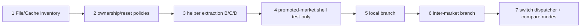

# AGENT instructions — PR126 refactor stack

Use this document as the prompt skeleton for coding agents. Q1–Q6 are the canonical context; there is no separate refresh-note file. The goal is to turn the PR126 audit into small, reviewable code PRs that converge toward the promoted-market monthly orchestration described in Q5.



## Global prompt

```txt
You are refactoring ModeU5 monthly stock orchestration. Read AGENTS.md and docs/audits/pr126/{README.md,Q1_architecture_fichiers.md,Q2_systeme_cache.md,Q3_redondances_code.md,Q4_boucles_performance.md,Q5_flux_logique_global.md,Q6_description_fonctionnelle.md}.

Also read docs/technical/VARIABLE_MAP_STORAGE_MODEL.md, docs/technical/GENERATOR_AND_VALIDATOR_MODEL.md, and docs/technical/TECH-01_engine_exposure_matrix.md.

Implement only the assigned PR step. Keep the patch small. Preserve the current MVP. Use country_market_good_stock maps as source of truth and market_good_stock maps as derived caches. All stock changes go through the centralized stock operators.

When an iterator, scope link, value, effect, or ownership rule is unconfirmed, record it in TECH-01 or keep the implementation test-only with an accepted fallback.

Reuse the existing generator model: tools/modeu5_tool_lib.sh, tools/modeu5_goods.sh, tools/templates/, tools/generate_all.sh, and tools/validate_generators.sh.
```

## PR stack to request from an AGENT

### PR 1 — File/Cache inventory executable audit

Goal: convert Q1/Q2/Q4 into a machine-checkable inventory before runtime refactor.

Task: extend the existing audit scripts against the latest `developement-balance` head. List persistent maps, global lists, work caches, debug variables, and direct stock-map write candidates. Classify each item as source, derived cache, work cache, monthly ledger, annual ledger, debug-only, or generated adapter output.

Likely files:

- `tools/audit_modeu5_persistent_state.sh`
- `docs/technical/PERSISTENT_STATE_AUDIT.md`
- `docs/audits/pr126/Q2_systeme_cache.md` if findings need correction

Acceptance: source/cache/work/debug state is identified; suspicious stock writes outside central operators are flagged; generator conventions remain aligned with #131; gameplay files are not rewired.

### PR 2 — Cache classification and cleanup plan

Goal: convert the inventory into explicit ownership rules.

Task: update documentation and comments so each cache has one owner, one rebuild trigger, and one reset policy. Remove references only after every reader is identified.

Acceptance: every persistent/work cache has owner, rebuild, and reset policy; `countries_present_in_market` is documented as work cache, not stock source.

### PR 3 — Extract helpers B/C/D without changing monthly order

Goal: prepare the promoted-market refactor without changing behaviour.

Task: extract no-op-equivalent helper entry points:

- B: capacity/cache helper for selected country-market or promoted market;
- C: generated-good adapter bridge for scoped market-good work;
- D: same-market consumption helper and inter-market handoff helper.

Acceptance: monthly dispatcher order remains semantically unchanged; tests can call the helpers; no new direct stock write appears.

### PR 4 — Create promoted-market list and dispatcher shell

Goal: implement the outer target shell, not the full logic.

Task: add `modeu5_run_monthly_promoted_market_cycle` as test-only or behind a disabled feature gate. Build a promoted-market work list from `every_market_present_in_country`. In Performance mode, restrict to human/performance-relevant markets; in Normal mode, treat all current-country markets as promoted.

Acceptance: promoted-market count is observable; Normal and Performance promotion differ as expected; `every_market_promoted` is implemented as a ModeU5 work-list/helper pattern, not assumed to be a native EU5 iterator.

### PR 5 — Wire local branch under promoted-market shell

Goal: run local market-good work under the promoted-market shell in controlled tests.

Task: for one promoted market, rebuild `countries_present_in_market` once, call B capacity, call C scoped US-00/generated-good bridge, call D same-market consumption, then validate scoped market-good consistency.

Acceptance: US-00 and same-market consumption do not rescan all markets independently; US-00 produced/added/rejected facts are frozen before consumption, trade, decay, validation, or reconciliation.

### PR 6 — Wire inter-market trade branch

Goal: add inter-market transfer after the local branch is stable.

Task: add the inter-market branch under the promoted-market shell. Use `every_trade` only if TECH-01 confirms it; otherwise use the accepted queued-demand fallback. Inter-market transfer calls `modeu5_resolve_inter_market_stock_transfer` and `modeu5_transfer_stock`. Same-market resolution remains stock consumption.

Acceptance: `source_market == target_market` stays same-market; `source_market != target_market` enters inter-market; requested/transferred/unsatisfied quantities are recorded separately.

### PR 7 — Switch monthly dispatcher and compare modes

Goal: replace the old broad path only after shell/local/trade tests pass.

Task: switch `modeu5_run_monthly_stock_cycle` to call `modeu5_run_monthly_promoted_market_cycle` after readiness and capacity prerequisites. Add comparative probes for Normal, Performance, Audit, and Debug. Record promoted markets, cache rebuilds, goods scanned, trade candidates, validations, rebuilds, and stock operator calls.

Acceptance: Normal and Performance produce comparable stock/ledger outcomes on controlled fixtures; Performance reduces promoted-market/good/trade scans; Audit and Debug add diagnostics without changing business results.

## Guardrails

```txt
one PR = one testable layer
central stock operators only for stock changes
country stock remains source of truth
market stock remains derived aggregate
no runtime-built map identifiers
no private good list in generators
no cache without owner/rebuild/reset classification
no gameplay dependency on unconfirmed TECH-01 exposure
same-market consumption is not trade
US-00 monthly facts are not recomputed after consumption/trade/decay/reconciliation
```

## Suggested first prompt

```txt
Implement PR 1 from docs/audits/pr126/AGENT_REFACTOR_INSTRUCTIONS.md. Scope: inventory/audit only. Before editing, read AGENTS.md and docs/audits/pr126/{README.md,Q1_architecture_fichiers.md,Q2_systeme_cache.md,Q3_redondances_code.md,Q4_boucles_performance.md,Q5_flux_logique_global.md,Q6_description_fonctionnelle.md}. Deliver an executable audit/check update, updated persistent-state documentation if needed, commands run, and results.
```
