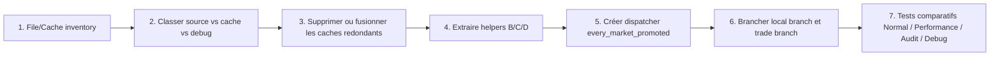

# AGENT instructions — refactor from PR126 audit findings

Use this document as the prompt skeleton for a coding agent. The goal is to turn the PR126 audit into small, reviewable code PRs that follow the documented flow:



## Global prompt to give an AGENT

```txt
You are refactoring ModeU5 monthly stock orchestration. Read and obey:
- AGENTS.md
- docs/audits/pr126/README.md
- docs/audits/pr126/Q1_architecture_fichiers.md
- docs/audits/pr126/Q2_systeme_cache.md
- docs/audits/pr126/Q4_boucles_performance.md
- docs/audits/pr126/Q5_flux_logique_global.md
- docs/technical/VARIABLE_MAP_STORAGE_MODEL.md
- docs/technical/TECH-01_engine_exposure_matrix.md

Do not widen the MVP. Do not add new gameplay behavior unless the current PR step explicitly asks for it. Do not directly mutate stock maps outside the centralized stock operators. Treat country_market_good_stock maps as source of truth and market_good_stock maps as derived caches.

Implement only the assigned PR step. Keep the patch small. If an iterator, scope link, value, effect, or map ownership is unconfirmed, do not assume it works: update TECH-01 or keep the implementation behind an explicit fallback/test-only path.
```

## PR stack to request from an AGENT

### PR 1 — File/Cache inventory executable audit

**Goal:** turn Q1/Q2/Q4 findings into a machine-checkable inventory before runtime refactor.

**Agent task:**

```txt
Create or extend a repository audit script that lists ModeU5 persistent maps, global lists, work caches, debug variables, and direct stock-map write candidates. The script must classify each item as source, derived cache, work cache, monthly ledger, annual ledger, debug-only, or generated adapter output. Do not change gameplay logic.
```

**Files likely touched:**

- `tools/audit_modeu5_persistent_state.sh`
- `docs/technical/PERSISTENT_STATE_AUDIT.md`
- `docs/audits/pr126/Q2_systeme_cache.md` if findings need correction

**Acceptance criteria:**

- The audit identifies source vs derived cache vs debug/work state.
- The audit flags direct writes to stock maps outside `modeu5_add_stock`, `modeu5_remove_stock`, `modeu5_transfer_stock`, `modeu5_decay_stock`, `modeu5_rebuild_market_stock_from_country_stocks`, and validation helpers.
- No gameplay files are rewired.

### PR 2 — Cache classification and cleanup plan

**Goal:** convert the inventory into explicit ownership rules.

**Agent task:**

```txt
Using the PR 1 inventory, update documentation and comments so each cache has one owner and one rebuild/reset policy. If a cache is redundant and safe to remove, remove only documentation references first unless no runtime user exists. Do not remove generated adapters or source-of-truth maps.
```

**Files likely touched:**

- `docs/technical/PERSISTENT_STATE_AUDIT.md`
- `docs/technical/VARIABLE_MAP_STORAGE_MODEL.md`
- `in_game/common/scripted_effects/modeu5_market_country_cache_effects.txt` comments only unless trivial
- `in_game/common/scripted_effects/modeu5_performance_effects.txt` comments only unless trivial

**Acceptance criteria:**

- Every persistent/work cache has a declared owner.
- Every derived cache has a rebuild trigger and reset policy.
- `countries_present_in_market` is explicitly documented as derived/work cache, not stock source.

### PR 3 — Extract helpers B/C/D without changing monthly order

**Goal:** prepare the promoted-market refactor without changing behavior.

**Agent task:**

```txt
Extract no-op-equivalent helper entry points for the future promoted-market flow:
- B: capacity/cache helper for a selected country-market or promoted market
- C: generated-good adapter bridge for scoped market-good work
- D: same-market consumption helper and inter-market handoff helper
Keep the existing monthly dispatcher order unchanged. Add debug counters proving the helpers are entered when called by tests.
```

**Files likely touched:**

- `in_game/common/scripted_effects/modeu5_capacity_effects.txt`
- `in_game/common/scripted_effects/modeu5_void_economy_effects.txt`
- `in_game/common/scripted_effects/modeu5_stock_demand_resolver_effects.txt`
- `packages/modeu5_core_tests/in_game/common/scripted_effects/*_test_effects.txt`

**Acceptance criteria:**

- No direct stock map writes are introduced.
- Existing `modeu5_run_monthly_stock_cycle` remains semantically unchanged.
- Tests/probes can call the new helpers directly.

### PR 4 — Create promoted-market list and dispatcher shell

**Goal:** implement the outer target shell, not the full logic.

**Agent task:**

```txt
Add a dispatcher shell named modeu5_run_monthly_promoted_market_cycle. It must run after modeu5_stock_runtime_ready_trigger in tests only or behind a disabled feature gate. Build a promoted-market work list from every_market_present_in_country. In Performance mode, restrict to human/performance-relevant markets; in Normal mode, treat all current-country markets as promoted. Do not yet replace the existing monthly dispatcher.
```

**Files likely touched:**

- `in_game/common/scripted_effects/modeu5_performance_effects.txt`
- `in_game/common/scripted_effects/modeu5_stock_effects.txt`
- `in_game/common/scripted_triggers/modeu5_configuration_triggers.txt`
- test package files

**Acceptance criteria:**

- Promoted-market count is observable in debug/test output.
- Normal mode promotes all current-country markets.
- Performance mode promotes the filtered subset.
- The shell is not enabled for normal gameplay until PR 6.

### PR 5 — Wire local branch under every_market_promoted

**Goal:** run local market-good work under the promoted-market shell in controlled tests.

**Agent task:**

```txt
Inside modeu5_run_monthly_promoted_market_cycle, wire the local branch for one promoted market:
1. read/rebuild countries_present_in_market once;
2. call the B capacity helper;
3. call the C scoped US-00 / generated-good bridge;
4. call the D same-market consumption helper;
5. validate scoped market-good consistency.
Keep inter-market trade disabled or test-only.
```

**Acceptance criteria:**

- `countries_present_in_market` is rebuilt once per promoted market in the test scenario.
- US-00 and same-market consumption do not each rescan all markets independently.
- Market stock is validated/rebuilt only from country stock.

### PR 6 — Wire inter-market trade branch

**Goal:** add the trade branch after the local branch is stable.

**Agent task:**

```txt
Add the inter-market branch under every_market_promoted. Use every_trade only if TECH-01 confirms it. Otherwise use the accepted queued-demand fallback. Inter-market transfer must call modeu5_resolve_inter_market_stock_transfer and modeu5_transfer_stock; same-market resolution must not create trade income, transport cost, or trade profit.
```

**Acceptance criteria:**

- `source_market == target_market` stays in the same-market branch.
- `source_market != target_market` enters the inter-market branch.
- Requested/transferred/unsatisfied quantities are recorded separately.
- TECH-01 is updated if new exposure is tested.

### PR 7 — Switch monthly dispatcher and compare modes

**Goal:** replace the old broad path only after shell/local/trade tests pass.

**Agent task:**

```txt
Switch modeu5_run_monthly_stock_cycle to call modeu5_run_monthly_promoted_market_cycle after readiness and capacity prerequisites. Preserve the normative runtime order. Add comparative test probes for Normal, Performance, Audit, and Debug. Record counts: promoted markets, countries_present_in_market rebuilds, goods scanned, trade candidates, validations, rebuilds, and direct stock mutation operator calls.
```

**Acceptance criteria:**

- Normal mode and Performance mode produce comparable stock/ledger outcomes for the same controlled fixture.
- Performance mode shows reduced promoted-market/good/trade scans.
- Audit mode adds validation/reconciliation but does not change business outcomes.
- Debug mode adds captures but does not change business outcomes.

## Agent guardrails

- Keep one PR per flowchart step unless the step is documentation-only.
- Do not rename generated maps or pass runtime map names through scripted-effect parameters.
- Do not create custom game rules or runtime package toggles.
- Do not rebuild country stocks from market stocks.
- Do not remove a cache until all readers are identified.
- Do not use `every_trade` or `every_market_center` in gameplay without TECH-01 confirmation.
- Do not change optional package semantics; package presence remains the source of truth.

## Suggested first AGENT prompt

```txt
Implement PR 1 from docs/audits/pr126/AGENT_REFACTOR_INSTRUCTIONS.md.
Scope: inventory/audit only. Do not change gameplay logic.
Before editing, read AGENTS.md and docs/audits/pr126/{README.md,Q1_architecture_fichiers.md,Q2_systeme_cache.md,Q4_boucles_performance.md,Q5_flux_logique_global.md}.
Deliver:
1. an executable audit/check update;
2. updated persistent-state documentation if needed;
3. a short report listing source maps, derived caches, work caches, debug-only variables, and suspicious direct stock-map writes;
4. commands run and results.
```
