# Q5.1 — Current global flow after PR144 + Q4.1/PR7.1

## Purpose

This file is a post-PR144 checkpoint for Q5. Q5 describes the target ownership split; Q5.1 records the current executable state after the live dispatcher switch, the remaining process risks, and the updated release checklist.

PR144 changes the status of the Q5 flow from "target / planned" to "wired into the monthly stock cycle, pending clean runtime validation on the current head".

The stacked Q4.1 / PR7.1 follow-up updates the detailed promoted-market branch without changing the outer Q5 ownership split: capacity refresh is fused into the US-00 country-present pass, US-00 enters the generated active-good guarded dispatcher, and US-10 remains a second generated pending-request pass so consumption still runs after all present-country US-00 updates.

## Current state summary

### Implemented in PR144

The live monthly stock cycle is now routed through the Q5 ownership split:

```txt
monthly_country_pulse(country)
  -> modeu5_run_monthly_stock_cycle
      -> modeu5_stock_runtime_ready_trigger
      -> modeu5_prepare_performance_mode_human_relevant_markets
      -> modeu5_run_monthly_capacity_refresh_for_current_country
      -> modeu5_prepare_monthly_market_seen_registry
      -> modeu5_prepare_human_relevant_full_ledger_markets
      -> modeu5_run_monthly_promoted_market_local_cycle
      -> modeu5_run_monthly_country_trade_owner_cycle
      -> modeu5_note_promoted_market_live_trade_owner_pass
      -> optional audit reconciliation
```

The old live broad-flow calls are no longer the normal monthly stock-cycle business path:

```txt
modeu5_run_us00_monthly_pipeline_all_goods
modeu5_run_monthly_stock_demand_resolution
```

They have been replaced at the live monthly dispatcher surface by:

```txt
modeu5_run_monthly_promoted_market_local_cycle
modeu5_run_monthly_country_trade_owner_cycle
```

### Promoted-market local branch

The promoted-market local branch is now market-center owned through `every_market_center_in_country`. This is the concrete PR144 answer to the Q5 anti-duplication requirement: a market-local mutation branch should run from the market-center owner, not once for every country that has locations in the market.

Current local branch shape:

```txt
modeu5_run_monthly_promoted_market_local_cycle
  -> every_market_center_in_country
      -> save current market scopes
      -> modeu5_mark_monthly_market_seen
      -> modeu5_prepare_market_runtime_accounting_mode
      -> if detailed accounting:
           modeu5_run_promoted_market_live_local_branch_market_all_goods
      -> else if vanilla fallback:
           record fallback metrics
      -> else if blocked:
           record blocked metrics
```

Detailed local branch shape after Q4.1 / PR7.1:

```txt
modeu5_run_promoted_market_live_local_branch_market_all_goods
  -> rebuild countries_present_in_market once for the market
  -> for each country present in the market:
       refresh country-market capacity
       run US-00 generated active-good guarded dispatch
  -> for each country present in the market:
       run US-10 generated pending-request guarded dispatch
  -> record local market processed
```

Process assessment:

- Good: the market-local branch is now explicitly owned by the market center.
- Good: country-present cache rebuild happens once inside the local branch.
- Good: Q4.1 fuses country-market capacity refresh with the US-00 country-present pass instead of running a separate countries-present capacity pass before US-00.
- Good: PR7.1 keeps US-00 before US-10 and narrows heavy generated helper entry through active/pending guards.
- Good: Performance mode has explicit detailed/fallback/blocked accounting.
- Still to watch: the generated guard surfaces still consider literal generated goods; the expected improvement is that full US-00 / US-10 helper work is entered only for produced/previous-state goods or pending same-market requests.
- Still to watch: validation is currently end-of-cycle/audit oriented; local validation metrics exist, but closure should not depend on reconciliation hiding earlier orchestration issues.

### Country-owned trade branch

The country trade-owner pass remains separate from the promoted-market local branch. This is correct for Q5 because `every_trade` is country-scope, not market-scope. The trade pass must process trades owned by the current country, not trades filtered to the current promoted market.

Current process rule:

```txt
promoted-market local branch
  -> same-market, non-trade consumption only

country-owned trade branch
  -> country-scoped every_trade
  -> inter-market trade only
  -> stock consequences delegated to transfer / add / remove handlers
```

Process assessment:

- Good: local same-market consumption and inter-market trade ownership are no longer blurred in the live dispatcher.
- Good: trade remains orchestration-only; stock writes should still go through central stock operators.
- Still to watch: trade-owner density and future US-17 / US-20 work may add cost; this cost is intentionally not hidden inside the promoted-market-local performance estimate.

### Test and safety state

PR144 adds a PR126 dispatcher comparison probe. The expected proof is not only "the event passed"; it is that the metrics show the intended process shape:

```txt
Normal mode:
  detailed markets/goods > Performance mode
  trade-owner pass = 1
  controlled wheat request satisfied

Performance mode:
  detailed markets = 1
  fallback markets > 0
  US-00 / US-10 good scans reduced
  trade-owner pass = 1
  controlled wheat request satisfied
```

PR144 also adds a script-safety validator for a class of probe bugs found during runtime validation: direct `var:` to `var:` comparison in script assertions. The corrected pattern is to snapshot variables into initialized `scope:` temporary values, then compare `scope:` values.

Current validation status for process closure:

```txt
Static PR state: improved by PR144
Q5 live dispatcher wiring: implemented
PR7-specific probe: available
Runtime logs on current squashed head: still required before treating Q5 as fully closed
Full regression revalidation: still separate from PR7-specific proof
```

## Current global flow diagram

Diagram reading rules:

- Subgraph nesting is semantic. A loop drawn inside another loop is owned by, and executed inside, that outer loop.
- `direction TB` is only a Mermaid layout hint. If a renderer widens a nested subgraph, the nesting still carries the process meaning.
- The `every_owned_location` block is a capacity-pool dependency, not the main monthly capacity split. The monthly hot split is `every_market_present_in_country`.

Q4.1 / PR7.1 updates the detailed local-branch part of the diagram: the old separate `countries_present_in_market` capacity pass and US-00 pass are now one fused countries-present pass. That pass refreshes country-market capacity, then enters the generated US-00 active-good guard. US-10 remains a second countries-present pass, and its generated guard only enters the heavy resolver when a pending same-market request exists. The Mermaid still shows generated literal per-good call surfaces because EU5 requires literal generated helper/map identifiers; the important distinction is now **guard considered** versus **heavy helper processed**.

```mermaid
flowchart TB
    %% Keep semantic loop ownership in the nesting. Do not flatten nested loops
    %% merely to improve rendering width, because that changes how the process reads.

    subgraph LOOP_COUNTRY["Loop: monthly_country_pulse / current country"]
        direction TB
        A["monthly_country_pulse<br/>engine country iteration"] --> B["modeu5_run_monthly_stock_cycle"]
        B --> C{"runtime ready?"}
        C -. no .-> Z["fail closed / debug gate only"]
        C -->|yes| P0["prepare performance human-relevant markets"]
        P0 --> P1["modeu5_run_monthly_capacity_refresh_for_current_country"]

        subgraph LOOP_CAP_MARKET["Loop: every_market_present_in_country<br/>current-country capacity split"]
            direction TB
            P1 --> CAP0["modeu5_recalculate_saved_country_storage_capacities"]
            CAP0 --> CAP1["count current-country markets"]
            CAP1 --> CAP2["store country-market capacity records"]
        end

        CAP0 -. reads .-> CAPD0["country location-capacity pool"]
        subgraph LOOP_CAP_POOL["Dependency loop: every_owned_location<br/>country location-capacity pool"]
            direction TB
            CAPD1["modeu5_rebuild_country_location_capacity_pool<br/>(outside hot monthly split)"] --> CAPD2["sum owned-location rank capacity"]
            CAPD2 -. maintains .-> CAPD0
        end

        CAP2 --> P2["prepare monthly market seen registry"]
        P2 --> P3["prepare human-relevant full-ledger markets"]
        P3 --> P4["save current country"]
        P4 --> L0["modeu5_run_monthly_promoted_market_local_cycle"]

        subgraph LOOP_MARKET_CENTER["Loop: every_market_center_in_country<br/>market-center-owned local branch"]
            direction TB
            L0 --> L1["save current market scopes"]
            L1 --> L2["mark monthly market seen"]
            L2 --> L3["prepare runtime accounting mode"]
            L3 --> L4{"market runtime mode"}

            L4 -->|detailed| L5["modeu5_run_promoted_market_live_local_branch_market_all_goods"]

            subgraph LOOP_MARKET_LOC["Loop: every_location_in_market<br/>rebuild countries_present_in_market"]
                direction TB
                L5 --> M0["clear/rebuild market country cache"]
                M0 --> M1["scan market locations"]
                M1 --> M2["location owner link to country"]
                M2 --> M3["dedupe into modeu5_countries_present_in_market"]
            end

            subgraph LOOP_COUNTRIES_CAP_US00["Loop: every_in_global_list modeu5_countries_present_in_market<br/>Q4.1 fused capacity + US-00 pass"]
                direction TB
                M3 --> D1["for each present country"]
                D1 --> D2["refresh country-market capacity"]
                D2 --> U1["modeu5_pr71_process_us00_monthly_market_active_goods"]

                subgraph LOOP_US00_GOODS["Generated literal per-good call surface<br/>US-00 active-good guards"]
                    direction TB
                    U1 --> U2["modeu5_pr71_process_us00_monthly_market_good_GOOD"]
                    U2 --> U3{"produced_in_market > 0<br/>or, if not produced,<br/>previous US-00 state?"}
                    U3 -->|yes| U4["modeu5_process_us00_monthly_market_good_GOOD"]
                    U3 -. no .-> U5["skip heavy US-00 helper"]
                    U4 --> U6["production admission / ledger update"]
                    U5 --> U7["US-00 good guard complete"]
                    U6 --> U7
                end
            end

            subgraph LOOP_COUNTRIES_US10["Loop: every_in_global_list modeu5_countries_present_in_market<br/>US-10 pending-request pass"]
                direction TB
                U7 --> S0["for each present country"]
                S0 --> S1["modeu5_pr71_process_us10_monthly_market_pending_goods"]

                subgraph LOOP_US10_GOODS["Generated literal per-good call surface<br/>US-10 pending-request guards"]
                    direction TB
                    S1 --> S2["modeu5_pr71_process_us10_monthly_market_good_GOOD"]
                    S2 --> S3{"pending same-market request?"}
                    S3 -->|yes| S4["modeu5_process_us10_monthly_market_good_GOOD"]
                    S3 -. no .-> S5["skip heavy US-10 helper"]
                    S4 --> S6["same-market consumption request"]
                    S5 --> S7["US-10 good guard complete"]
                    S6 --> S7
                end
            end

            S7 --> L9["record local market processed"]
            L4 -->|vanilla fallback| F1["record fallback / no ModeU5 stock mutation"]
            L4 -->|blocked| F2["record blocked"]
        end

        L9 --> LEND["after all market-center iterations"]
        F1 --> LEND
        F2 --> LEND
        LEND --> T0["modeu5_run_monthly_country_trade_owner_cycle"]

        subgraph LOOP_TRADE["Loop: every_trade<br/>country-scope trade-owner pass"]
            direction TB
            T0 --> T1["enter trade scope"]
            T1 --> T2["inter-market trade handlers<br/>from_market != to_market"]
            T2 --> T3["central stock operators only"]
        end

        T3 --> R0{"audit enabled?"}
        R0 -->|yes| R1["monthly reconciliation"]
        R0 -->|no| END["end country monthly cycle"]
        R1 --> END
    end
```



## Updated checklist

| Priority | Issue | Current state after PR144 | Release impact | Affected files / areas | Recommended action | Effort | Exit criterion |
|---|---|---|---|---|---|---|---|
| P0 | Runtime scripts rely on many convention-synchronized maps | Partially mitigated. Central stock operators remain the intended mutation surface, and PR144 adds script-safety validation for unsafe `var:` comparisons. A direct-write checker for stock/capacity maps is still not fully covered by PR144. | Silent divergence is still possible if a helper bypasses central operators or writes source/cache maps directly. | `modeu5_stock_effects.txt`, generated stock adapters, `VARIABLE_MAP_STORAGE_MODEL.md`, validation tools. | Add an automated direct-write audit that flags `set_variable`, `add_to_variable_map`, `remove_from_variable_map`, and generated map writes outside approved operators/adapters. Maintain an allowlist for central operators, migrations, initialization, and explicit test fixtures. | M | CI/static check fails when a stock source/cache map is mutated outside an approved helper or documented exception. |
