# Q5.1 — Current global flow after Q8.7

## Purpose

This file is the current executable Q5 flow checkpoint after the Q8.7 live owner switch.

Q5's design rule remains the same:

```txt
country pulse prepares country-owned work;
market-local stock mutation runs once per market;
country-owned trade runs from country scope;
audit/reconciliation validates after the business branches.
```

Q8.7 changes the concrete owner of the market-local branch. The old PR144 / PR7 implementation used the market-center workaround:

```txt
monthly_country_pulse
  -> every_market_center_in_country
  -> market-local branch
```

The current implementation uses a once-per-month global market pass:

```txt
monthly_country_pulse
  -> modeu5_run_monthly_stock_cycle_q8_7_owner_switch
  -> modeu5_run_monthly_q8_7_global_market_local_cycle_once
  -> every_market_in_world
  -> market-local branch
```

The market-center owner is retained only as fallback behind:

```txt
modeu5_q8_7_live_global_market_owner_disabled
```

## Current executable flow

```mermaid
flowchart TB
    %% Q5 ownership diagram after Q8.7.
    %% Keep loop ownership visible: country pulse remains the entry point,
    %% but market-local mutation is owned by one global market pass per month.

    subgraph COUNTRY_PULSE["Loop: monthly_country_pulse / current country"]
        direction TB
        A["monthly_country_pulse<br/>current country"] --> B["modeu5_run_monthly_stock_cycle_q8_7_owner_switch"]
        B --> C{"Q8.7 global owner disabled?"}
        C -->|yes| FB["fallback:<br/>modeu5_run_monthly_promoted_market_local_cycle"]
        C -->|no| D["modeu5_run_monthly_stock_cycle"]

        D --> R{"modeu5_stock_runtime_ready_trigger?"}
        R -->|no| Z["fail closed / debug gate only"]
        R -->|yes| P0["prepare performance human-relevant markets"]
        P0 --> P1["refresh current-country capacity"]
        P1 --> P2["prepare monthly market-seen registry"]
        P2 --> P3["prepare human-relevant full-ledger markets"]
        P3 --> G0["modeu5_run_monthly_q8_7_global_market_local_cycle_once"]

        subgraph CAPACITY["Country-owned preparation"]
            direction TB
            P1 --> CAP0["every_market_present_in_country"]
            CAP0 --> CAP1["recalculate country-market capacity"]
            CAP1 --> CAP2["store capacity cache"]
        end

        G0 --> S{"monthly global market pass already run?"}
        S -->|yes| SKIP["record Q8.7 skip counter<br/>continue to country trade pass"]
        S -->|no| GM0["run global market pass"]

        subgraph GLOBAL_MARKETS["Loop: every_market_in_world / once per month"]
            direction TB
            GM0 --> GM1["save market scope"]
            GM1 --> GM2["modeu5_prepare_market_runtime_accounting_mode"]
            GM2 --> GM3{"market runtime mode"}
            GM3 -->|detailed| L0["modeu5_run_promoted_market_live_local_branch_market_all_goods"]
            GM3 -->|vanilla fallback| F1["record fallback<br/>no ModeU5 stock mutation"]
            GM3 -->|blocked| F2["record blocked"]
        end

        subgraph PROMOTION["Promotion / migration repair boundary"]
            direction TB
            GM2 --> PR0{"market is human-relevant<br/>and not yet promoted?"}
            PR0 -->|yes| PR1["promote market to detailed accounting"]
            PR1 --> PR2{"country_sum differs from<br/>market_aggregate?"}
            PR2 -->|country_sum > 0| PR3["repair: market aggregate is source<br/>rebuild country stocks from aggregate"]
            PR2 -->|country_sum = 0<br/>aggregate > 0| PR4["materialize country stocks<br/>from market aggregate"]
            PR3 --> PR5["validate repaired ledger"]
            PR4 --> PR5
            PR5 --> PR6{"clean?"}
            PR6 -->|yes| PR7["mark market promoted"]
            PR6 -->|no| PR8["fail promotion / blocked diagnostic"]
        end

        subgraph LOCAL_BRANCH["Detailed market-local branch"]
            direction TB
            L0 --> M0["rebuild countries_present_in_market once"]
            M0 --> M1["for each country present:<br/>refresh country-market capacity"]
            M1 --> U0["for each country present:<br/>US-00 active-good dispatcher"]
            U0 --> U1{"active-good guard"}
            U1 -->|yes| U2["heavy US-00 generated helper"]
            U1 -->|no| U3["skip heavy US-00 helper"]
            U2 --> U4["US-00 facts frozen"]
            U3 --> U4
            U4 --> S0["for each country present:<br/>US-10 pending-good dispatcher"]
            S0 --> S1{"pending same-market request?"}
            S1 -->|yes| S2["heavy US-10 generated helper"]
            S1 -->|no| S3["skip heavy US-10 helper"]
            S2 --> S4["same-market consumption handled"]
            S3 --> S4
            S4 --> L9["record local market processed"]
        end

        L9 --> AFTER_LOCAL["after global market pass"]
        F1 --> AFTER_LOCAL
        F2 --> AFTER_LOCAL
        SKIP --> T0["modeu5_run_monthly_country_trade_owner_cycle"]
        AFTER_LOCAL --> T0
        FB --> T0

        subgraph TRADE["Country-owned trade branch"]
            direction TB
            T0 --> T1["country-scoped every_trade"]
            T1 --> T2["inter-market trades only<br/>from_market != to_market"]
            T2 --> T3["central stock operators only"]
        end

        T3 --> A0{"audit enabled?"}
        A0 -->|yes| A1["monthly audit reconciliation"]
        A0 -->|no| END["end country monthly cycle"]
        A1 --> END
    end
```



## Reading notes

- `monthly_country_pulse` is still the engine entry point.
- The market-local mutation branch is no longer owned by `every_market_center_in_country` in the default path.
- Q8.7's global owner uses a monthly stamp guard so the mutating market-local branch runs once per month, not once per country pulse.
- `every_market_in_world` is used only for the market-local pass. It does not create a market-scoped trade loop.
- `every_trade` remains country-scope and stays in the country-owned trade pass.
- Performance Mode still narrows detailed ModeU5 accounting through human-relevant markets. Once a market is human-relevant, AI countries present in that market are allowed to participate in the market-local ledger.

## Promotion mismatch business rule

During promotion, the current source of truth is the market aggregate. The country ledger must converge to it before the market can be marked promoted.

```txt
if country_sum == market_aggregate:
  promote normally

if country_sum > 0 and country_sum != market_aggregate:
  repair country stocks from market aggregate
  validate
  promote only if repaired sum == aggregate

if country_sum == 0 and market_aggregate > 0:
  materialize country stocks from market aggregate
  validate
  promote only if materialized sum == aggregate
```

This is intentionally expressed as **different**, not only `country_sum > market_aggregate`. The aggregate can be above or below the existing country ledger; in both cases the aggregate is the cap/source for promotion repair.

## Guardrails

| Area | Current rule |
|---|---|
| Market-local mutation | Runs from the Q8.7 once-per-month global market owner by default. |
| Fallback owner | Old market-center owner remains behind `modeu5_q8_7_live_global_market_owner_disabled`. |
| US-00 / US-10 ordering | All present-country US-00 active-good passes happen before any present-country US-10 pending-good pass. |
| Trade | Country-owned only; no market-scope `every_trade`. |
| Promotion repair | Market aggregate is source of truth; country ledger is rebuilt/materialized to match it before promotion. |
| Audit | Reconciliation remains after business branches and must not hide orchestration errors. |

## Validation expectations

```txt
- Q8.7 global owner runs once per month;
- later country pulses record skip counters;
- detailed/fallback/blocked market counts remain explicit;
- US-00 passes precede US-10 passes inside each detailed market;
- country trade-owner pass still runs after market-local work;
- no market-scope every_trade path appears;
- mismatch repair logs BLOCKED/repair diagnostics when current-save migration repair is needed;
- stock validation is clean after repair and promotion.
```
