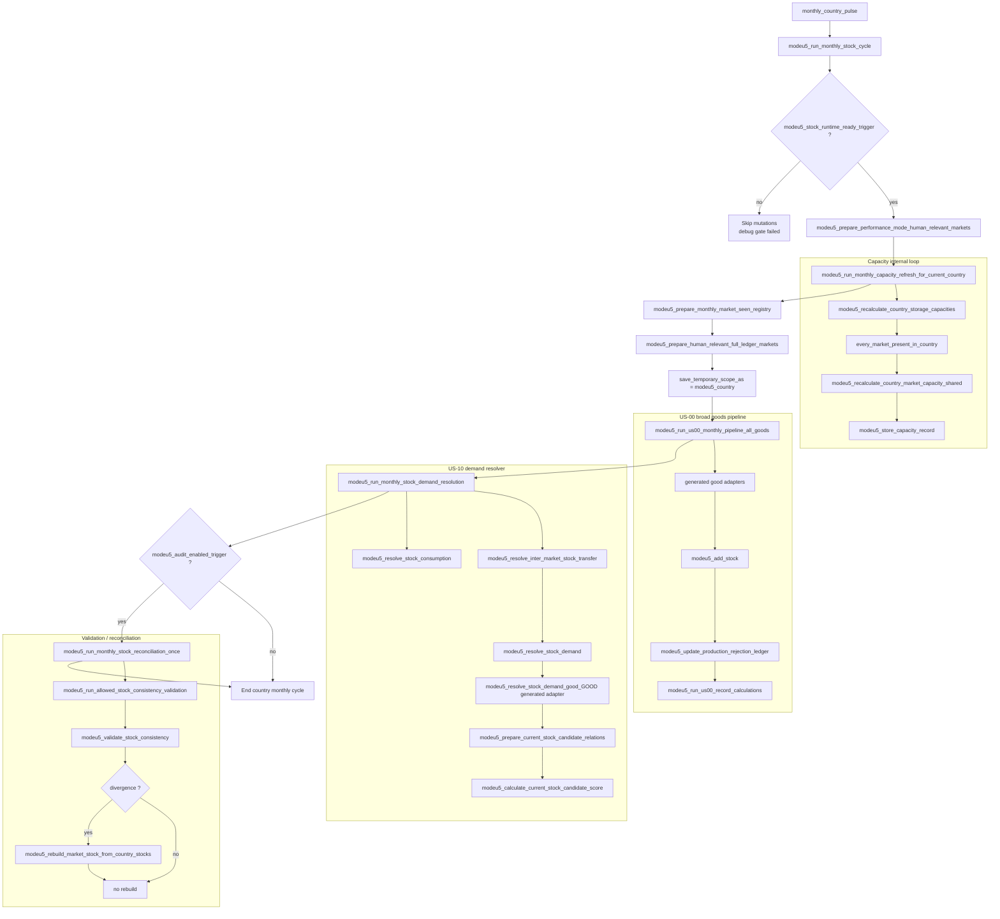
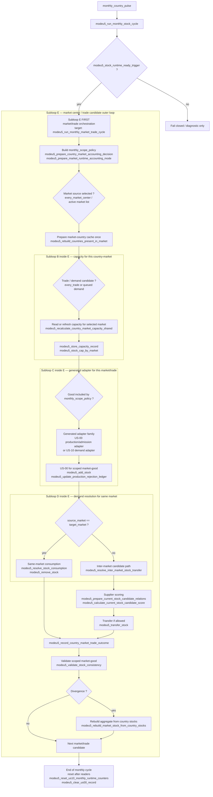
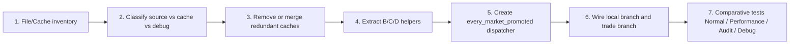

# Q5 — Global logical flow

## 1. Precision review of the “current state” diagram

The previous diagram was useful to discuss the **expected business process**, but it was too optimistic as a diagram of the current wiring. It mixed:

1. the callgraph actually visible in dispatchers;
2. business sub-loops required by the target design;
3. loops still to be confirmed (`every_trade`, `every_market_center`).

The concerning point is real: in the audited current wiring, `modeu5_run_monthly_stock_cycle` starts from the current country, launches a few global preparations, then calls broad pipelines (`modeu5_run_us00_monthly_pipeline_all_goods`, `modeu5_run_monthly_stock_demand_resolution`). The market/trade loop is not the explicit container for B/C/D. This makes scope auditing difficult and encourages File/Cache redundancy.

## 2. Mermaid diagram — current state corrected as observable callgraph



### What this current state means

| Finding | Why it is concerning | Refactor consequence |
|---|---|---|
| The current country is the visible outer loop | Markets/trades are not the main orchestration container | Hard to share B/C/D by market center |
| Capacity has its own `every_market_present_in_country` loop | Good input data, but it does not frame US-00/US-10 | Risk of redundant recalculation/cache glue |
| US-00 is called as an all-goods pipeline | Simple to call, but less clear for market/trade scope | Requires an explicit goods/market policy |
| US-10 is called after US-00 as a separate resolver | Same-market and inter-market are not structured under the same market loop | Makes `every_trade` / market supplier loops difficult to audit |
| Audit/reconciliation is a conditional end-of-cycle step | Correct for diagnostics, but not a process container | Must not compensate for suboptimal orchestration |

## 3. Mermaid diagram — initial conceptual target: Subloop E market/trade

Goal: as soon as `modeu5_stock_runtime_ready_trigger` passes, enter an E loop oriented toward **market/trade**. The old B, C, and D sub-loops become sub-loops inside E, making the owning scope of each cache explicit and reducing redundancy.

This Target E remains useful as an abstraction to understand the general objective. The **main target to implement first** is the promoted-market variant described in section 6; do not create two competing dispatchers.



## 4. Why this target is preferable

| Dimension | Current state | Target process |
|---|---|---|
| Outer loop | Current country + broad pipelines | Market/trade loop immediately after readiness gate |
| Cache owner visible | Scattered across capacity, performance, US-00, US-10 | Market/trade scope explicit before B/C/D |
| B capacity loop | Before pipelines, but not a container | Sub-loop of E for the relevant market |
| C goods loop | All-goods or broad active-goods pipeline | Sub-loop of E, filtered by policy and market/trade |
| D demand loop | Separate resolver after production | Sub-loop of E, with same-market/inter-market visible in one place |
| Reconciliation | End-of-cycle audit | Scoped market-good validation, localized rebuild |
| File/Cache refactor | Hard to know which cache is source at each step | Each sub-loop declares its source/cache records |

## 5. Technical index of diagram methods / loops

| Mermaid zone | Associated method, trigger, or loop | Main file | Audit comment |
|---|---|---|---|
| Current monthly orchestrator | `monthly_country_pulse` -> `modeu5_run_monthly_stock_cycle` | `in_game/common/on_action/modeu5_stock_on_actions.txt`, `in_game/common/scripted_effects/modeu5_stock_effects.txt` | Actual current entry point. |
| Runtime gate | `modeu5_stock_runtime_ready_trigger` | `in_game/common/scripted_triggers/modeu5_stock_triggers.txt` | Target keeps this gate before any mutation. |
| Current performance preparation | `modeu5_prepare_performance_mode_human_relevant_markets` / current equivalent | `modeu5_performance_effects.txt` | To be turned into an input of `monthly_scope_policy`, not business orchestration. |
| Current capacity | `modeu5_run_monthly_capacity_refresh_for_current_country`, `every_market_present_in_country` | `modeu5_capacity_effects.txt` | Becomes sub-loop B inside E. |
| Current monthly registries | `modeu5_prepare_monthly_market_seen_registry`, `modeu5_prepare_human_relevant_full_ledger_markets` | `modeu5_stock_effects.txt`, `modeu5_performance_effects.txt` | Should be driven by policy E. |
| Current US-00 | `modeu5_run_us00_monthly_pipeline_all_goods`, `modeu5_add_stock`, `modeu5_update_production_rejection_ledger` | `modeu5_void_economy_effects.txt` + generated adapters | Becomes market-good sub-loop C. |
| Current US-10 | `modeu5_run_monthly_stock_demand_resolution`, `modeu5_resolve_stock_consumption`, `modeu5_resolve_inter_market_stock_transfer` | `modeu5_stock_demand_resolver_effects.txt` | Becomes sub-loop D under market/trade. |
| Market countries cache | `modeu5_rebuild_countries_present_in_market`, `every_location_in_market`, `modeu5_countries_present_in_market` | `modeu5_market_country_cache_effects.txt` | To prepare once per market center in E. |
| Supplier scoring | `modeu5_prepare_current_stock_candidate_relations`, `modeu5_apply_current_stock_candidate_hard_filters`, `modeu5_calculate_current_stock_candidate_score` | `modeu5_stock_demand_resolver_effects.txt` | Remains in E after prefilter. |
| Validation/rebuild | `modeu5_validate_stock_consistency`, `modeu5_rebuild_market_stock_from_country_stocks` | `modeu5_stock_effects.txt` | Target: scoped market-good rather than global end-of-cycle. |
| New target dispatcher | `modeu5_run_monthly_promoted_market_cycle` | to create | Preferred name. `modeu5_run_monthly_market_trade_cycle` remains only an older conceptual name. |
| Iterators to confirm | `every_trade`, `every_market_center` | TECH-01 to complete before gameplay | Target shows them as desired design, not confirmed exposure. |


## 6. Main recommended target — market promotion then segregated loops

I think this variant is better as the **first concrete refactor** than the previous Target E, because it first relies on loops already close to the current code (`monthly_country_pulse`, `every_market_present_in_country`, market promotion), then cleanly separates **country/market/good** processing from **trade/inter-market** processing.


`every_market_promoted` is a diagram label for a ModeU5 work list built by the mod. It is not assumed to be a native EU5 engine exposure.

US-00 scoped market-good must produce and freeze the `produced / added / rejected / overproduction input` facts before the US-10 branch, decay, validation, or reconciliation. Late US-00 finalization must read only these frozen facts.

### Opinion on this variant

| Point | Opinion | Reason | Guardrail |
|---|---|---|---|
| `monthly_country_pulse` remains the entry point | Yes | Compatible with current wiring and existing on_actions | Keep readiness gate before any mutation |
| `every_market_present_in_country` in preparation | Yes | The right place to build country market lists and required caches | Do not recalculate per good |
| `countries_present_in_market` cache | Yes, priority | Gives the promoted market its country list once | Cache remains derived, never stock source |
| Performance: filtered `human_relevant_market` | Yes | Reduces scopes without changing business order | Normal mode must define the equivalent as all current-country markets, not all global markets |
| Market Promotion before US | Yes | Very good File/Cache pivot: following loops read promoted markets only | Document promotion criteria and fallback reasons |
| Separate `every_market_promoted` loop | Yes | Clarifies scope owner and avoids US-00/US-10 each scanning their own markets | Add a single helper to iterate promoted markets |
| Branch 2.1 countries/US-00/same-market | Yes | Separates local market-good from inter-market | Keep mutations through central operators only |
| Branch 2.2 `every_trade` / transfer | Yes as target | Correct conceptual separation for inter-market | Blocked until `every_trade` is confirmed in TECH-01; provide queued-demand fallback |
| Future non-good / market-focused US | Yes | Good location before goods/trade loops | Do not mix with per-good adapters |

### Recommended adjustment compared to the previous Target E

The previous Target E started from generic `market/trade` orchestration. This proposed variant is more operational:

```txt
monthly country
→ build/promote market set
→ every promoted market
  → local country/market/good branch
  → inter-market trade branch
```

I therefore recommend making this variant the **main target process** and keeping `modeu5_run_monthly_market_trade_cycle` only as a possible name for step 2, or choosing a more precise name:

```txt
modeu5_run_monthly_promoted_market_cycle
```

This name better describes the mechanism: we do not traverse all markets or all trades; we first traverse markets promoted by the File/Cache preparation.

## 7. Recommended refactor order



The order remains File/Cache first, because the promoted-market cycle will only be reliable if each sub-loop clearly knows which record is source of truth, which record is a derived cache, and which record exists only for debug/audit.
