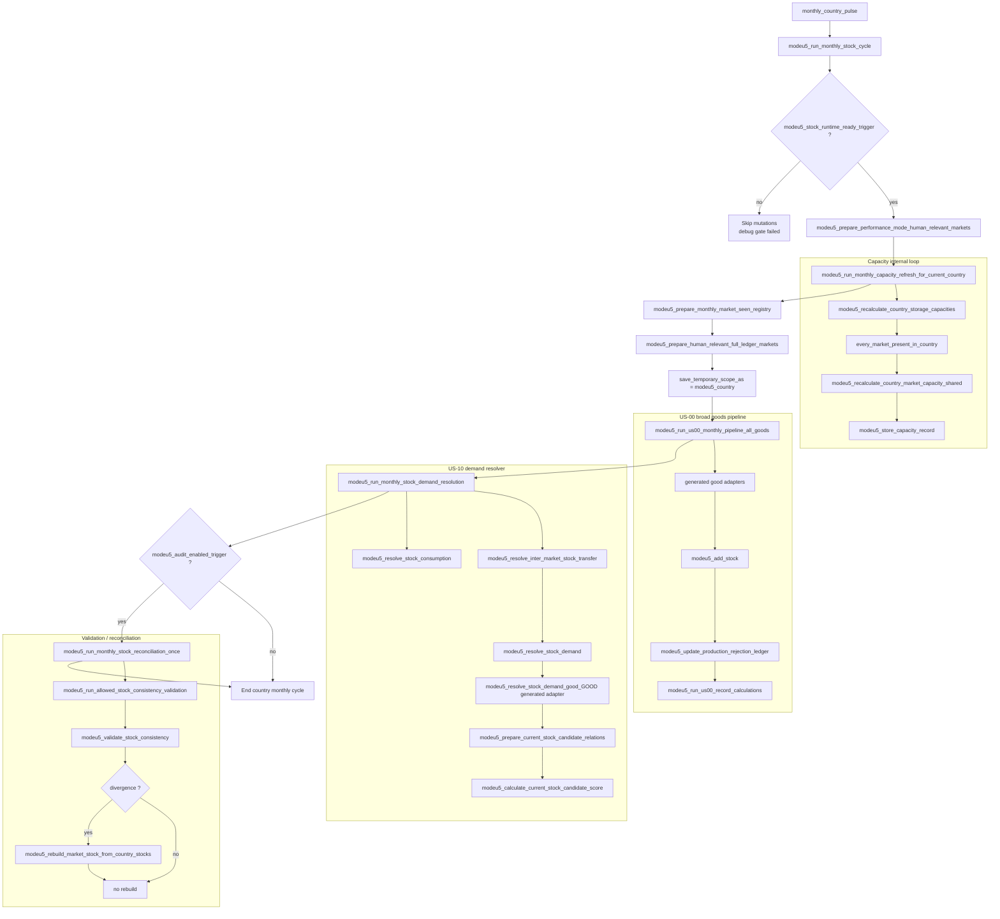
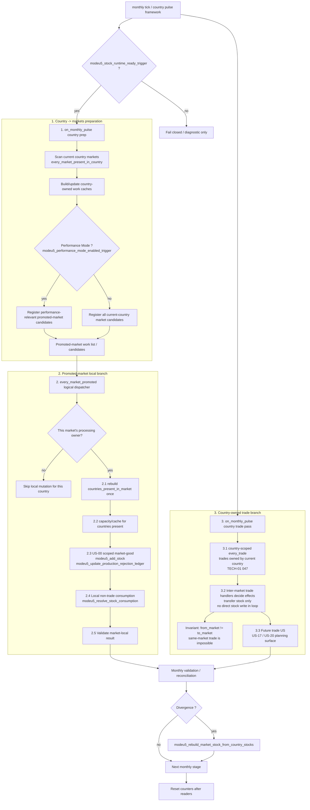
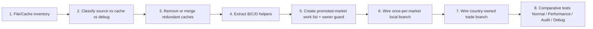

# Q5 — Global logical flow

## 1. Precision review of the “current state” diagram

The previous diagram was useful to discuss the **expected business process**, but it was too optimistic as a diagram of the current wiring. It mixed:

1. the callgraph actually visible in dispatchers;
2. business sub-loops required by the target design;
3. loops whose exact scope had to be confirmed before gameplay use (`every_trade`, `every_market_center_in_country`).

The TECH-01 consequence is important for the target design: `every_trade` is confirmed as a country-scope iterator, not as a market-scope iterator. The consequence is **not** to filter the trade loop down to the current promoted market. The safer target is one country-level trade pass that visits all trades for which the current country is the ModeU5 trade owner, so each trade is processed once and only once. Stock movement remains owned by the add/remove/transfer handlers; the trade pass is an orchestration surface, not a direct stock writer. The promoted-market local branch has a separate anti-duplication requirement: each promoted market must be locally processed once per month, either by a real promoted-market dispatcher or by a deterministic country owner guard if the implementation is still launched from country pulse. `every_market_center_in_country` is confirmed for market-center-owned scheduling, but Q5's current PR4/PR5 shell still builds the work list from `every_market_present_in_country`.

The concerning point is real: in the audited current wiring, `modeu5_run_monthly_stock_cycle` starts from the current country, launches a few global preparations, then calls broad pipelines (`modeu5_run_us00_monthly_pipeline_all_goods`, `modeu5_run_monthly_stock_demand_resolution`). The market/trade loop is not the explicit container for B/C/D. This makes scope auditing difficult and encourages File/Cache redundancy.

## 2. Mermaid diagram — current state corrected as observable callgraph



### What this current state means

| Finding | Why it is concerning | Refactor consequence |
|---|---|---|
| The current country is the visible outer loop | Markets/trades are not the main orchestration container | Country pulse should prepare country-owned work, but must not make every country execute the same market-owned local branch |
| Capacity has its own `every_market_present_in_country` loop | Good input data, but it does not frame US-00/US-10 | Risk of redundant recalculation/cache glue |
| US-00 is called as an all-goods pipeline | Simple to call, but less clear for market/trade scope | Requires an explicit goods/market policy |
| US-10 is called after US-00 as a separate resolver | Local non-trade consumption and inter-market trade transfer are not structured under explicit ownership phases | Local non-trade consumption should be once-per-promoted-market; vanilla trade work should be country-level, owner-gated, and inter-market only. |
| Audit/reconciliation is a conditional end-of-cycle step | Correct for diagnostics, but not a process container | Must not compensate for suboptimal orchestration |

## 6. Main recommended target — country prep, market-local branch, country trade pass

I recommend the target as **three ownership phases**, not as one monolithic country pulse that mutates everything:

```txt
on_monthly_pulse(country)
  1. Country -> markets preparation
     - build/update country-owned work caches
     - register promoted-market candidates
     - do not execute the full market-local branch for every country

every_market_promoted / promoted-market dispatcher
  2. Promoted-market local branch
     - process each promoted market once per month
     - if launched from country pulse, require a deterministic processing-owner guard
     - local US-00 / local non-trade consumption / validation are market-local, not repeated by all countries present

on_monthly_pulse(country)
  3. Country-owned trade branch
     - country-scoped every_trade
     - process trades owned by this country once
     - delegate add/remove/transfer stock consequences to handlers
```

This is closest to your second option. The only caveat is implementation: `every_market_promoted` is still a ModeU5 work-list/helper pattern, not a confirmed native engine iterator. Therefore PR4/PR5 may still be driven by country pulse while test-only, but the design contract must be equivalent to a once-per-promoted-market dispatcher. If the shell is launched from country scope, the promoted-market local branch needs a processing-owner guard so the same market is not processed by every country present in it.



`every_market_promoted` is a diagram label for a ModeU5 work list built by the mod. It is not assumed to be a native EU5 engine exposure. Its design meaning is **once per promoted market**, not “once per country that can see this market.”

The promoted-market local branch must have one of these two execution models:

| Execution model | Status | Guardrail |
|---|---|---|
| Real promoted-market dispatcher | Preferred target | Process each promoted market once, then run local B/C/D work. |
| Country-pulse-launched shell | Acceptable for PR4/PR5 tests and early implementation | Add a deterministic market processing-owner guard; non-owner countries may prepare/register candidates but must not run the market-local mutations. |

`every_trade` is different: TECH-01 confirms it as a country-scope iterator that enters trade scope. The target trade branch should run from the monthly country context and process all trades for which that country is the ModeU5 trade owner. It should **not** be narrowed to the currently promoted market. That avoids double accounting across countries while preserving visibility for future trade-oriented systems such as US-17 and US-20.

The trade loop must remain orchestration-only: stock consequences go through the existing transfer handlers and central stock operators. Vanilla trade is inter-market only: `from_market` and `to_market` are always distinct. Do not model `source_market == target_market` as a trade branch.

Same-market stock consumption remains a local non-trade demand/consumption path in the promoted-market local branch. It is not a vanilla trade case and must not be handled by the country trade-owner pass.

US-00 scoped market-good must produce and freeze the `produced / added / rejected / overproduction input` facts before local non-trade consumption, trade pass, decay, validation, or reconciliation. Late US-00 finalization must read only these frozen facts.

### Opinion on this variant

| Point | Opinion | Reason | Guardrail |
|---|---|---|---|
| `monthly_country_pulse` remains a required entry point | Yes | Compatible with current wiring and existing on_actions | Use it for country prep and country-owned trade, not for repeated market-local mutation |
| `every_market_present_in_country` in preparation | Yes | The right place to discover candidate markets and required caches | Discovery may happen per country; market-local mutation must not |
| `countries_present_in_market` cache | Yes, priority | Gives the promoted market its country list once | Cache remains derived/work state, never stock source |
| Performance: filtered `human_relevant_market` | Yes | Reduces promoted-market candidates without changing business order | Normal mode must define the equivalent as all current-country markets, not all global markets |
| Market promotion before local branch | Yes | Good File/Cache pivot before local B/C/D | Add processing-owner guard if country pulse launches the shell |
| Separate `every_market_promoted` local branch | Yes, as once-per-market logical dispatcher | Clarifies market-local scope and avoids US-00/US-10 each scanning independently | Do not run local branch once per country present in the market |
| Branch 2 local countries/US-00/local consumption | Yes | Separates market-local non-trade work from trade-owned inter-market work | Keep mutations through central operators only |
| Country-level `every_trade` pass | Yes as target, but only owner-gated | All trades deserve processing and future trade systems need a full pass | Process only trades owned by the current country to avoid double accounting; do not filter to promoted market; every vanilla trade is inter-market. |
| Future non-good / market-focused US | Yes | Good location before goods/trade loops | Attach to the phase whose ownership matches the feature |

This proposed variant is more operational:

```txt
monthly country pulse
→ country -> markets preparation only
→ register promoted-market candidates

promoted-market dispatcher / owner-guarded shell
→ every promoted market exactly once
  → market-local country/market/good branch
  → local validation

monthly country pulse
→ country-owned every_trade pass
  → every inter-market trade owned by current country
  → stock handlers decide add/remove/transfer consequences
  → future US-17 / US-20 hooks can attach here
```

I therefore recommend naming the two executable surfaces separately:

```txt
modeu5_run_monthly_promoted_market_cycle
modeu5_run_monthly_country_trade_owner_cycle
```

This names the two different mechanisms: promoted-market local work is driven by a once-per-market ModeU5 work list, while trade work is driven by a country-scoped ownership pass over all owned trades.

### Impact on the PR126 stacked PRs

| PR layer | Impact from TECH-01 row 047 and monthly ownership clarification | Action for the layer |
|---|---|---|
| PR1 — File/Cache inventory | Yes, audit/check impact only | Inventory scripts should classify `every_trade` as a confirmed **country-scope** iterator and flag raw market-scope usage as suspicious. Also flag future market-local mutation paths that can run once per country without an owner guard. |
| PR2 — Cache ownership plan | Yes, ownership wording | Keep `countries_present_in_market` as a promoted-market work cache; define how a promoted market gets a single processing owner if the dispatcher is country-pulse-launched. Trade ownership remains a separate country-level orchestration rule. |
| PR3 — Helper extraction B/C/D | Small interface guardrail | Do not expose a helper that implies market-scoped `every_trade`. Do not expose local B/C/D helpers that silently process the same promoted market for every country present. |
| PR4 — Promoted-market shell | Direct shell impact | The shell must distinguish candidate registration from once-per-promoted-market execution. If still country-launched, it needs an owner guard or equivalent test-only restriction. |
| PR5 — Local branch | Direct local-branch impact | PR5 remains local/test-only, but the contract must say the local branch represents a once-per-promoted-market execution surface, not a per-country repeated market mutation. |
| PR6 — Country-owned trade branch | Direct trade impact | This is the first layer that should run the country-scoped, owner-gated every_trade pass. It must treat vanilla trade as inter-market only and must not implement a source_market == target_market branch. |

## 7. Recommended refactor order



The order remains File/Cache first, because the promoted-market cycle and the country-owned trade pass will only be reliable if each sub-loop clearly knows which record is source of truth, which record is a derived cache, which record exists only for debug/audit, and which scope owns the right to execute mutations.

## 8. PR3 helper extraction contract

PR3 introduces the helper names needed by the future promoted-market shell while
leaving `modeu5_run_monthly_stock_cycle` semantically unchanged. These helpers
are delegation points only:

| Block | Helper | Delegates to | Notes |
|---|---|---|---|
| B | `modeu5_prepare_promoted_market_country_cache` | `modeu5_rebuild_countries_present_in_market` | Rebuilds the current target market's country work list; not durable storage and not stock proof. |
| B | `modeu5_prepare_promoted_country_market_capacity` | `modeu5_recalculate_country_market_capacity_from_prepared_pool_shared` | Refreshes one country-market capacity record from the cached country location pool and current market trade capacity. |
| B | `modeu5_prepare_promoted_market_capacity_cache` | B country cache + B country-market capacity helper | Convenience wrapper for every country present in one promoted market; must be called from a once-per-market owner surface when it becomes stock-affecting. |
| C | `modeu5_run_scoped_us00_market_good` | generated `modeu5_process_us00_monthly_market_good_<good>` | Future local branch entry point; not called by the current dispatcher in PR3. |
| C | `modeu5_probe_scoped_us00_market_good_bridge` | generated `modeu5_probe_us00_previous_record_activity_good_<good>` | Non-mutating probe surface for tests. |
| C/D | `modeu5_run_scoped_us10_monthly_market_good` | generated `modeu5_process_us10_monthly_market_good_<good>` | Processes one scoped queued same-market consumption request. |
| D | `modeu5_resolve_scoped_same_market_consumption` | `modeu5_resolve_stock_consumption` | Same-market consumption remains non-trade and delegates stock removal to central operators. |
| D | `modeu5_handoff_scoped_inter_market_transfer` | `modeu5_resolve_inter_market_stock_transfer` | The canonical resolver still owns the `source_market == target_market` guard and central transfer call. |

The PR3 helpers must not be interpreted as an activated promoted-market
dispatcher. PR4 remains responsible for creating the disabled/test-only
promoted-market shell and its once-per-market owner guard.

## 9. PR4 promoted-market shell contract

PR4 introduces the explicit work-list pattern that replaces the conceptual
`every_market_promoted` loop. There is still no native EU5 iterator by that
name and the live monthly dispatcher remains unchanged in this PR.

| Layer | Helper / state | Role | Notes |
|---|---|---|---|
| Shell prep | `modeu5_prepare_promoted_market_work_list_for_current_country` | Builds candidate promoted-market entries from `every_market_present_in_country`. | Normal mode promotes all current-country markets; Performance mode keeps only markets in `modeu5_performance_relevant_markets`. Candidate registration may happen per country. |
| Work list | `modeu5_promoted_markets_this_cycle` | Current-cycle market targets for the future promoted-market dispatcher. | Rebuilt work cache only; not durable storage and not proof of stock/capacity readiness. |
| Processing owner | `modeu5_promoted_market_processing_owner` / equivalent guard | Ensures one country-owned launch cannot make every country present execute the same market-local branch. | Required before local market mutation is generalized beyond controlled probes. |
| Shell loop | `modeu5_run_monthly_promoted_market_cycle` | Iterates promoted-market work and records shell iteration metrics. | Test-only in PR4; B/C/D business work is wired by later PR126 layers. |
| Observability | `modeu5_promoted_market_*` counters | Candidate, promoted, rejected, owner-skip, and shell-iteration counts. | Debug metrics only; they must not drive stock mutation. |

PR4 deliberately keeps `modeu5_promoted_markets_this_cycle` separate from
`modeu5_detailed_accounting_promoted_markets`. The former answers "which
markets should this cycle consider?", while the latter answers "has this market
completed detailed-accounting promotion?". Stock-affecting PRs must still check
promotion readiness before using detailed country-market records.

## 10. PR5 promoted-market local branch contract

PR5 wires a controlled local branch under the promoted-market shell. It still
does not replace `modeu5_run_monthly_stock_cycle`; it proves that the shell can
drive one promoted market-good through the intended local order:

```txt
modeu5_run_monthly_promoted_market_cycle
  -> modeu5_promoted_markets_this_cycle
  -> processing-owner guard for the promoted market
  -> modeu5_run_promoted_market_local_branch_market_good
      -> B rebuild countries_present_in_market once for the promoted market
      -> B refresh country-market capacities for countries present in that market
      -> C run scoped US-00 generated-good bridge
      -> D run scoped same-market US-10 generated-good bridge
      -> validate scoped market-good consistency from the prepared country cache
```

The PR5 debug probe deliberately satisfies the US-10 request from the current
country's own stock. This exercises the same-market consumption fast path and
keeps the controlled test from using a broad supplier candidate fallback. The
generated US-10 resolver still owns its internal candidate scan for cases where
own stock cannot satisfy the request; that remaining narrowing belongs to a
later PR126 layer, not to PR5.

The local-branch contract is **once per promoted market**. If the implementation
is still launched from country pulse, non-owner countries may register or refresh
candidate data, but they must not execute the market-local mutation branch for
the same promoted market.

The probe validates the observable order with metrics:

| Metric | Expected in PR5 probe | Meaning |
|---|---:|---|
| `modeu5_promoted_market_local_branch_country_cache_rebuilds` | 1 | The local branch prepared the market-country cache once. |
| `modeu5_promoted_market_local_branch_capacity_country_count` | `> 0` | At least one country-market capacity record was refreshed. |
| `modeu5_promoted_market_local_branch_us00_calls` | 1 | The scoped US-00 generated-good bridge ran before consumption. |
| `modeu5_promoted_market_local_branch_us10_calls` | 1 | The scoped same-market US-10 bridge ran after US-00. |
| `modeu5_promoted_market_local_branch_validation_calls` | 1 | The market-good consistency check ran after US-10. |
| `modeu5_promoted_market_local_branch_validation_failures` | 0 | The market aggregate remained reconcilable from country stocks. |

Known PR5 boundary:

- live monthly dispatch remains unchanged;
- the test covers one promoted market and one good (`wheat`);
- inter-market trade branch wiring remains deferred;
- US-10 supplier-candidate internals may still rebuild their own candidate
  cache when own stock cannot satisfy the request;
- PR5 establishes the outer local branch, owner-guard expectation, and scoped
  validation shape for the next stacked PR, not the final optimized monthly cycle.
