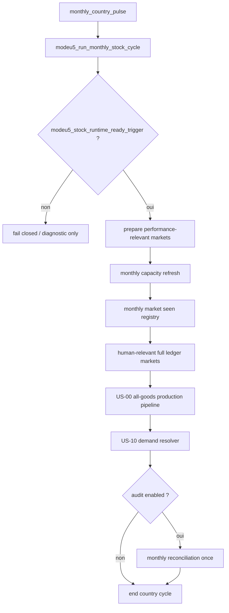
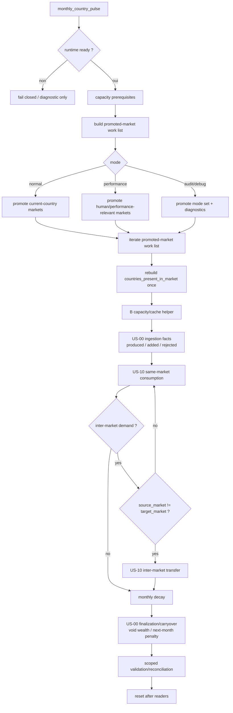
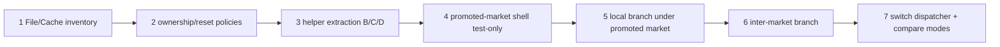

# Q5 — Flux logique global

## 1. Diagnostic current state

Le câblage mensuel actuel reste un **country-pulse broad-flow**. Il fonctionne comme point d'entrée stable, mais il ne donne pas encore à US-00, US-10, validation et debug un conteneur commun par marché promu.



### Lecture du current state

| Constat | Impact pour agent | Refactor attendu |
|---|---|---|
| Le pays courant est l'outer loop visible | Le scope market/trade n'est pas propriétaire du cycle | Construire une work-list de marchés promus |
| La capacité est refresh avant US-00/US-10 | Bon ordre économique, mais pas encore conteneur | Garder comme prérequis B |
| US-00 reste all-goods / broad pipeline | Risque de scan et de cache owner implicite | Brancher sous promoted-market/good |
| US-10 reste resolver séparé | Same-market et inter-market sont lisibles mais pas orchestrés ensemble | Séparer local branch et trade branch sous le marché promu |
| Reconciliation est une fin de cycle audit | Utile pour diagnostics, dangereux comme compensation permanente | Valider scoped market-good puis rebuild ciblé |

## 2. Workflow cible canonique

Le workflow cible est **promoted-market driven**. `every_market_promoted` est un label de diagramme : l'implémentation doit utiliser une work-list ModeU5, pas supposer un itérateur moteur natif.



## 3. US-00 split obligatoire

US-00 doit être lu comme deux étapes différentes.

| Étape | Moment | Inputs | Outputs | Règle |
|---|---|---|---|---|
| US-00 ingestion facts | Immédiatement après production/admission | production vanilla/fallback, `modeu5_add_stock` result | produced, added, rejected, overproduction inputs | Figer avant US-10, transfer, decay, validation |
| US-00 finalization/carryover | Après readers métier, avant reset | facts US-00 figés, prix/fallbacks, buffer | void wealth, taxable proxy, next-month penalty | Ne pas recalculer depuis stock post-decay |

Cette séparation évite la double pénalisation : le decay réduit le stock restant, mais ne doit pas changer rétroactivement le taux de surproduction du mois.

## 4. Mapping des boucles cibles

| Couche | Propriétaire | Fichier principal | Entrées | Sorties |
|---|---|---|---|---|
| A readiness | stock runtime | `modeu5_stock_effects.txt`, triggers | CORE-02 schema/init | fail-closed ou cycle autorisé |
| B capacity prerequisite | capacity | `modeu5_capacity_effects.txt` | pays, marchés présents | `modeu5_stock_cap_by_market` |
| C promoted-market selection | performance | `modeu5_performance_effects.txt` | mode, human relevance, active markets | work-list marchés promus |
| D market-country cache | market-country cache | `modeu5_market_country_cache_effects.txt` | promoted market | `countries_present_in_market` |
| E US-00 ingestion | void economy | `modeu5_void_economy_effects.txt`, adapters | production/admission | facts figés |
| F same-market consumption | demand resolver | `modeu5_stock_demand_resolver_effects.txt` | stock accessible même marché | consumption ledgers |
| G inter-market transfer | demand resolver | `modeu5_stock_demand_resolver_effects.txt` | source != target | transfer ledgers |
| H decay | stock core | `modeu5_stock_effects.txt` | stock restant | stock décayé |
| I US-00 finalization | void economy | `modeu5_void_economy_effects.txt` | facts figés | void wealth / penalty N+1 |
| J validation/reconciliation | stock core | `modeu5_stock_effects.txt` | country stock, market aggregate | consistency / rebuild aggregate |
| K reset | domain owners | US-00, US-10, debug | monthly readers complete | counters cleared |

## 5. Ordre de refactor recommandé



## 6. Questions de contrôle avant code

```txt
1. Quel est le scope propriétaire de cette étape ?
2. Le record lu est-il source, cache dérivé, work cache, ledger ou debug ?
3. Le marché est-il seulement découvert ou explicitement promu ?
4. Le good est-il supporté, produit dans ce marché, ou actif après filtre ?
5. La modification ajoute-t-elle un scan large mensuel ?
6. Les facts US-00 sont-ils protégés contre un recalcul post-decay ?
7. L'implémentation dépend-elle d'un iterator/scope link TECH-01 non confirmé ?
```
