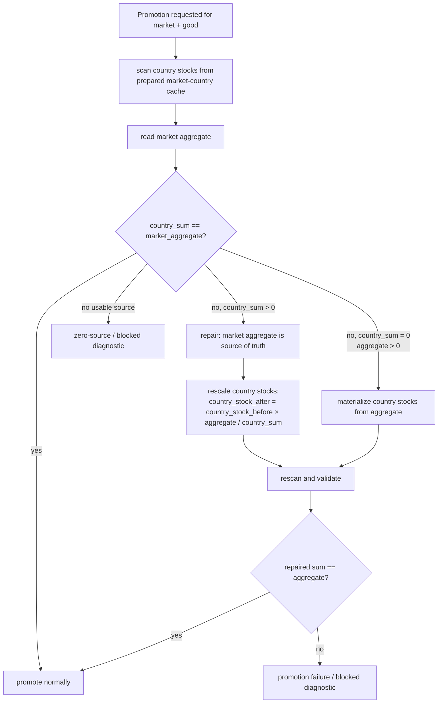
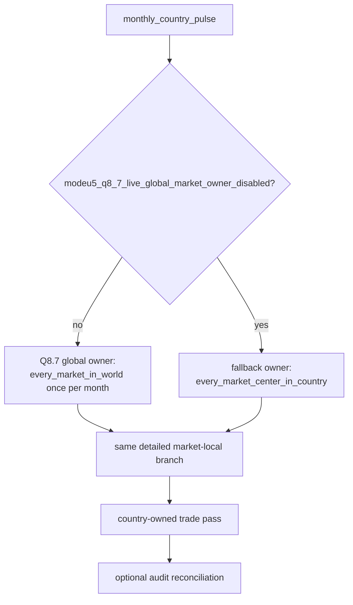
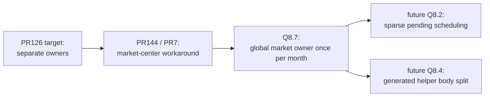

# Q5 — Global logical flow

## 1. Scope

Q5 documents the global monthly ownership model for ModeU5 stock work.

The important part of this file is the Mermaid flow. The diagram is the process contract: it must show which loop owns each mutation surface.

Current post-Q8.7 rule:

```txt
monthly country pulse
  -> country-owned preparation
  -> once-per-month global market-local owner
  -> country-owned trade pass
  -> optional audit reconciliation
```

The Q5 invariant is not “everything starts from country pulse”. The invariant is:

```txt
- country pulse may discover/prep work;
- market-local stock mutation must run once per market;
- trade remains country-owned because every_trade is country-scope;
- audit validates after business work and must not be the normal process owner.
```

## 2. Current executable flow after Q8.7

```mermaid
flowchart TB
    %% Q5 current executable process after Q8.7.
    %% Do not flatten subgraphs: loop nesting is the ownership contract.

    subgraph COUNTRY["Engine loop: monthly_country_pulse / current country"]
        direction TB
        A["monthly_country_pulse"] --> B["modeu5_run_monthly_stock_cycle_q8_7_owner_switch"]
        B --> SW{"fallback variable present?<br/>modeu5_q8_7_live_global_market_owner_disabled"}
        SW -->|yes| OLD["old fallback owner:<br/>modeu5_run_monthly_promoted_market_local_cycle"]
        SW -->|no| C["modeu5_run_monthly_stock_cycle"]

        C --> READY{"runtime ready?"}
        READY -->|no| CLOSED["fail closed / diagnostics only"]
        READY -->|yes| PREP0["prepare performance human-relevant markets"]
        PREP0 --> PREP1["refresh current-country capacities"]
        PREP1 --> PREP2["prepare monthly market-seen registry"]
        PREP2 --> PREP3["prepare human-relevant full-ledger markets"]
        PREP3 --> MARKET_OWNER["modeu5_run_monthly_q8_7_global_market_local_cycle_once"]

        subgraph COUNTRY_PREP["Country-owned preparation"]
            direction TB
            PREP1 --> CM0["every_market_present_in_country"]
            CM0 --> CM1["recalculate country-market capacity"]
            CM1 --> CM2["store capacity/cache records"]
        end

        MARKET_OWNER --> STAMP{"global market-local pass<br/>already run this month?"}
        STAMP -->|yes| SKIP["record Q8.7 skip counter"]
        STAMP -->|no| WORLD["every_market_in_world"]

        subgraph MARKET_LOOP["Market-local owner: once per world market per month"]
            direction TB
            WORLD --> M0["save market scope"]
            M0 --> M1["prepare market runtime accounting mode"]
            M1 --> M2{"runtime mode"}
            M2 -->|detailed| LOCAL["modeu5_run_promoted_market_live_local_branch_market_all_goods"]
            M2 -->|vanilla fallback| MF["record fallback<br/>no ModeU5 stock mutation"]
            M2 -->|blocked| MB["record blocked"]
        end

        subgraph LOCAL_DETAIL["Detailed market-local branch"]
            direction TB
            LOCAL --> L0["rebuild countries_present_in_market once"]
            L0 --> L1["for each present country:<br/>refresh country-market capacity"]
            L1 --> L2["for each present country:<br/>US-00 active-good dispatcher"]
            L2 --> L3{"active good or previous state?"}
            L3 -->|yes| L4["run heavy US-00 generated helper"]
            L3 -->|no| L5["skip heavy US-00 helper"]
            L4 --> L6["US-00 admission facts frozen"]
            L5 --> L6
            L6 --> L7["for each present country:<br/>US-10 pending-good dispatcher"]
            L7 --> L8{"pending same-market request?"}
            L8 -->|yes| L9["run heavy US-10 generated helper"]
            L8 -->|no| L10["skip heavy US-10 helper"]
            L9 --> L11["same-market consumption processed"]
            L10 --> L11
            L11 --> L12["record local market processed"]
        end

        OLD --> TRADE0
        SKIP --> TRADE0
        L12 --> TRADE0["modeu5_run_monthly_country_trade_owner_cycle"]
        MF --> TRADE0
        MB --> TRADE0

        subgraph TRADE["Country-owned trade branch"]
            direction TB
            TRADE0 --> T1["every_trade from country scope"]
            T1 --> T2["trade owner / current country"]
            T2 --> T3["inter-market trade only<br/>from_market != to_market"]
            T3 --> T4["delegate effects to stock handlers"]
        end

        T4 --> AUDIT{"audit enabled?"}
        AUDIT -->|yes| R1["monthly reconciliation / validation"]
        AUDIT -->|no| END["end country monthly cycle"]
        R1 --> END
    end
```



## 3. Promotion / migration repair sub-flow

Promotion sits inside `prepare market runtime accounting mode`. Its job is not merely to set a marker. It must ensure the detailed country ledger can be trusted before the market is marked promoted.

The business rule is now expressed as **different**, not only “overmaterialized”.



This protects both directions:

```txt
country_sum > market_aggregate  -> rebuild country ledger downward
country_sum < market_aggregate  -> rebuild/materialize country ledger upward
country_sum = market_aggregate  -> no repair
```

The aggregate is the cap/source of truth for the promotion exception. The country ledger must not inflate the aggregate during this path.

## 4. Fallback flow retained

The old owner remains available for comparison and rollback.



The fallback path is only an owner-shape fallback. It must not change the business branch internals.

## 5. Q5 ownership rules

| Surface | Owner after Q8.7 | Rule |
|---|---|---|
| Country capacity prep | Current country pulse | Prepare capacity/cache records for the current country. |
| Human-relevant market preparation | Country/world prep helpers | Performance Mode chooses market relevance, not human-only execution. |
| Market-local mutation | Q8.7 global market owner | Run once per market per month. |
| US-00 | Inside detailed market-local branch | All present-country US-00 passes complete before any US-10 pass. |
| US-10 same-market consumption | Inside detailed market-local branch | Non-trade, same-market stock consumption only. |
| Trade | Country-owned pass | `every_trade` stays country-scope; do not call it from market scope. |
| Audit / reconciliation | End-of-cycle validation | Detect/repair drift; do not rely on it as normal orchestration. |

## 6. Refactor reading

The historical PR126 target was:

```txt
country prep
  -> promoted-market local branch once per promoted market
  -> country-owned trade pass
```

Q8.7 is the live implementation of that target, with `every_market_in_world` and a monthly stamp guard replacing the earlier market-center workaround.



## 7. Validation reading

A clean Q5/Q8.7 validation should show:

```txt
- one Q8.7 global owner run per month;
- later country pulses skip the market-local owner;
- detailed/fallback/blocked market counts are explicit;
- US-00 active-good country passes precede US-10 pending-good country passes;
- country-owned trade pass still runs after market-local work;
- no market-scope every_trade path exists;
- promotion mismatch repair logs explain any current-save migration repair;
- final stock validation remains clean.
```
