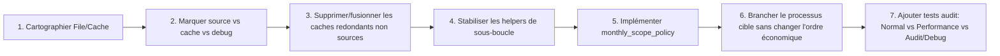

# Q5 — Vue d'ensemble du flux logique

## Diagramme Mermaid — situation actuelle auditée

```mermaid
flowchart TD
    A[Launcher / playset] --> B[Core requis + packages optionnels chargés]
    B --> C[CMM pré-campagne<br/>modeu5_refresh_nve_main_mode_from_cmm_country_scope<br/>modeu5_refresh_configuration_from_cmm_country_scope]
    C --> D[on_game_start<br/>modeu5_initialize_configuration_state_effect]
    D --> E{CORE-02 schema prêt ?}
    E -->|non| FAIL[Fail-closed: diagnostic-only, aucune mutation stock]
    E -->|oui| INIT[Init / réparation initiale<br/>modeu5_start_game_stock_initialization_dispatcher<br/>modeu5_rebuild_and_refresh_country_storage_capacities]

    INIT --> MODE{Politique d'exécution}
    MODE -->|Normal| NORMAL[Normal<br/>modeu5_enter_normal_runtime_mode]
    MODE -->|Performance| PERF[Performance<br/>modeu5_enter_nve_performance_mode<br/>modeu5_prepare_performance_mode_human_relevant_markets]
    MODE -->|Audit| AUDIT[Audit<br/>modeu5_enter_audit_runtime_mode<br/>modeu5_run_monthly_stock_reconciliation_once]
    MODE -->|Debug| DEBUG[Debug<br/>modeu5_enter_debug_runtime_mode<br/>modeu5_debug_capture_*]

    NORMAL --> POLICY[Construire monthly_scope_policy<br/>modeu5_prepare_country_market_accounting_decision<br/>modeu5_prepare_stock_mutation_accounting_mode<br/>modeu5_prepare_market_runtime_accounting_mode]
    PERF --> POLICY
    AUDIT --> POLICY
    DEBUG --> POLICY

    POLICY --> MONTH[monthly_country_pulse<br/>modeu5_run_monthly_stock_cycle]

    subgraph MC[Subloop A — pays courant]
        MONTH --> COUNTRY[current country]
        COUNTRY --> READY{modeu5_stock_runtime_ready_trigger ?}
        READY -->|non| DIAG[debug gate failed, skip mutations]
        READY -->|oui| CAPACITY[1. Refresh capacité<br/>modeu5_run_monthly_capacity_refresh_for_current_country]
    end

    subgraph CM[Subloop B — country -> every_market_present_in_country]
        CAPACITY --> MKTS[every_market_present_in_country<br/>modeu5_recalculate_country_storage_capacities<br/>modeu5_add_country_present_markets_to_performance_relevant_list]
        MKTS --> CAPREC[Réécrire capacité<br/>modeu5_recalculate_country_market_capacity_shared<br/>modeu5_store_capacity_record]
        CAPREC --> SEEN[Préparer registres mensuels<br/>modeu5_prepare_monthly_market_seen_registry<br/>modeu5_prepare_human_relevant_full_ledger_markets]
    end

    subgraph GOODS[Subloop C — goods adapters]
        SEEN --> GOODSCOPE{Good inclus par monthly_scope_policy ?}
        GOODSCOPE -->|Normal/Audit/Debug| ALLGOODS[Tous goods supportés<br/>modeu5_run_us00_monthly_pipeline_all_goods]
        GOODSCOPE -->|Performance| ACTIVEGOODS[Goods actifs / marchés actifs<br/>modeu5_GOOD_active_markets<br/>modeu5_active_markets_any_good]
        ALLGOODS --> US00[2-8 US-00 pipeline<br/>modeu5_run_us00_monthly_pipeline_all_goods<br/>modeu5_add_stock<br/>modeu5_update_production_rejection_ledger]
        ACTIVEGOODS --> US00
    end

    subgraph DEMAND[Subloop D — demandes même marché]
        US00 --> DEMANDREQ[US-10.1 demandes<br/>modeu5_run_monthly_stock_demand_resolution<br/>modeu5_queue_monthly_stock_consumption]
        DEMANDREQ --> SAME{source_market == target_market ?}
        SAME -->|oui| CONSUME[Résolution same-market<br/>modeu5_resolve_stock_consumption<br/>modeu5_resolve_pop_stock_consumption<br/>modeu5_remove_stock]
        SAME -->|non| TRADEPREP[Passer au flux inter-market]
    end

    subgraph TRADE[Subloop E — inter-market / every_trade candidat]
        TRADEPREP --> TRADEITER[Pour chaque demande inter-market<br/>modeu5_resolve_inter_market_stock_transfer]
        TRADEITER --> CENTER{every_market_center / marché source candidat<br/>exposure TECH-01 à confirmer}
        CENTER --> PREFILTER[Préfiltre<br/>modeu5_GOOD_market_stock<br/>modeu5_active_markets_any_good<br/>sparse supplier cache]
        PREFILTER --> SUPPLIERS[Rebuild/lecture fournisseurs<br/>modeu5_rebuild_countries_present_in_market<br/>modeu5_countries_present_in_market]
        SUPPLIERS --> SCORE[Scoring candidats<br/>modeu5_prepare_current_stock_candidate_relations<br/>modeu5_apply_current_stock_candidate_hard_filters<br/>modeu5_calculate_current_stock_candidate_score]
        SCORE --> TRANSFER[Transfert stock<br/>modeu5_transfer_stock]
        TRANSFER --> TRADELEDGER[US-10.2 outcome<br/>modeu5_record_country_market_trade_outcome]
    end

    CONSUME --> POSTDEMAND[US-10.3 outcomes<br/>modeu5_record_pop_demand_outcome<br/>modeu5_record_country_market_consumption_outcome]
    TRADELEDGER --> POSTDEMAND

    subgraph END[Fin de boucle mensuelle]
        POSTDEMAND --> DECAY[12. Decay<br/>modeu5_decay_stock]
        DECAY --> VOID[13-15 US-00 calculs<br/>modeu5_run_us00_record_calculations<br/>modeu5_calculate_us00_overproduction_ratio<br/>modeu5_calculate_us00_void_wealth<br/>modeu5_calculate_us00_production_penalty]
        VOID --> OPTIONAL{Package Rebalance Economy chargé ?}
        OPTIONAL -->|oui| ECON[16-17 US-05 / debug économie optionnelle]
        OPTIONAL -->|non| VALIDATE
        ECON --> VALIDATE[18. Validation stock<br/>modeu5_validate_stock_consistency<br/>modeu5_run_allowed_stock_consistency_validation]
        VALIDATE --> RECONCILE{Audit mensuel ou divergence ?}
        RECONCILE -->|oui| REBUILD[Rebuild agrégat marché<br/>modeu5_rebuild_market_stock_from_country_stocks]
        RECONCILE -->|non| RESET[19. Reset compteurs<br/>modeu5_reset_us10_monthly_runtime_counters<br/>modeu5_clear_us00_record]
        REBUILD --> RESET
        RESET --> YEARLY[Boucle annuelle<br/>modeu5_run_four_yearly_stock_reconciliation_once<br/>modeu5_validate_active_stock_consistency]
    end
```

## Index technique des méthodes / boucles du diagramme

| Zone Mermaid | Méthode, trigger ou boucle associé | Fichier principal | Commentaire audit |
|---|---|---|---|
| `on_game_start` configuration | `modeu5_initialize_configuration_state_effect` | `in_game/common/scripted_effects/modeu5_configuration_effects.txt` | Initialise les modes runtime et les réglages CMM script-safe. |
| Initialisation stock | `modeu5_start_game_stock_initialization_dispatcher` | `in_game/common/scripted_effects/modeu5_stock_effects.txt` | Point d'entrée CORE-02 avant toute mutation mensuelle. |
| Mode Normal | `modeu5_enter_normal_runtime_mode` | `modeu5_configuration_effects.txt` | Définit la policy sans réduction performance. |
| Mode Performance | `modeu5_enter_nve_performance_mode`, `modeu5_prepare_performance_mode_human_relevant_markets` | `modeu5_configuration_effects.txt`, `modeu5_performance_effects.txt` | Réduit les scopes, mais ne change pas l'ordre économique. |
| Mode Audit | `modeu5_enter_audit_runtime_mode`, `modeu5_run_monthly_stock_reconciliation_once` | `modeu5_configuration_effects.txt`, `modeu5_stock_effects.txt` | Ajoute la validation/réconciliation mensuelle. |
| Mode Debug | `modeu5_enter_debug_runtime_mode`, `modeu5_debug_capture_*` | `modeu5_configuration_effects.txt`, `modeu5_debug_effects.txt` | Ajoute les captures de diagnostic. |
| Boucle mensuelle | `monthly_country_pulse` -> `modeu5_run_monthly_stock_cycle` | `in_game/common/on_action/modeu5_stock_on_actions.txt`, `modeu5_stock_effects.txt` | Orchestrateur de la boucle canonique. |
| Gate runtime | `modeu5_stock_runtime_ready_trigger` | `in_game/common/scripted_triggers/modeu5_stock_triggers.txt` | Fail-closed si le schéma/init n'est pas prêt. |
| Refresh capacité | `modeu5_run_monthly_capacity_refresh_for_current_country` | `modeu5_capacity_effects.txt` | Première étape mensuelle, avant admission/demande/decay. |
| Boucle marchés du pays | `every_market_present_in_country` | `modeu5_capacity_effects.txt`, `modeu5_performance_effects.txt` | Base de capacité et human-relevant markets. |
| Ecriture capacité | `modeu5_recalculate_country_market_capacity_shared`, `modeu5_store_capacity_record` | `modeu5_capacity_effects.txt` | Réécrit le record partagé pays-marché. |
| Registre mensuel | `modeu5_prepare_monthly_market_seen_registry`, `modeu5_mark_monthly_market_seen` | `modeu5_stock_effects.txt` | Evite les doubles traitements par marché vu. |
| Policy accounting | `modeu5_prepare_country_market_accounting_decision`, `modeu5_prepare_stock_mutation_accounting_mode`, `modeu5_prepare_market_runtime_accounting_mode` | `modeu5_configuration_effects.txt` | Décide full/minimal/human-relevant accounting. |
| Pipeline US-00 | `modeu5_run_us00_monthly_pipeline_all_goods`, `modeu5_update_production_rejection_ledger` | `modeu5_void_economy_effects.txt` + adapters générés | Production, add stock, ledger produced/added/rejected. |
| Mutation stock | `modeu5_add_stock`, `modeu5_remove_stock`, `modeu5_transfer_stock`, `modeu5_decay_stock` | `modeu5_stock_effects.txt` | Seuls opérateurs autorisés pour muter le stock. |
| Demande same-market | `modeu5_run_monthly_stock_demand_resolution`, `modeu5_resolve_stock_consumption`, `modeu5_resolve_pop_stock_consumption` | `modeu5_stock_demand_resolver_effects.txt` | Consommation locale, pas commerce intra-marché. |
| Transfert inter-market | `modeu5_resolve_inter_market_stock_transfer` | `modeu5_stock_demand_resolver_effects.txt` | Déclenché seulement si source et target market diffèrent. |
| Cache pays du marché | `modeu5_rebuild_countries_present_in_market`, `every_location_in_market`, `modeu5_countries_present_in_market` | `modeu5_market_country_cache_effects.txt` | Work cache reconstruit depuis les locations du marché. |
| Scoring candidat US-10 | `modeu5_prepare_current_stock_candidate_relations`, `modeu5_apply_current_stock_candidate_hard_filters`, `modeu5_calculate_current_stock_candidate_score` | `modeu5_stock_demand_resolver_effects.txt` | Classe et exclut les fournisseurs avant transfert. |
| Outcomes US-10 | `modeu5_record_pop_demand_outcome`, `modeu5_record_country_market_consumption_outcome`, `modeu5_record_country_market_trade_outcome` | `modeu5_stock_demand_resolver_effects.txt` | Enregistre requested/satisfied/transferred/unsatisfied. |
| Calculs US-00 finaux | `modeu5_run_us00_record_calculations`, `modeu5_calculate_us00_overproduction_ratio`, `modeu5_calculate_us00_void_wealth`, `modeu5_calculate_us00_production_penalty` | `modeu5_void_economy_effects.txt` | Ratios, void wealth, pénalité N+1. |
| Validation/rebuild | `modeu5_validate_stock_consistency`, `modeu5_rebuild_market_stock_from_country_stocks`, `modeu5_run_allowed_stock_consistency_validation` | `modeu5_stock_effects.txt` | Rebuild uniquement depuis les country stocks. |
| Réconciliation périodique | `modeu5_run_monthly_stock_reconciliation_once`, `modeu5_run_four_yearly_stock_reconciliation_once` | `modeu5_stock_effects.txt` | Audit mensuel ou validation périodique active. |
| Reset compteurs | `modeu5_reset_us10_monthly_runtime_counters`, `modeu5_clear_us00_record` | `modeu5_stock_demand_resolver_effects.txt`, `modeu5_void_economy_effects.txt` | Après que les consommateurs mensuels ont lu les compteurs. |
| Itérateurs à confirmer | `every_trade`, `every_market_center` | TECH-01 à compléter avant gameplay | Le Mermaid les montre comme sous-boucle cible/audit, pas comme exposition confirmée. |

## Point important pour la revue

Les modes `Normal`, `Performance`, `Audit` et `Debug` ne devraient pas définir quatre processus économiques différents. Ils alimentent une même boucle mensuelle canonique, mais changent la **policy de scope** appliquée aux sous-boucles :

| Mode | Même ordre mensuel ? | Ce qui change dans les sous-boucles | Étapes sautées ? |
|---|---|---|---|
| Normal | Oui | Parcours le plus complet autorisé par les dispatchers | Non, sauf fallback moteur explicite |
| Performance | Oui | Réduit les marchés/goods/candidats via listes pertinentes, active markets et sparse supplier cache | Ne doit pas sauter une étape économique ; il peut limiter les scopes non pertinents |
| Audit | Oui | Ajoute ou force les validations/réconciliations et conserve davantage de ledgers | Non |
| Debug | Oui | Ajoute les captures `modeu5_debug_last_*` et dumps tests | Non |

## Sous-boucles à préserver pendant le refactor

| Sous-boucle | Rôle dans l'audit | Source / cache attendu | Règle de refactor |
|---|---|---|---|
| Pays courant | Point d'entrée du `monthly_country_pulse` | Country scope | Ne pas muter si runtime non prêt |
| `every_market_present_in_country` | Capacité, registres de marchés vus, human relevance | Capacité pays-marché et listes de marchés | À factoriser en helpers File/Cache avant logique métier |
| Goods adapters | Permet les maps littérales par good | Adapters générés | Ne pas remplacer par map-name dynamique |
| Demandes same-market | Consommation locale, pas commerce | Stock pays/marché/good + counters US-10.1 | Interdire trade income / transport cost ici |
| Inter-market / every_trade candidat | Transferts stock entre marchés | Active markets, sparse suppliers, market-country work cache | Préfiltrer avant scoring ; transférer uniquement via opérateur central |
| `every_market_center` / marché source candidat | Sélection des marchés fournisseurs | Market aggregate + active list | Expliciter la disponibilité moteur dans TECH-01 avant dépendance gameplay |
| Validation/réconciliation | Garantir l'invariant agrégat marché = somme pays | Country stock source, market stock cache | Rebuild uniquement du marché depuis les pays |

## Processus cible recommandé pour organiser le refactor

L'ordre de refactor conseillé est donc : File/Cache d'abord, puis helpers de sous-boucles, puis processus cible. Cela évite de réécrire la logique économique avant d'avoir réduit les redondances de stockage et clarifié quels caches sont des sources, des index de performance ou de simples diagnostics.
