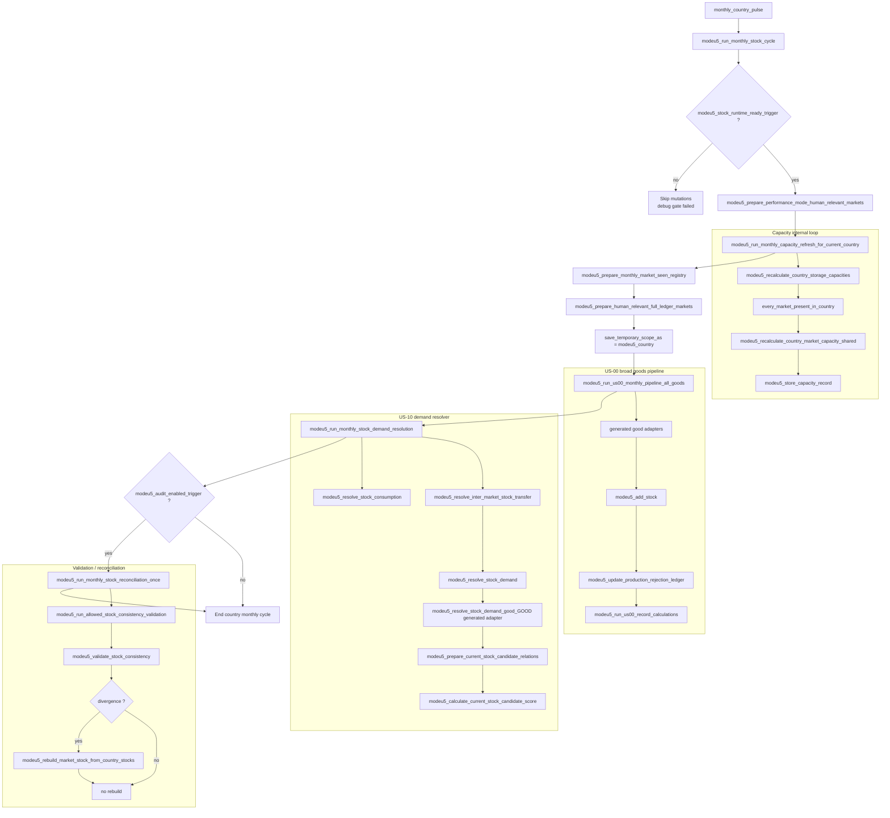
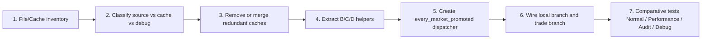

# Q5 — Global logical flow

## 1. Precision review of the “current state” diagram

The previous diagram was useful to discuss the **expected business process**, but it was too optimistic as a diagram of the current wiring. It mixed:

1. the callgraph actually visible in dispatchers;
2. business sub-loops required by the target design;
3. loops still to be confirmed (`every_trade`, `every_market_center`).

The concerning point is real: in the audited current wiring, `modeu5_run_monthly_stock_cycle` starts from the current country, launches a few global preparations, then calls broad pipelines (`modeu5_run_us00_monthly_pipeline_all_goods`, `modeu5_run_monthly_stock_demand_resolution`). The market/trade loop is not the explicit container for B/C/D. This makes scope auditing difficult and encourages File/Cache redundancy.

## 2. Mermaid diagram — current state corrected as observable callgraph



### What this current state means

| Finding | Why it is concerning | Refactor consequence |
|---|---|---|
| The current country is the visible outer loop | Markets/trades are not the main orchestration container | Hard to share B/C/D by market center |
| Capacity has its own `every_market_present_in_country` loop | Good input data, but it does not frame US-00/US-10 | Risk of redundant recalculation/cache glue |
| US-00 is called as an all-goods pipeline | Simple to call, but less clear for market/trade scope | Requires an explicit goods/market policy |
| US-10 is called after US-00 as a separate resolver | Same-market and inter-market are not structured under the same market loop | Makes `every_trade` / market supplier loops difficult to audit |
| Audit/reconciliation is a conditional end-of-cycle step | Correct for diagnostics, but not a process container | Must not compensate for suboptimal orchestration |

## 6. Main recommended target — market promotion then segregated loops

I think this variant is better as the **first concrete refactor**, because it first relies on loops already close to the current code (`monthly_country_pulse`, `every_market_present_in_country`, market promotion), then cleanly separates **country/market/good** processing from **trade/inter-market** processing.


`every_market_promoted` is a diagram label for a ModeU5 work list built by the mod. It is not assumed to be a native EU5 engine exposure.

US-00 scoped market-good must produce and freeze the `produced / added / rejected / overproduction input` facts before the US-10 branch, decay, validation, or reconciliation. Late US-00 finalization must read only these frozen facts.

### Opinion on this variant

| Point | Opinion | Reason | Guardrail |
|---|---|---|---|
| `monthly_country_pulse` remains the entry point | Yes | Compatible with current wiring and existing on_actions | Keep readiness gate before any mutation |
| `every_market_present_in_country` in preparation | Yes | The right place to build country market lists and required caches | Do not recalculate per good |
| `countries_present_in_market` cache | Yes, priority | Gives the promoted market its country list once | Cache remains derived, never stock source |
| Performance: filtered `human_relevant_market` | Yes | Reduces scopes without changing business order | Normal mode must define the equivalent as all current-country markets, not all global markets |
| Market Promotion before US | Yes | Very good File/Cache pivot: following loops read promoted markets only | Document promotion criteria and fallback reasons |
| Separate `every_market_promoted` loop | Yes | Clarifies scope owner and avoids US-00/US-10 each scanning their own markets | Add a single helper to iterate promoted markets |
| Branch 2.1 countries/US-00/same-market | Yes | Separates local market-good from inter-market | Keep mutations through central operators only |
| Branch 2.2 `every_trade` / transfer | Yes as target | Correct conceptual separation for inter-market | Blocked until `every_trade` is confirmed in TECH-01; provide queued-demand fallback |
| Future non-good / market-focused US | Yes | Good location before goods/trade loops | Do not mix with per-good adapters |

his proposed variant is more operational:

```txt
monthly country
→ build/promote market set
→ every promoted market
  → local country/market/good branch
  → inter-market trade branch
```

I therefore recommend making this variant the **main target process** and keeping `modeu5_run_monthly_market_trade_cycle` only as a possible name for step 2, or choosing a more precise name:

```txt
modeu5_run_monthly_promoted_market_cycle
```

This name better describes the mechanism: we do not traverse all markets or all trades; we first traverse markets promoted by the File/Cache preparation.

## 7. Recommended refactor order



The order remains File/Cache first, because the promoted-market cycle will only be reliable if each sub-loop clearly knows which record is source of truth, which record is a derived cache, and which record exists only for debug/audit.

## 8. PR3 helper extraction contract

PR3 introduces the helper names needed by the future promoted-market shell while
leaving `modeu5_run_monthly_stock_cycle` semantically unchanged. These helpers
are delegation points only:

| Block | Helper | Delegates to | Notes |
|---|---|---|---|
| B | `modeu5_prepare_promoted_market_country_cache` | `modeu5_rebuild_countries_present_in_market` | Rebuilds the current target market's country work list; not durable storage and not stock proof. |
| B | `modeu5_prepare_promoted_country_market_capacity` | `modeu5_recalculate_country_market_capacity_from_prepared_pool_shared` | Refreshes one country-market capacity record from the cached country location pool and current market trade capacity. |
| B | `modeu5_prepare_promoted_market_capacity_cache` | B country cache + B country-market capacity helper | Convenience wrapper for every country present in one promoted market. |
| C | `modeu5_run_scoped_us00_market_good` | generated `modeu5_process_us00_monthly_market_good_<good>` | Future local branch entry point; not called by the current dispatcher in PR3. |
| C | `modeu5_probe_scoped_us00_market_good_bridge` | generated `modeu5_probe_us00_previous_record_activity_good_<good>` | Non-mutating probe surface for tests. |
| C/D | `modeu5_run_scoped_us10_monthly_market_good` | generated `modeu5_process_us10_monthly_market_good_<good>` | Processes one scoped queued same-market consumption request. |
| D | `modeu5_resolve_scoped_same_market_consumption` | `modeu5_resolve_stock_consumption` | Same-market consumption remains non-trade and delegates stock removal to central operators. |
| D | `modeu5_handoff_scoped_inter_market_transfer` | `modeu5_resolve_inter_market_stock_transfer` | The canonical resolver still owns the `source_market == target_market` guard and central transfer call. |

The PR3 helpers must not be interpreted as an activated promoted-market
dispatcher. PR4 remains responsible for creating the disabled/test-only
promoted-market shell.
