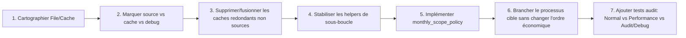

# Q5 — Vue d'ensemble du flux logique

## Diagramme Mermaid — situation actuelle auditée

```mermaid
flowchart TD
    A[Launcher / playset] --> B[Core requis + packages optionnels chargés]
    B --> C[CMM pré-campagne: debug, audit, save, performance]
    C --> D[on_game_start: configuration + package markers]
    D --> E{CORE-02 schema prêt ?}
    E -->|non| FAIL[Fail-closed: diagnostic-only, aucune mutation stock]
    E -->|oui| INIT[Init / réparation initiale: stocks, capacité, caches relationnels]

    INIT --> MODE{Politique d'exécution}
    MODE -->|Normal| NORMAL[Scope complet autorisé par les dispatchers]
    MODE -->|Performance| PERF[Scope réduit: marchés humains pertinents, listes actives, sparse suppliers]
    MODE -->|Audit| AUDIT[Mêmes étapes économiques + validation/réconciliation mensuelle]
    MODE -->|Debug| DEBUG[Mêmes étapes économiques + captures modeu5_debug_last_*]

    NORMAL --> POLICY[Construire monthly_scope_policy]
    PERF --> POLICY
    AUDIT --> POLICY
    DEBUG --> POLICY

    POLICY --> MONTH[monthly_country_pulse / modeu5_run_monthly_stock_cycle]

    subgraph MC[Subloop A — pays courant]
        MONTH --> COUNTRY[current country]
        COUNTRY --> READY{modeu5_stock_runtime_ready_trigger ?}
        READY -->|non| DIAG[debug gate failed, skip mutations]
        READY -->|oui| CAPACITY[1. Refresh capacité]
    end

    subgraph CM[Subloop B — country -> every_market_present_in_country]
        CAPACITY --> MKTS[every_market_present_in_country]
        MKTS --> CAPREC[réécrire modeu5_stock_cap_by_market et breakdowns]
        CAPREC --> SEEN[préparer market_seen_registry + human_relevant_full_ledger_markets]
    end

    subgraph GOODS[Subloop C — goods adapters]
        SEEN --> GOODSCOPE{Good inclus par la policy ?}
        GOODSCOPE -->|Normal/Audit/Debug| ALLGOODS[tous goods supportés par les adapters générés]
        GOODSCOPE -->|Performance| ACTIVEGOODS[goods actifs / marchés actifs / fallback sparse]
        ALLGOODS --> US00[2-8 US-00: production lue, modeu5_add_stock, ledger produced/added/rejected]
        ACTIVEGOODS --> US00
    end

    subgraph DEMAND[Subloop D — demandes même marché]
        US00 --> DEMANDREQ[US-10.1 demandes connues ou simulées]
        DEMANDREQ --> SAME{source_market == target_market ?}
        SAME -->|oui| CONSUME[Résolution disponibilité stock, puis remove via opérateur central]
        SAME -->|non| TRADEPREP[Passer au flux inter-market]
    end

    subgraph TRADE[Subloop E — inter-market / every_trade candidat]
        TRADEPREP --> TRADEITER[Pour chaque demande inter-market / trade candidate]
        TRADEITER --> CENTER{every_market_center / marché source candidat}
        CENTER --> PREFILTER[Préfiltre: market aggregate, active markets, sparse supplier cache]
        PREFILTER --> SUPPLIERS[Rebuild/lecture countries_present_in_market]
        SUPPLIERS --> SCORE[Scoring candidats pays: stock, capacité, réserves, exclusions]
        SCORE --> TRANSFER[modeu5_transfer_stock si quantité transférable]
        TRANSFER --> TRADELEDGER[US-10.2 requested/transferred/unsatisfied]
    end

    CONSUME --> POSTDEMAND[US-10.3 satisfaction/unsatisfaction]
    TRADELEDGER --> POSTDEMAND

    subgraph END[Fin de boucle mensuelle]
        POSTDEMAND --> DECAY[12. modeu5_decay_stock]
        DECAY --> VOID[13-15 ratios overproduction, void wealth, production penalty N+1]
        VOID --> OPTIONAL{Package Rebalance Economy chargé ?}
        OPTIONAL -->|oui| ECON[16-17 US-05 / debug économie optionnelle]
        OPTIONAL -->|non| VALIDATE
        ECON --> VALIDATE[18. validation stock]
        VALIDATE --> RECONCILE{Audit mensuel ou divergence ?}
        RECONCILE -->|oui| REBUILD[rebuild market_good_stock depuis sum country stocks]
        RECONCILE -->|non| RESET[19. reset compteurs après lecteurs]
        REBUILD --> RESET
        RESET --> YEARLY[Boucle annuelle: validation active, US-04 optionnel, reset annuel]
    end
```

## Point important pour la revue

Les modes `Normal`, `Performance`, `Audit` et `Debug` ne devraient pas définir quatre processus économiques différents. Ils alimentent une même boucle mensuelle canonique, mais changent la **policy de scope** appliquée aux sous-boucles :

| Mode | Même ordre mensuel ? | Ce qui change dans les sous-boucles | Étapes sautées ? |
|---|---|---|---|
| Normal | Oui | Parcours le plus complet autorisé par les dispatchers | Non, sauf fallback moteur explicite |
| Performance | Oui | Réduit les marchés/goods/candidats via listes pertinentes, active markets et sparse supplier cache | Ne doit pas sauter une étape économique ; il peut limiter les scopes non pertinents |
| Audit | Oui | Ajoute ou force les validations/réconciliations et conserve davantage de ledgers | Non |
| Debug | Oui | Ajoute les captures `modeu5_debug_last_*` et dumps tests | Non |

## Sous-boucles à préserver pendant le refactor

| Sous-boucle | Rôle dans l'audit | Source / cache attendu | Règle de refactor |
|---|---|---|---|
| Pays courant | Point d'entrée du `monthly_country_pulse` | Country scope | Ne pas muter si runtime non prêt |
| `every_market_present_in_country` | Capacité, registres de marchés vus, human relevance | Capacité pays-marché et listes de marchés | À factoriser en helpers File/Cache avant logique métier |
| Goods adapters | Permet les maps littérales par good | Adapters générés | Ne pas remplacer par map-name dynamique |
| Demandes same-market | Consommation locale, pas commerce | Stock pays/marché/good + counters US-10.1 | Interdire trade income / transport cost ici |
| Inter-market / every_trade candidat | Transferts stock entre marchés | Active markets, sparse suppliers, market-country work cache | Préfiltrer avant scoring ; transférer uniquement via opérateur central |
| `every_market_center` / marché source candidat | Sélection des marchés fournisseurs | Market aggregate + active list | Expliciter la disponibilité moteur dans TECH-01 avant dépendance gameplay |
| Validation/réconciliation | Garantir l'invariant agrégat marché = somme pays | Country stock source, market stock cache | Rebuild uniquement du marché depuis les pays |

## Processus cible recommandé pour organiser le refactor

L'ordre de refactor conseillé est donc : File/Cache d'abord, puis helpers de sous-boucles, puis processus cible. Cela évite de réécrire la logique économique avant d'avoir réduit les redondances de stockage et clarifié quels caches sont des sources, des index de performance ou de simples diagnostics.
