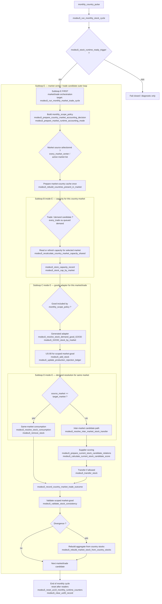
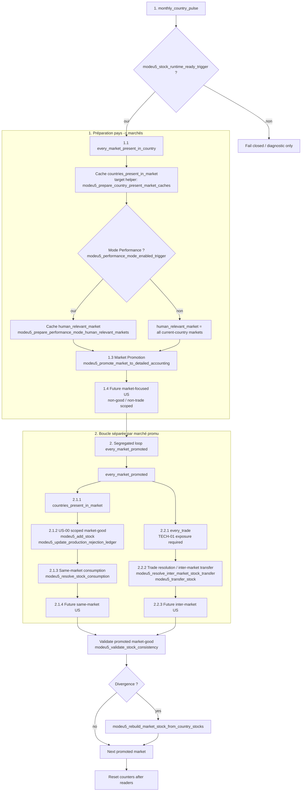
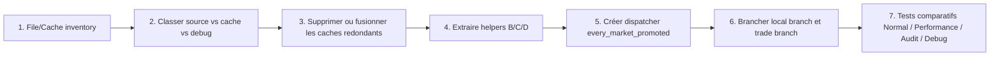

# Q5 — Vue d'ensemble du flux logique

## 1. Review de précision du diagramme « current state »

Le diagramme précédent était utile pour discuter du **processus métier attendu**, mais il était trop optimiste comme diagramme de câblage actuel. Il mélangeait :

1. le callgraph réellement visible dans les dispatchers ;
2. des sous-boucles métier nécessaires au design cible ;
3. des boucles encore à confirmer (`every_trade`, `every_market_center`).

Le point inquiétant est réel : dans le câblage actuel audité, `modeu5_run_monthly_stock_cycle` part du pays courant, lance quelques préparations globales, puis appelle des pipelines larges (`modeu5_run_us00_monthly_pipeline_all_goods`, `modeu5_run_monthly_stock_demand_resolution`). La boucle market/trade n'est pas le conteneur explicite de B/C/D. Cela rend l'audit des scopes difficile et encourage les redondances File/Cache.

## 2. Diagramme Mermaid — current state corrigé comme callgraph observable


### Ce que ce current state signifie

| Constat | Pourquoi c'est inquiétant | Conséquence refactor |
|---|---|---|
| Le pays courant est l'outer loop visible | Les marchés/trades ne sont pas le conteneur d'orchestration principal | Difficile de mutualiser B/C/D par market center |
| La capacité a sa propre boucle `every_market_present_in_country` | Bonne donnée d'entrée, mais elle n'encadre pas US-00/US-10 | Risque de recalculs/cache glue redondants |
| US-00 est appelé comme pipeline all-goods | Simple à appeler, mais moins clair pour scope market/trade | Nécessite une policy goods/market explicite |
| US-10 est appelé après US-00 comme resolver séparé | Same-market et inter-market ne sont pas structurés sous la même boucle marché | Rend `every_trade` / market supplier loops difficiles à auditer |
| Audit/reconciliation est une fin de cycle conditionnelle | Correct pour diagnostics, mais pas un conteneur de process | Ne doit pas compenser une orchestration suboptimale |

## 3. Diagramme Mermaid — target process recommandé

Objectif : dès que `modeu5_stock_runtime_ready_trigger` passe, entrer dans une boucle E orientée **market/trade**. Les anciennes sous-boucles B, C et D deviennent des sous-boucles de E, ce qui rend explicite le scope propriétaire de chaque cache et réduit la redondance.



## 4. Pourquoi ce target est préférable

| Dimension | Current state | Target process |
|---|---|---|
| Outer loop | Pays courant + pipelines larges | Market/trade loop immédiatement après readiness gate |
| Cache owner visible | Dispersé entre capacity, performance, US-00, US-10 | Market/trade scope explicite avant B/C/D |
| B capacity loop | Avant les pipelines, mais pas conteneur | Sous-boucle de E pour le market concerné |
| C goods loop | All-goods ou active-goods pipeline large | Sous-boucle de E, filtrée par policy et market/trade |
| D demand loop | Resolver séparé après production | Sous-boucle de E, same-market/inter-market visible au même endroit |
| Reconciliation | Fin de cycle audit | Validation scoped market-good, rebuild localisé |
| Refactor File/Cache | Difficile de savoir quel cache est source dans chaque étape | Chaque sous-boucle déclare ses records sources/caches |

## 5. Index technique des méthodes / boucles du diagramme

| Zone Mermaid | Méthode, trigger ou boucle associé | Fichier principal | Commentaire audit |
|---|---|---|---|
| Orchestrateur mensuel actuel | `monthly_country_pulse` -> `modeu5_run_monthly_stock_cycle` | `in_game/common/on_action/modeu5_stock_on_actions.txt`, `in_game/common/scripted_effects/modeu5_stock_effects.txt` | Point d'entrée réel actuel. |
| Gate runtime | `modeu5_stock_runtime_ready_trigger` | `in_game/common/scripted_triggers/modeu5_stock_triggers.txt` | Le target conserve ce gate avant toute mutation. |
| Préparation performance actuelle | `modeu5_prepare_performance_mode_human_relevant_markets` | `modeu5_configuration_effects.txt` | À transformer en input de `monthly_scope_policy`, pas en orchestration métier. |
| Capacité actuelle | `modeu5_run_monthly_capacity_refresh_for_current_country`, `every_market_present_in_country` | `modeu5_capacity_effects.txt` | Devient sous-boucle B dans E. |
| Registres mensuels actuels | `modeu5_prepare_monthly_market_seen_registry`, `modeu5_prepare_human_relevant_full_ledger_markets` | `modeu5_stock_effects.txt`, `modeu5_performance_effects.txt` | Devraient être pilotés par la policy E. |
| US-00 actuel | `modeu5_run_us00_monthly_pipeline_all_goods`, `modeu5_add_stock`, `modeu5_update_production_rejection_ledger` | `modeu5_void_economy_effects.txt` + adapters générés | Devient sous-boucle C market-good. |
| US-10 actuel | `modeu5_run_monthly_stock_demand_resolution`, `modeu5_resolve_stock_consumption`, `modeu5_resolve_inter_market_stock_transfer` | `modeu5_stock_demand_resolver_effects.txt` | Devient sous-boucle D sous market/trade. |
| Cache pays du marché | `modeu5_rebuild_countries_present_in_market`, `every_location_in_market`, `modeu5_countries_present_in_market` | `modeu5_market_country_cache_effects.txt` | À préparer une fois par market center dans E. |
| Scoring fournisseur | `modeu5_prepare_current_stock_candidate_relations`, `modeu5_apply_current_stock_candidate_hard_filters`, `modeu5_calculate_current_stock_candidate_score` | `modeu5_stock_demand_resolver_effects.txt` | Reste dans E après préfiltre. |
| Validation/rebuild | `modeu5_validate_stock_consistency`, `modeu5_rebuild_market_stock_from_country_stocks` | `modeu5_stock_effects.txt` | Target : scoped market-good plutôt que fin de cycle globale. |
| Target nouveau dispatcher | `modeu5_run_monthly_market_trade_cycle` | à créer | Nom proposé pour rendre E explicite. |
| Itérateurs à confirmer | `every_trade`, `every_market_center` | TECH-01 à compléter avant gameplay | Le target les montre comme design souhaité, pas exposition confirmée. |


## 6. Variante cible proposée par review — market promotion puis boucles ségrégées

Je pense que cette variante est meilleure comme **premier refactor concret** que le target E précédent, parce qu'elle s'appuie d'abord sur les boucles déjà proches du code actuel (`monthly_country_pulse`, `every_market_present_in_country`, market promotion), puis sépare proprement le traitement **country/market/good** du traitement **trade/inter-market**.



### Avis sur cette variante

| Point | Avis | Raison | Garde-fou |
|---|---|---|---|
| `monthly_country_pulse` reste l'entrée | Oui | Compatible avec le câblage actuel et les on_actions existants | Garder le readiness gate avant toute mutation |
| `every_market_present_in_country` en préparation | Oui | C'est le bon endroit pour construire les listes de marchés du pays et les caches nécessaires | Ne pas recalculer par good |
| `countries_present_in_market` cache | Oui, prioritaire | Donne au marché promu sa liste de pays une seule fois | Le cache reste dérivé, jamais source de stock |
| Performance: `human_relevant_market` filtré | Oui | Réduit les scopes sans changer l'ordre métier | Normal mode doit définir l'équivalent comme tous les marchés du pays courant, pas tous les marchés globaux |
| Market Promotion avant US | Oui | Très bon pivot File/Cache : seules les boucles suivantes lisent les marchés promus | Documenter les critères de promotion et les raisons de fallback |
| Boucle séparée `every_market_promoted` | Oui | Clarifie le propriétaire de scope et évite que US-00/US-10 scannent chacun leurs propres marchés | Ajouter un helper unique pour itérer les marchés promus |
| Branche 2.1 countries/US-00/same-market | Oui | Sépare le local market-good de l'inter-market | Garder les mutations via opérateurs centraux uniquement |
| Branche 2.2 `every_trade` / transfer | Oui comme target | C'est la bonne séparation conceptuelle pour inter-market | Bloqué tant que `every_trade` n'est pas confirmé dans TECH-01 ; prévoir fallback queued-demand |
| Future US non-good / market-focused | Oui | Bon emplacement avant les goods/trade loops | Ne pas mélanger avec les per-good adapters |

### Ajustement recommandé par rapport au target E précédent

Le target E précédent partait d'une orchestration `market/trade` générique. La variante proposée ici est plus opérationnelle :

```txt
monthly country
→ build/promote market set
→ every promoted market
  → local country/market/good branch
  → inter-market trade branch
```

Je recommanderais donc de faire de cette variante le **target process principal** et de garder `modeu5_run_monthly_market_trade_cycle` comme nom possible pour l'étape 2, ou de choisir un nom plus précis :

```txt
modeu5_run_monthly_promoted_market_cycle
```

Ce nom décrit mieux la mécanique : on ne parcourt pas tous les marchés ni tous les trades, on parcourt d'abord les marchés promus par la préparation File/Cache.

## 7. Ordre de refactor recommandé



L'ordre reste File/Cache d'abord, car le cycle des marchés promus ne sera fiable que si chaque sous-boucle sait clairement quel record est source de vérité, quel record est cache dérivé, et quel record n'existe que pour debug/audit.
