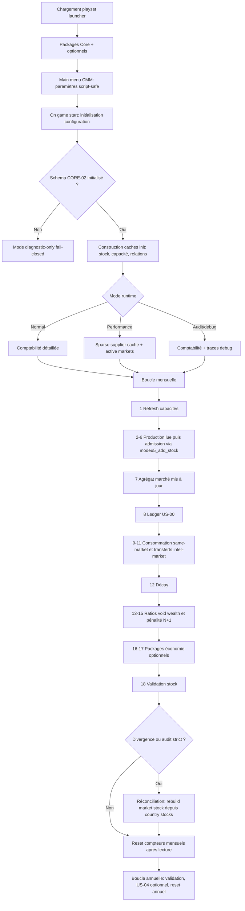

# Q5 — Vue d'ensemble du flux logique

## Diagramme Mermaid

## Lecture du flux

Le flux confirme trois séparations importantes :

1. La configuration et le choix des packages précèdent la campagne.
2. Les stocks pays restent la source de vérité ; les caches marché ne sont que des agrégats.
3. Les réconciliations doivent être exceptionnelles, car elles parcourent les contributeurs pays d'un marché et d'un good pour reconstruire l'agrégat.
