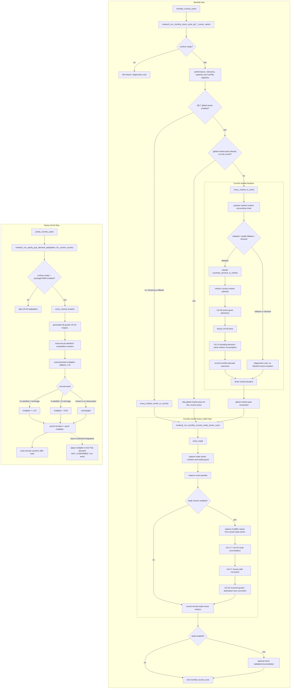

# Q5 — PR #69 global logical flow (living v2)

## Purpose

This is the PR-specific living flow document for PR #69.

It records the current branch flow without modifying the canonical Q8 document:

```txt
docs/audits/q8/Q5_flux_logique_global.md
```

This file should be updated as PR #69 changes, tests run, or assumptions are corrected.

## Current branch context

PR #69 adds yearly US-04 Pop-demand adaptation on top of the existing Q8.7 monthly flow and the already-merged PR #107 trade reconciliation.

The branch therefore has three relevant layers:

```txt
1. Monthly market-local stock and demand flow
2. Monthly country-owned trade and route reconciliation flow
3. Yearly location × good Pop-demand adaptation flow
```

## Monthly market-local flow

```txt
monthly_country_pulse
  -> modeu5_run_monthly_stock_cycle_q8_7_owner_switch
     -> runtime readiness and configuration gates
     -> performance/relevance preparation
     -> current-country capacity refresh
     -> monthly market registries
     -> Q8.7 global market-local cycle, once per month
          -> every_market_in_world
          -> prepare market runtime accounting mode
          -> detailed market:
               -> rebuild countries_present_in_market
               -> refresh country-market capacity
               -> US-00 active-good production/admission pass
               -> freeze US-00 facts
               -> US-10 pending-demand/same-market consumption pass
               -> record monthly demand outcomes
          -> vanilla-fallback or blocked market:
               -> diagnostics only
               -> no ModeU5 stock mutation
```

## Monthly country-owned trade flow

After market-local work, each country runs its own trade-owner pass:

```txt
modeu5_run_monthly_country_trade_owner_cycle
  -> every_trade
     -> capture trade.owner
     -> capture from_market
     -> capture to_market
     -> capture traded_goods
     -> capture route quantity
     -> when trade rework is enabled:
          -> capture owner-country modifier inputs
          -> US-17 money-side route reconciliation
          -> US-20 received-goods and destination-loss reconciliation
```

The route reconciliation is distinct from the later optional stock audit reconciliation.

```txt
US-17 / US-20 route reconciliation
  = business correction for the current trade route

modeu5_run_monthly_stock_reconciliation_once
  = optional stock consistency validation/repair
```

## Yearly US-04 flow

```txt
yearly_country_pulse
  -> modeu5_yearly_pop_demand_adaptation_pulse
     -> modeu5_run_yearly_pop_demand_adaptation_for_current_country
     -> runtime/configuration gates
     -> every_owned_location
     -> generated location × good helpers
          -> read annual satisfied_months
          -> read annual unsatisfied_months
          -> read current persisted multiplier
          -> missing multiplier fallback = 1.20
          -> 12 satisfied and 0 unsatisfied: multiplier × 1.01
          -> 0 satisfied and 12 unsatisfied: multiplier × 0.99
          -> mixed or zero-demand year: unchanged
          -> persist multiplier
          -> reset annual counters after reading them
```

## Dependency clarification — stock records

The yearly US-04 calculation does not directly read:

```txt
country × market × good stock
market × good aggregate stock
country-market capacity
market promotion state
```

Its direct data dependency is:

```txt
location × good annual outcome counters
+
location × good persisted demand multiplier
```

Therefore, a positive or existing country × market stock record is not itself required for the yearly arithmetic to run.

The current gate:

```txt
modeu5_stock_runtime_ready_trigger = yes
```

means only:

```txt
initialization complete
+
stock schema version exists
+
stock schema version matches the current version
```

It does not prove that a particular country × market × good stock entry exists.

### Indirect upstream dependency

The intended monthly producer of truthful satisfaction outcomes may depend on stock resolution:

```txt
Pop or explicit demand request
  -> US-10 attempts stock removal
  -> actual removed quantity = satisfied quantity
  -> remainder = unsatisfied quantity
  -> US-10.3 writes location × good outcome counters
  -> US-04 reads those counters yearly
```

So the correct distinction is:

```txt
US-04 yearly adaptation itself
  does not require country × market stock records

but

the monthly producer of meaningful satisfied/unsatisfied counters
  may depend on ModeU5 stock resolution
```

Missing annual counters should be treated as no observation, not automatically as satisfaction or shortage.

## Current engine boundary

PR #69 currently implements:

```txt
annual counters
  -> yearly adaptation
  -> persisted modeu5_pop_demand_multiplier[good]
```

PR #69 does not yet prove or wire:

```txt
persisted modeu5_pop_demand_multiplier[good]
  -> vanilla location × good Pop-demand calculation
  -> additional live Pop requested consumption
```

TECH-01 #039 therefore remains:

```txt
Apply a local demand modifier to vanilla demand: NOT_CONFIRMED
Fallback: persist ModeU5 multiplier only
```

The configured baseline `1.20` must currently be described as a persisted ModeU5 multiplier, not as proven 20% extra live Pop consumption.

## Ordering and ownership invariants

1. Capacity is prepared before US-00 stock admission.
2. US-00 admission facts are frozen before US-10 same-market consumption.
3. Same-market US-10 consumption is local non-trade work.
4. Vanilla trade remains inter-market and country-owned through `every_trade`.
5. US-17/US-20 reconciliation runs inside the current trade iteration after route scopes and quantity are captured.
6. Route business reconciliation is separate from optional stock audit reconciliation.
7. US-04 is yearly and consumes annual location × good counters.
8. Annual counters reset only after US-04 reads them.
9. Persisting a multiplier is not equivalent to applying it to vanilla Pop demand.
10. The Q8.7 global market pass runs once per month, while each country-owned trade pass still runs from its country pulse.
11. Performance Mode relevance remains market-level.
12. Stock mutation remains centralized.

## Mermaid flow — current PR #69



## Living update log

### 2026-07-11 — Initial v2 creation

Recorded:

- current Q8.7 monthly market-local owner;
- merged PR #107 US-17/US-20 route reconciliation inside `every_trade`;
- PR #69 yearly US-04 adaptation;
- distinction between route reconciliation and stock audit reconciliation;
- distinction between stock-runtime readiness and existence of stock records;
- explicit `NOT_CONFIRMED` boundary for live vanilla Pop-demand application.

### Pending updates

This file should be updated when any of the following becomes proven or changes:

```txt
- focused US-04 runtime test result;
- full revalidation result;
- exact live producer of location × good Pop outcome counters;
- exact live consumer of modeu5_pop_demand_multiplier[good];
- decision to replace the broad stock-runtime gate with a narrower counter/readiness gate;
- changes to the trade reconciliation route placement or formulas.
```
