# Q5 — PR #69 global logical flow (living v2)

## Purpose

This is the PR-specific living flow document for PR #69.

It records the branch flow and validation state without modifying the canonical Q8 document:

```txt
docs/audits/q8/Q5_flux_logique_global.md
```

## Current branch layers

PR #69 adds yearly US-04 Pop-demand adaptation on top of:

```txt
1. Q8.7 monthly market-local stock and demand flow
2. country-owned monthly trade and PR #107 route reconciliation
3. yearly location × good Pop-demand multiplier adaptation
```

## Monthly market-local flow

```txt
monthly_country_pulse
  -> modeu5_run_monthly_stock_cycle_q8_7_owner_switch
     -> runtime/configuration gates
     -> performance and market-relevance preparation
     -> country capacity and monthly registries
     -> once-per-month Q8.7 global market pass
          -> every_market_in_world
          -> prepare market accounting mode
          -> detailed market:
               -> rebuild countries_present_in_market
               -> refresh country-market capacity
               -> US-00 production/admission
               -> freeze US-00 facts
               -> US-10 same-market demand resolution
               -> record monthly demand outcomes
          -> fallback/blocked market:
               -> diagnostics only
               -> no ModeU5 stock mutation
```

## Monthly country-owned trade flow

After the market-local pass, each country runs:

```txt
modeu5_run_monthly_country_trade_owner_cycle
  -> every_trade
     -> capture trade.owner
     -> capture source market, target market and good
     -> capture route quantity
     -> when trade rework is enabled:
          -> capture owner-country modifier inputs
          -> US-17 money-side route reconciliation
          -> US-20 received-goods/destination-loss reconciliation
```

Route reconciliation and stock audit reconciliation are separate:

```txt
US-17 / US-20 route reconciliation
  = business correction for the current route

modeu5_run_monthly_stock_reconciliation_once
  = optional consistency validation/repair
```

## Yearly US-04 flow

```txt
yearly_country_pulse
  -> modeu5_yearly_pop_demand_adaptation_pulse
     -> modeu5_run_yearly_pop_demand_adaptation_for_current_country
     -> runtime/configuration gates
     -> every_owned_location
     -> generated location × good helpers
          -> read annual satisfied_months
          -> read annual unsatisfied_months
          -> read persisted multiplier, fallback 1.20
          -> 12 satisfied / 0 unsatisfied: × 1.01
          -> 0 satisfied / 12 unsatisfied: × 0.99
          -> mixed or no observation: unchanged
          -> persist multiplier
          -> reset annual counters after reading them
```

## Stock dependency clarification

The yearly US-04 arithmetic does not directly read:

```txt
country × market × good stock
market × good aggregate stock
country-market capacity
market promotion state
```

Its direct dependencies are:

```txt
location × good annual outcome counters
+
location × good persisted multiplier
```

Therefore, existence of a positive country × market stock record is not itself required for yearly adaptation.

The current gate:

```txt
modeu5_stock_runtime_ready_trigger = yes
```

only proves initialization and schema readiness. It does not prove that a particular country × market × good stock entry exists.

The indirect upstream relationship remains:

```txt
Pop or explicit demand request
  -> US-10 attempts stock removal
  -> removed quantity = satisfied quantity
  -> remainder = unsatisfied quantity
  -> US-10.3 writes location × good outcome counters
  -> US-04 reads those counters yearly
```

So:

```txt
US-04 yearly adaptation itself
  does not require country × market stock records

but

the monthly producer of meaningful outcome counters
  may depend on ModeU5 stock resolution
```

Missing counters are no observation, not automatic satisfaction or shortage.

## Validated PR #69 behavior

Runtime validation from clean installed commit:

```txt
87a1e29c1751adbc5955c3ac3be30267ee93f123
source_dirty=no
```

proved both the focused fixture and its inclusion in the full revalidation chain:

```txt
baseline:                         1.2000
12 satisfied months:             1.2120
12 unsatisfied months:           1.1880
mixed year:                      1.2000
zero-observation year:           1.2000
annual counters after read:      0
focused scenario:                PASS
full-chain US-04 scenario:       PASS
```

Expected and observed markers:

```txt
ModeU5 TEST ENTERED scenario=us04_pop_demand_adaptation
ModeU5 US-04 DUMP base_multiplier=1.2000 wheat_multiplier=1.2120 beer_multiplier=1.1880 cloth_multiplier=1.2000 tools_multiplier=1.2000 ...
ModeU5 US-04 RESULT pop_demand_adaptation PASS
ModeU5 TEST PASS scenario=us04_pop_demand_adaptation
```

The full repository revalidation did not emit `main_revalidation_summary` because the trace stopped after entering `us17_us20_route_reconciliation`. This does not invalidate US-04, whose PASS marker occurred earlier. The unresolved tail is tracked separately in `runtime_validation_2026-07-11.md`.

## Current engine boundary

PR #69 proves:

```txt
annual counters
  -> yearly branch decision
  -> persisted modeu5_pop_demand_multiplier[good]
  -> annual counter reset
```

PR #69 does not prove or wire:

```txt
persisted modeu5_pop_demand_multiplier[good]
  -> vanilla location × good Pop-demand calculation
  -> additional live Pop requested consumption
```

TECH-01 #039 remains:

```txt
Apply a local demand modifier to vanilla demand: NOT_CONFIRMED
Fallback: persist ModeU5 multiplier only
```

The baseline `1.20` is a validated persisted ModeU5 multiplier. It must not yet be described as proven 20% additional live Pop consumption.

## Ordering and ownership invariants

1. Capacity is prepared before US-00 stock admission.
2. US-00 facts are frozen before US-10 same-market consumption.
3. Same-market consumption is local non-trade work.
4. Inter-market trade remains country-owned through `every_trade`.
5. US-17/US-20 runs after route scopes and quantity are captured.
6. Route reconciliation is separate from optional stock audit reconciliation.
7. US-04 runs yearly from location × good outcome counters.
8. Annual counters reset only after the yearly decision reads them.
9. Persisting the multiplier is not equivalent to applying it to vanilla Pop demand.
10. The global market pass runs once monthly, while each country-owned trade pass still runs.
11. Performance relevance remains market-level.
12. Stock mutation remains centralized.

## Mermaid flow — current PR #69

```mermaid
flowchart TB
    subgraph MONTHLY["Monthly flow"]
        A["monthly_country_pulse"] --> B["Q8.7 owner switch"]
        B --> READY{"runtime ready?"}
        READY -->|no| CLOSED["fail closed / diagnostics"]
        READY -->|yes| PREP["relevance, capacity, registries"]
        PREP --> ONCE{"global market pass already run?"}
        ONCE -->|no| WORLD["every_market_in_world"]
        ONCE -->|yes| TRADE0["country-owned trade pass"]

        WORLD --> MODE["prepare market accounting mode"]
        MODE --> KIND{"detailed / fallback / blocked"}
        KIND -->|fallback or blocked| DIAG["diagnostics; no stock mutation"]
        KIND -->|detailed| CACHE["countries-present cache"]
        CACHE --> CAP["country-market capacity"]
        CAP --> US00["US-00 admission"]
        US00 --> FREEZE["freeze US-00 facts"]
        FREEZE --> US10["US-10 same-market demand"]
        US10 --> OUTCOME["monthly outcome records"]
        OUTCOME --> TRADE0
        DIAG --> TRADE0

        TRADE0 --> T1["every_trade"]
        T1 --> T2["capture owner, markets, good, quantity"]
        T2 --> TGATE{"trade rework enabled?"}
        TGATE -->|yes| REC["US-17 / US-20 route reconciliation"]
        TGATE -->|no| TEND["finish route"]
        REC --> MONEY["money-side correction"]
        MONEY --> GOODS["received-goods/loss correction"]
        GOODS --> TEND
        TEND --> AUDIT{"stock audit enabled?"}
        AUDIT -->|yes| STOCKREC["optional stock validation/repair"]
        AUDIT -->|no| MEND["end monthly cycle"]
        STOCKREC --> MEND
    end

    subgraph YEARLY["Yearly US-04 flow"]
        Y0["yearly_country_pulse"] --> Y1["US-04 yearly country effect"]
        Y1 --> YGATE{"runtime + package/CMM enabled?"}
        YGATE -->|no| YSKIP["skip"]
        YGATE -->|yes| YLOC["every_owned_location"]
        YLOC --> YGOOD["generated good helpers"]
        YGOOD --> YREAD["read annual counters"]
        YREAD --> YMULT["read multiplier, fallback 1.20"]
        YMULT --> YCASE{"annual result"}
        YCASE -->|12 satisfied| YUP["× 1.01"]
        YCASE -->|12 shortage| YDOWN["× 0.99"]
        YCASE -->|mixed/no observation| YSAME["unchanged"]
        YUP --> YWRITE["persist multiplier"]
        YDOWN --> YWRITE
        YSAME --> YWRITE
        YWRITE --> YRESET["reset annual counters"]
        YWRITE -. unconfirmed integration .-> YAPPLY["apply to live Pop demand<br/>NOT_CONFIRMED"]
    end
```



## Living update log

### 2026-07-11 — Initial v2

Recorded the Q8.7 market owner, PR #107 trade reconciliation, yearly US-04 branch, stock-dependency distinction and live-demand boundary.

### 2026-07-11 — Runtime acceptance

Recorded clean static/install provenance and two successful US-04 executions:

```txt
focused US-04 scenario:       PASS
full-chain US-04 scenario:    PASS
annual arithmetic:            PASS
annual counter reset:         PASS
live vanilla application:     NOT_CONFIRMED
```

### Pending living updates

```txt
- exact live producer of location × good Pop outcome counters;
- exact live consumer of modeu5_pop_demand_multiplier[good];
- decision on replacing the broad stock-runtime gate with narrower counter readiness;
- closure of the separate US-17/US-20 full-revalidation tail;
- changes to route placement or formulas.
```
