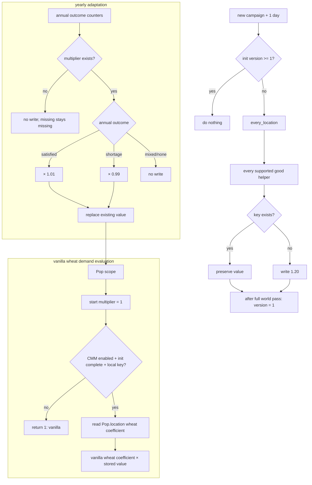

# Q5 — PR #69 global logical flow (living v2)

## Purpose

This is the PR-specific living flow for PR #69. It evolves with the branch without modifying the canonical Q8 document:

```txt
docs/audits/q8/Q5_flux_logique_global.md
```

## Current objective

PR #69 targets the complete Pop-demand feedback loop:

```txt
vanilla Pop-demand coefficient
  × initialized location × good ModeU5 coefficient
  -> actual vanilla Pop requested demand
  -> monthly satisfaction / shortage outcome
  -> yearly coefficient adjustment
  -> next year's actual vanilla Pop requested demand
```

The annual adaptation layer has already passed runtime validation. Live vanilla consumption remains prototype-gated.

## State ownership

ModeU5 owns one persistent value per:

```txt
location × good
```

Physical storage:

```txt
location.variable_map(modeu5_pop_demand_multiplier|goods:<good>)
```

The Pop is an evaluation scope, not an additional persistence dimension. All Pops in the same location read the same coefficient for a given good.

## Fundamental invariant

```txt
1.20 = explicit, one-time initialized ModeU5 state
1.00 = every missing, disabled, uninitialized, or invalid-state fallback
```

The `1.20` baseline must never be synthesized by the live reader or yearly updater.

Correct live formula:

```txt
actual coefficient
  = complete vanilla coefficient
  × stored location × good coefficient
```

Incorrect formula — forbidden:

```txt
vanilla coefficient
  × 1.20 baseline
  × stored coefficient already initialized to 1.20
```

The incorrect formula would start at `1.44`.

## Static vanilla integration — wheat prototype

The runtime contract is tested with wheat only before any all-good generalization.

```txt
./tools/generate_all.sh
  -> tools/generate_us04_pop_demand_override.py --goods wheat
     -> read installed vanilla goods_demand/pop_demands.txt
     -> preserve the complete vanilla file
     -> preserve every non-wheat coefficient unchanged
     -> wrap only vanilla pop_demand.wheat
     -> generate one Pop-scope wheat multiplier script value
```

Generated local artifacts:

```txt
packages/modeu5_economy_rebalance/in_game/common/goods_demand/pop_demands.txt
packages/modeu5_economy_rebalance/in_game/common/script_values/modeu5_us04_pop_demand_values_generated.txt
```

Generalization to every good is forbidden until the wheat probe passes.

## One-time campaign initialization

The baseline is materialized once on a new campaign, after the existing one-day startup delay:

```txt
on_game_start
  -> delay 1 day
  -> modeu5_start_game_stock_initialization_pulse
     -> modeu5_initialize_pop_demand_multipliers_once
```

Initialization contract:

```txt
if modeu5_us04_multiplier_initialization_version is missing or < 1:
    every_location
      -> modeu5_initialize_pop_demand_multiplier_all_goods
         -> for every supported good:
              if location × good key is missing:
                  write 1.20
              else:
                  preserve existing value

    after the complete world pass:
        set modeu5_us04_multiplier_initialization_version = 1
```

The delayed startup pulse may have an empty/root scope. It therefore performs no country-scoped CMM read. The initialization path uses only global state, the global location iterator, and location-scoped maps.

The version gate is persistent saved state. It prevents:

```txt
second campaign-start application
save reload application
1.20 × 1.20 accidental double initialization
recreation of a deleted/corrupt key during normal runtime
```

## Live Pop-scope read

Generated wheat script value:

```txt
modeu5_us04_live_pop_demand_multiplier_wheat
```

Evaluation contract:

```txt
start result = 1

only when all conditions are true:
  live CMM integration marker exists
  initialization version exists and >= 1
  Pop.location has multiplier map
  Pop.location has wheat key

then:
  return stored location × wheat value

otherwise:
  return 1
```

Therefore:

| State | Live multiplier | Result |
|---|---:|---|
| integration disabled | `1` | vanilla |
| initialization incomplete | `1` | vanilla |
| location map missing | `1` | vanilla |
| good key missing | `1` | vanilla |
| valid initialized record | stored value | vanilla × ModeU5 |

The country-scoped CMM setting is mirrored by country pulses/callbacks into:

```txt
modeu5_pop_demand_live_integration_enabled
```

## Yearly adaptation

```txt
yearly_country_pulse
  -> refresh live CMM marker from country scope
  -> every owned location
  -> generated location × good annual helper
```

Per good:

```txt
read annual satisfied months
read annual unsatisfied months
read existing multiplier

if multiplier record exists:
    12 satisfied / 0 shortage -> current × 1.01
    0 satisfied / 12 shortage -> current × 0.99
    mixed or no observation   -> no write
else:
    no write
    no 1.20 recreation

reset annual counters after read
```

The yearly updater may only modify an existing initialized record. A missing record remains missing, and the live reader consequently returns vanilla multiplier `1`.

## Monthly economic flow

```txt
vanilla pop_demand.wheat
  -> unchanged vanilla wheat coefficient
  -> generated Pop-scope ModeU5 multiplier
  -> actual vanilla requested wheat demand
  -> US-10 stock resolution
  -> US-10.3 location × good outcomes
  -> yearly US-04 counters
```

The final handoff from vanilla requested Pop demand into the intended location × good US-10.3 counters remains a separate proof obligation.

## Runtime tests

Run from a clean new campaign after at least one full day:

```txt
event modeu5_us04_debug.1
```

### 1. Initialization lifecycle

Option:

```txt
Probe new-campaign 1.20 multiplier initialization
```

Scenario:

```txt
us04_pop_demand_initialization
```

Required evidence:

```txt
initialization version = 1
capital wheat = 1.2000
capital beer = 1.2000
second initializer call leaves wheat = 1.2000
deleted wheat key is not recreated
missing read = 1.0000
PASS
```

### 2. Pop → location endpoint

Option:

```txt
Probe live Pop-demand location multiplier endpoint
```

Scenario:

```txt
us04_pop_demand_endpoint
```

Required evidence:

```txt
seeded       1.3700
missing      1.0000
uninitialized 1.0000
disabled     1.0000
PASS
```

This proves only the scope link and failback contract.

### 3. Observable vanilla demand response

Option:

```txt
Probe vanilla Pop demand response (disposable save)
```

Scenario:

```txt
us04_vanilla_pop_demand_integration
```

Probe sequence:

```txt
capital wheat coefficient = 1.0
wait for vanilla recalculation
read goods_demand_in_market(wheat)
capital wheat coefficient = 4.0
wait for vanilla recalculation
read goods_demand_in_market(wheat)
assert high demand > low demand
restore original coefficient and gates
```

Only this PASS confirms that vanilla `pop_demand.wheat` consumes the generated location coefficient.

### 4. Annual adaptation

Already validated on clean commit `87a1e29c1751adbc5955c3ac3be30267ee93f123`:

```txt
baseline                         1.2000
12 satisfied months             1.2120
12 unsatisfied months           1.1880
mixed year                      1.2000
zero-observation year           1.2000
annual counters after read      0
PASS
```

The annual test seeds its own explicit records. Its result remains valid, while the branch now prevents normal yearly runtime from creating missing records.

## Static architecture guard

```txt
tools/validate_us04_pop_demand_architecture.py
```

It rejects:

```txt
1.20 getter fallback
missing-record yearly recreation
initialization gate written before the world pass
missing version gate
all-good live wrapper before wheat acceptance
endpoint tests that do not expect vanilla multiplier 1
```

`generate_all.sh` runs this validator automatically.

## Current status

```txt
Annual arithmetic and counter reset:         CONFIRMED
One-time initialization implementation:      IMPLEMENTED / RUNTIME PENDING
Vanilla-safe missing-state fallback:          IMPLEMENTED / RUNTIME PENDING
Wheat Pop-scope location lookup:              IMPLEMENTED / RUNTIME PENDING
Wheat vanilla market-demand response:         IMPLEMENTED / RUNTIME PENDING
All-good live integration:                    DEFERRED
TECH-01 #039:                                 NOT_CONFIRMED
```

PR #69 must remain draft until the three new-campaign probes load and pass without parser, duplicate-key, empty-scope, location-link, or variable-map errors.

## Mermaid flow



## Living update log

### 2026-07-11 — Annual layer accepted

Focused and full-chain annual adaptation scenarios passed.

### 2026-07-11 — Live wheat probe opened

Added the exact-path wheat wrapper, Pop-scope endpoint probe, and market-demand response probe.

### 2026-07-11 — Initialization/fallback architecture corrected

Replaced the former missing-key `1.20` fallback with vanilla multiplier `1` and introduced:

```txt
- versioned one-time world initialization;
- explicit 1.20 location × good seed;
- no yearly recreation of missing records;
- wheat-only live prototype;
- new-campaign initialization lifecycle probe;
- static architecture validator.
```
