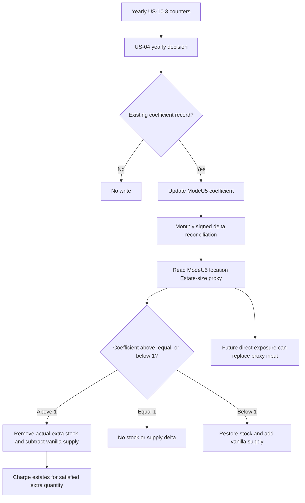

# PR #69 Q5 v3 — US-04 source of truth after probes

This document consolidates the PR #69 probe history into the current
implementation truth. Older files in `docs/audits/pr69/archives/` remain
useful historical evidence, but this Q5 v3 is the first file to read when
deciding what US-04 currently does and what remains blocked.

## Current State

```txt
Annual adaptation coefficient:         IMPLEMENTED / deterministic fixture PASS
ModeU5-owned reconciliation coefficient: IMPLEMENTED
Vanilla pop_demand runtime mutation:    REJECTED FOR PRODUCTION
Monthly stock reconciliation:           IMPLEMENTED through TECH-01 150 ModeU5 proxy
Estate gold charge:                     IMPLEMENTED through confirmed country-scope endpoint
Live location Estate demand by good:    NOT_CONFIRMED
ModeU5 local Estate proxy:              ACCEPTED / active production bridge
Peasants fallback:                      REJECTED
```

US-04 now has two separate layers:

```txt
1. A yearly ModeU5 coefficient layer.
   This is implemented and safe.

2. A monthly stock/estate reconciliation layer.
   This uses the accepted ModeU5-owned local proxy and stays independent from
   unconfirmed direct vanilla Estate-demand exposure.
```

## Probe Conclusions

| Probe family | Result | Current consequence |
|---|---:|---|
| Annual location x good fixture | PASS | Keep the 1.20 baseline and yearly 1.01 / 1.00 / 0.99 updates. |
| ModeU5 Pop/location endpoint and fallback | PASS | Missing/uninitialized state falls back to 1.00, not 1.20. |
| Additive `INJECT:pop_demand` candidates Q1-Q8 | REJECTED | Do not use additive demand injection in production. |
| Observed-current market demand target | PASS as architecture probe | Useful alternative idea, but not exact US-04 Pop x estate demand. |
| Q9 full `REPLACE:pop_demand` | AMBIGUOUS HISTORICAL RESULT | Not accepted as proof after Q10/Q10b/Q10c failed to reproduce safe runtime responsiveness. |
| Q10/Q10b/Q10c replacement lifecycle | REJECTED | Runtime replacement is not a viable production path. |
| `every_pop -> pop_demand x good` direct read | NOT_CONFIRMED | Archived; no longer required for the proxy implementation. |
| `modeu5_us04_reconciliation_coefficient × proxy_estate_size_at_location` | ACCEPTED | Active bridge for stock removal and estate charge. |

## Implemented Coefficient Layer

Persistent owner:

```txt
location
```

Persistent state:

```txt
modeu5_pop_demand_multiplier[goods:<good>]
modeu5_us04_reconciliation_coefficient[goods:<good>]
```

`modeu5_pop_demand_multiplier` is archived PR69 probe state. It is still
initialized and updated so old probes remain interpretable, but no production
rule may assume that the vanilla engine consumes it.

`modeu5_us04_reconciliation_coefficient` is the active ModeU5-owned coefficient.
It starts at `1.20` through explicit one-time initialization and receives the
yearly update:

```txt
12 satisfied months / 0 shortage months -> coefficient x 1.01
0 satisfied months / 12 shortage months -> coefficient x 0.99
mixed year                              -> unchanged
zero-observation year                   -> unchanged
missing key                             -> unchanged
```

Missing runtime reads fail closed to `1.00`. Missing records must not silently
recreate the `1.20` baseline outside the versioned initialization path.

## Current Monthly Behavior

The monthly reconciliation helper reads ModeU5-owned local Estate proxy inputs:

```txt
estate_requested_quantity =
  modeu5_us04_reconciliation_coefficient(location, good)
  × proxy_estate_size_at_location

estate_extra_quantity =
  proxy_estate_size_at_location
  × max(0, modeu5_us04_reconciliation_coefficient - 1)

estate_restored_quantity =
  proxy_estate_size_at_location
  × max(0, 1 - modeu5_us04_reconciliation_coefficient)

total_extra_quantity = sum(estate_extra_quantity)
total_restored_quantity = sum(estate_restored_quantity)

if total_extra_quantity > 0 and stock runtime is ready:
    call modeu5_remove_stock(reason = consumption)
    charge known estates through add_gold_to_estate
    persist requested / extra / removed / unsatisfied / stock-delta diagnostics

if total_restored_quantity > 0 and stock runtime is ready:
    call modeu5_add_stock(capacity_policy = allow_over_capacity)
    persist requested / restored / stock-delta diagnostics
```

A location x good aggregate alone still cannot tell which estate should pay. A
fixed `peasants_estate` fallback remains rejected because it would be wrong as a
business rule. The production bridge is the explicit local Estate-size proxy,
not a hard-coded fallback Estate.

## Runtime Flow

The desired target architecture remains a US-10-compatible demand request, but
the current branch wires US-04 from the monthly country pulse after the monthly
stock cycle. Therefore the implemented production flow is a signed monthly
reconciliation delta:

```txt
coefficient = 1.20 -> remove the additional 20%
coefficient = 1.00 -> no stock/supply correction
coefficient = 0.99 -> restore/add 1%
```

US-10 owns full consumption resolution. US-04 must not remove the whole
consumption again; it only applies the coefficient delta.

The intended traversal is country-owned and market-scoped:

```txt
monthly country pulse
  -> current country
  -> every_market_present_in_country as target market
  -> generated per-good demand-preparation adapter
  -> for each good demanded by Pops in the target market
  -> every_owned_location limited to location.market = target market
```

If a later promoted-market dispatcher owns the monthly local branch, the
equivalent shape is:

```txt
promoted market shell
  -> target promoted market
  -> rebuild countries_present_in_market
  -> each present country
  -> generated per-good demand-preparation adapter
  -> for each good demanded by Pops in the target market
  -> that country's owned locations in the target market
```

Do not use a global `every_location` scan. When the US-04 detailed preparation
path cannot enter, the result is vanilla fallback/no ModeU5 additional demand
for every runtime mode. Performance Mode only changes accounting sparsity; it
does not change the US-04 business gate.

The documented cheap gate is market-scoped:

```txt
target market = {
    demands_goods_by_pops = goods:<good>
}
```

It can skip a whole market x good before the owned-location and location-estate
work. It is a presence/boolean gate, not a quantity source and not an estate
split. The active quantity/split bridge is TECH-01 150; TECH-01 149 direct
location Estate demand remains a future replacement candidate.

The target request-preparation logic is:

```txt
for each country x market reached by the monthly country-owned traversal:
    for each good:
        if target market does not demand goods:<good> by Pops:
            skip this market x good before scanning locations

        for each owned location in market:
            reset estate requested totals
            reset estate extra-demand totals

            future preferred path if TECH-01 149 is confirmed:
                read exact location x good x estate requested quantities

            current TECH-01 150 proxy path:
                modeu5_us04_reconciliation_coefficient(location, good)
                x proxy_estate_size_at_location

            total_requested_quantity = sum estate requested totals
            if total_requested_quantity <= 0:
                skip this location x good

            coefficient_extra =
              max(0, modeu5_us04_reconciliation_coefficient - 1)

            coefficient_restore =
              max(0, 1 - modeu5_us04_reconciliation_coefficient)

            for each estate with requested quantity:
                estate_extra_quantity =
                  estate_requested_quantity x coefficient_extra
                estate_restored_quantity =
                  estate_requested_quantity x coefficient_restore

            total_extra_quantity = sum estate_extra_quantity
            total_restored_quantity = sum estate_restored_quantity

            apply signed reconciliation delta:
                country = current country
                market = target market
                location = current location
                good = current good
                extra quantity = total_extra_quantity
                restored quantity = total_restored_quantity
                estate split = estate_extra_quantity by estate
```

The current reconciliation implementation applies the signed delta directly
through central stock operators:

```txt
actual_removed_quantity =
  modeu5_remove_stock(country, market, good, total_extra_quantity)

actual_restored_quantity =
  modeu5_add_stock(country, market, good, total_restored_quantity)

vanilla_supply_delta =
  -actual_removed_quantity
  +actual_restored_quantity
  through the confirmed add_goods_supply surface

for each estate with estate_extra_quantity:
    estate_actual_quantity =
      actual_removed_quantity
      x estate_extra_quantity
      / total_extra_quantity

    estate_charge =
      estate_actual_quantity
      x market_price(goods:<good>)

    add_gold_to_estate = negative estate_charge

unsatisfied_extra_quantity =
  total_extra_quantity - actual_removed_quantity
```

Important accounting rule: mutate stock and vanilla market supply only for the
actual delta applied by the central operators, not for theoretical totals or full
requested consumption. Positive deltas charge estates and subtract vanilla
supply. Negative deltas restore stock and add vanilla supply back. This keeps
ModeU5 stock, vanilla supply adjustment, and estate payment aligned, and avoids
double imputation.

The central stock invariant still applies:

```txt
market_good_stock = sum(country_market_good_stock)
```

When this future path is implemented, stock must be removed through the central
operator so the country record and market aggregate change in the same
transaction. If that guarantee is ever unclear, add an explicit US-04 assertion
before accepting the path.

## Current Flow Diagram



## Evidence Map

| File | How to read it now |
|---|---|
| `archives/runtime_validation_2026-07-11.md` | Historical annual fixture and early injection plan. Annual fixture remains valid; injection plan is superseded. |
| `archives/us04_injection_probe_candidate_1_2026-07-11.md` | Historical candidate #1 result. Additive injection rejected. |
| `archives/us04_injection_matrix_runtime_result_2026-07-11.md` | Historical additive matrix. Additive upstream mutation rejected. |
| `archives/us04_q7_q8_and_observed_current_runtime_2026-07-11.md` | Q7/Q8 rejected; observed-current target is an alternative architecture idea, not exact US-04. |
| `archives/us04_q9_replace_pop_demand_runtime_2026-07-11.md` | Ambiguous historical result. Not accepted as production proof after later lifecycle probes. |
| `archives/us04_q10_q10b_q10c_replacement_lifecycle_runtime_2026-07-11.md` | Replacement lifecycle rejected for production. |
| `archives/us04_observed_current_demand_alternative.md` | Archived alternative design. Useful if US-04 is re-scoped away from exact Pop x estate demand. |
| `archives/us04_final_probe_lessons_and_reconciliation_pivot_2026-07-11.md` | Short pivot note; this Q5 v3 supersedes it for the current source of truth. |

The rejected/static `pop_demand` engine probes are archived outside every
loadable package. They must not live under `in_game/common/goods_demand`,
including in optional test packages, because EU5 parses those files at load time
and logs the intentionally invalid probe syntax as errors:

```txt
docs/audits/pr69/archives/goods_demand_invalid_syntax/
```

## Test Procedure

Static/local validation:

```sh
./tools/generate_all.sh
python3 tools/validate_us04_pop_demand_architecture.py
./tools/validate_module_packages.sh
./tools/validate_modeu5_script_safety.sh
./tools/audit_modeu5_persistent_state.sh
./tools/normalize_cmm_value_links.sh --check
python3 tools/validate_ci_static_contracts.py
python3 tools/validate_cmm_configuration.py
git diff --check
./tools/install_local_packages.sh
./tools/install_local_packages.sh --check
```

Runtime validation:

```txt
1. Install the local packages.
2. Start a fresh disposable campaign.
3. Let at least one full in-game day pass.
4. Run: event modeu5_us04_debug.1
5. Run: ./tools/summarize_modeu5_test_logs.sh --expected us04
6. Review error.log, game.log, debug.log, and system.log.
```

Expected US-04 outcome with the TECH-01 150 proxy path:

```txt
ModeU5 US-04 RESULT pop_demand_adaptation PASS
ModeU5 TEST PASS scenario=us04_pop_demand_adaptation
```

Expected proxy reconciliation diagnostics:

```txt
requested > 0
extra_quantity > 0
removed_quantity > 0
goods_supply_removed_quantity = removed_quantity
country_stock_delta > 0
market_stock_delta > 0
estate_charge > 0
```

Expected below-baseline diagnostics:

```txt
coefficient = 0.99
restored_quantity > 0
goods_supply_added_quantity = restored_quantity
country_stock_delta > 0
market_stock_delta > 0
removed_quantity = 0
goods_supply_removed_quantity = 0
```

No parser/database errors related to US-04 are acceptable. Vanilla noise should
be classified separately from ModeU5 errors.

## Confirmed Proxy Boundary

US-04 stock/estate reconciliation is unblocked through the ModeU5 proxy because
the implementation owns all inputs in the formula:

```txt
modeu5_us04_reconciliation_coefficient(location, good)
× proxy_estate_size_at_location
```

This does not confirm direct vanilla `location × estate × good` demand exposure.
That remains future/optional and must not be used in loaded runtime scripts until
a controlled probe proves it.
