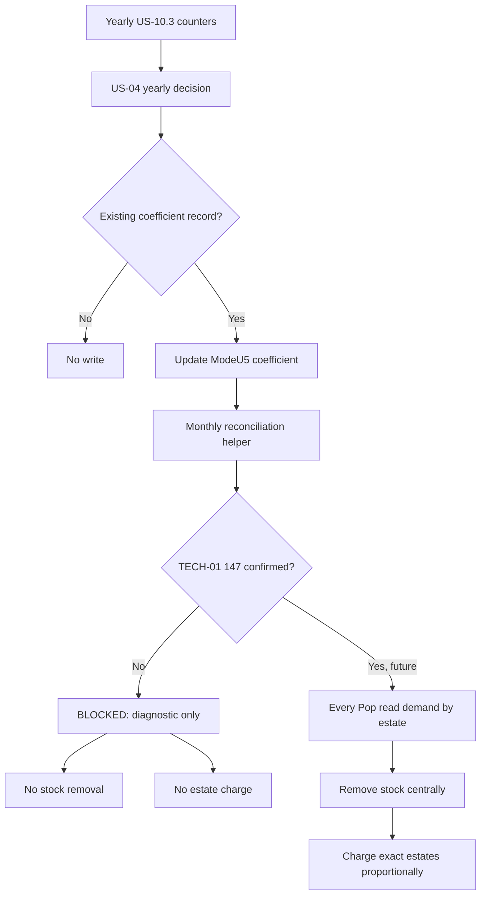

# PR #69 Q5 v3 — US-04 source of truth after probes

This document consolidates the PR #69 probe history into the current
implementation truth. Older files in `docs/audits/pr69/archives/` remain
useful historical evidence, but this Q5 v3 is the first file to read when
deciding what US-04 currently does and what remains blocked.

## Current State

```txt
Annual adaptation coefficient:         IMPLEMENTED / deterministic fixture PASS
ModeU5-owned reconciliation coefficient: IMPLEMENTED
Vanilla pop_demand runtime mutation:    REJECTED FOR PRODUCTION
Monthly stock reconciliation:           BLOCKED pending TECH-01 147
Estate gold charge:                     CONFIRMED endpoint / not used yet
Live Pop demand by estate and good:     NOT_CONFIRMED
Peasants fallback:                      REJECTED
```

US-04 now has two separate layers:

```txt
1. A yearly ModeU5 coefficient layer.
   This is implemented and safe.

2. A future monthly stock/estate reconciliation layer.
   This is deliberately fail-closed until exact live Pop demand by good can be
   read from Pop scope.
```

## Probe Conclusions

| Probe family | Result | Current consequence |
|---|---:|---|
| Annual location x good fixture | PASS | Keep the 1.20 baseline and yearly 1.01 / 1.00 / 0.99 updates. |
| ModeU5 Pop/location endpoint and fallback | PASS | Missing/uninitialized state falls back to 1.00, not 1.20. |
| Additive `INJECT:pop_demand` candidates Q1-Q8 | REJECTED | Do not use additive demand injection in production. |
| Observed-current market demand target | PASS as architecture probe | Useful alternative idea, but not exact US-04 Pop x estate demand. |
| Q9 full `REPLACE:pop_demand` | AMBIGUOUS HISTORICAL RESULT | Not accepted as proof after Q10/Q10b/Q10c failed to reproduce safe runtime responsiveness. |
| Q10/Q10b/Q10c replacement lifecycle | REJECTED | Runtime replacement is not a viable production path. |
| `every_pop -> pop_demand x good` direct read | NOT_CONFIRMED | Blocks stock removal and estate charge. |

## Implemented Coefficient Layer

Persistent owner:

```txt
location
```

Persistent state:

```txt
modeu5_pop_demand_multiplier[goods:<good>]
modeu5_us04_reconciliation_coefficient[goods:<good>]
```

`modeu5_pop_demand_multiplier` is archived PR69 probe state. It is still
initialized and updated so old probes remain interpretable, but no production
rule may assume that the vanilla engine consumes it.

`modeu5_us04_reconciliation_coefficient` is the active ModeU5-owned coefficient.
It starts at `1.20` through explicit one-time initialization and receives the
yearly update:

```txt
12 satisfied months / 0 shortage months -> coefficient x 1.01
0 satisfied months / 12 shortage months -> coefficient x 0.99
mixed year                              -> unchanged
zero-observation year                   -> unchanged
missing key                             -> unchanged
```

Missing runtime reads fail closed to `1.00`. Missing records must not silently
recreate the `1.20` baseline outside the versioned initialization path.

## Current Monthly Behavior

The monthly reconciliation helper computes diagnostics, then fails closed:

```txt
requested_quantity = known explicit/test requested quantity
extra_quantity = requested_quantity x max(0, reconciliation_coefficient - 1)

if TECH-01 147 is not confirmed:
    log direct_pop_demand_read_not_confirmed
    removed_quantity = 0
    country_stock_delta = 0
    market_stock_delta = 0
    estate_charge = 0
    do not call modeu5_remove_stock
    do not call add_gold_to_estate
```

This is intentional. A location x good aggregate cannot tell which estate should
pay. A fixed `peasants_estate` fallback is rejected because it would be wrong as
a business rule. A bounded static estate-map bridge is diagnostic/test-only and
does not authorize production mutation.

## Target Future Flow

Only after TECH-01 147 confirms a direct live Pop requested-demand-by-good read,
the production flow can become:

```txt
for each relevant country x market x location:
    for each good:
        reset estate request totals

        every_pop in location:
            read estate_type
            read current requested quantity for goods:<good>
            add requested quantity to that estate total

        if total requested quantity > 0:
            extra_quantity =
              total_requested_quantity
              x max(0, modeu5_us04_reconciliation_coefficient - 1)

            remove extra_quantity once through modeu5_remove_stock

            for each estate with requested quantity:
                estate_share = estate_requested / total_requested
                estate_charge =
                  actual_removed_quantity
                  x market_price(goods:<good>)
                  x estate_share
                add_gold_to_estate = negative estate_charge
```

The central stock invariant still applies:

```txt
market_good_stock = sum(country_market_good_stock)
```

When this future path is implemented, stock must be removed through the central
operator so the country record and market aggregate change in the same
transaction. If that guarantee is ever unclear, add an explicit US-04 assertion
before accepting the path.

## Current Flow Diagram



## Evidence Map

| File | How to read it now |
|---|---|
| `archives/runtime_validation_2026-07-11.md` | Historical annual fixture and early injection plan. Annual fixture remains valid; injection plan is superseded. |
| `archives/us04_injection_probe_candidate_1_2026-07-11.md` | Historical candidate #1 result. Additive injection rejected. |
| `archives/us04_injection_matrix_runtime_result_2026-07-11.md` | Historical additive matrix. Additive upstream mutation rejected. |
| `archives/us04_q7_q8_and_observed_current_runtime_2026-07-11.md` | Q7/Q8 rejected; observed-current target is an alternative architecture idea, not exact US-04. |
| `archives/us04_q9_replace_pop_demand_runtime_2026-07-11.md` | Ambiguous historical result. Not accepted as production proof after later lifecycle probes. |
| `archives/us04_q10_q10b_q10c_replacement_lifecycle_runtime_2026-07-11.md` | Replacement lifecycle rejected for production. |
| `archives/us04_observed_current_demand_alternative.md` | Archived alternative design. Useful if US-04 is re-scoped away from exact Pop x estate demand. |
| `archives/us04_final_probe_lessons_and_reconciliation_pivot_2026-07-11.md` | Short pivot note; this Q5 v3 supersedes it for the current source of truth. |

The rejected/static `pop_demand` engine probes are isolated in the optional test
probe package, not the campaign economy package:

```txt
packages/modeu5_core_tests_q9/in_game/common/goods_demand/
```

## Test Procedure

Static/local validation:

```sh
./tools/generate_all.sh
python3 tools/validate_us04_pop_demand_architecture.py
./tools/validate_module_packages.sh
./tools/validate_modeu5_script_safety.sh
./tools/audit_modeu5_persistent_state.sh
./tools/normalize_cmm_value_links.sh --check
python3 tools/validate_ci_static_contracts.py
python3 tools/validate_cmm_configuration.py
git diff --check
./tools/install_local_packages.sh
./tools/install_local_packages.sh --check
```

Runtime validation:

```txt
1. Install the local packages.
2. Start a fresh disposable campaign.
3. Let at least one full in-game day pass.
4. Run: event modeu5_us04_debug.1
5. Run: ./tools/summarize_modeu5_test_logs.sh --expected none
6. Review error.log, game.log, debug.log, and system.log.
```

Expected US-04 outcome while TECH-01 147 is unconfirmed:

```txt
ModeU5 US-04 BLOCKED reason=direct_pop_demand_read_not_confirmed
ModeU5 TEST BLOCKED scenario=us04_pop_demand_adaptation reason=direct_pop_demand_read_not_confirmed
```

Expected blocked reconciliation diagnostics:

```txt
requested > 0
extra_quantity > 0
removed_quantity = 0
unsatisfied_quantity = extra_quantity
country_stock_delta = 0
market_stock_delta = 0
estate_charge = 0
```

No parser/database errors related to US-04 are acceptable. Vanilla noise should
be classified separately from ModeU5 errors.

## Gate For Unblocking

US-04 stock/estate reconciliation can only move out of blocked status when a
controlled probe proves all of the following:

```txt
every_pop can run from the intended location scope
the Pop estate_type can be read
the current requested demand for goods:<good> can be read from that Pop
the demand value is exact enough to drive stock removal
the read is stable in a fresh campaign, after a monthly tick, and after reload
```

Until then, any PR that removes stock or charges estates for US-04 is out of
scope, even if the annual coefficient fixture passes.
