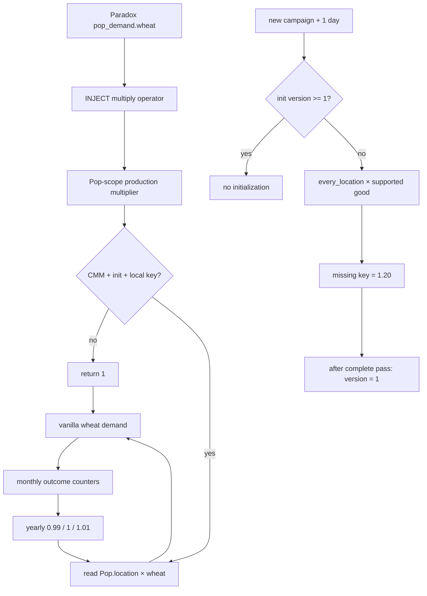

# Q5 — PR #69 global logical flow (living v2)

Superseded:

```txt
Read docs/audits/pr69/Q5_flux_logique_global.v3.md for the current PR #69
source of truth. This v2 file is preserved as historical design evidence.
```

## Purpose

This PR-specific flow evolves with PR #69 without modifying the canonical Q8 document:

```txt
docs/audits/q8/archives/Q5_flux_logique_global.md
```

## Target loop

```txt
vanilla Pop demand
  × location × good ModeU5 coefficient
  -> actual vanilla requested demand
  -> monthly satisfied / shortage outcomes
  -> yearly coefficient adjustment
  -> next year's vanilla requested demand
```

## State ownership

ModeU5 persists one value per:

```txt
location × good
```

Physical representation:

```txt
location.variable_map(cbp_pop_demand_multiplier|goods:<good>)
```

The Pop is the evaluation scope used by vanilla `pop_demand`; it is not an additional persistence dimension.

## Fundamental invariant

```txt
1.20 = explicit one-time initialized state
1.00 = every disabled, missing, uninitialized, or invalid fallback
```

The live reader and yearly updater must never synthesize `1.20` from missing state.

## Compatibility-first vanilla integration

PR #69 no longer reads, copies, generates, or overrides Paradox's `pop_demands.txt`.

The wheat prototype is a tiny tracked database injection:

```txt
packages/cbp_economy_rebalance/in_game/common/goods_demand/
zz_cbp_us04_pop_demand_injection_probe.txt
```

```txt
INJECT:pop_demand = {
    wheat = {
        multiply = "cbp_us04_live_pop_demand_multiplier_wheat"
    }
}
```

Intended loader result:

```txt
existing Paradox pop_demand.wheat formula
  + ModeU5 multiply operator
```

No Paradox formula is represented in ModeU5 source. Consequently, a Paradox minor or major update can change wheat demand without requiring ModeU5 regeneration.

The unresolved engine question is nested injection semantics. Runtime must distinguish:

```txt
A. wheat block merges into the existing wheat value      desired
B. wheat block replaces the existing wheat value         reject
C. duplicate-key/parser/database error                    reject
```

All-good injection is deferred until case A is proven for wheat.

## Production Pop-scope value

Tracked file:

```txt
packages/cbp_economy_rebalance/in_game/common/script_values/
cbp_us04_pop_demand_injection_values.txt
```

Value:

```txt
cbp_us04_live_pop_demand_multiplier_wheat
```

Contract:

```txt
start result = 1

only if all are true:
  live CMM marker exists
  initialization version exists and >= 1
  Pop.location has the multiplier map
  Pop.location has the wheat key

then:
  return stored location × wheat coefficient

otherwise:
  return 1
```

## One-time campaign initialization

After the existing one-day startup delay:

```txt
on_game_start
  -> cbp_start_game_stock_initialization_pulse
     -> cbp_initialize_pop_demand_multipliers_once
```

Initialization:

```txt
if cbp_us04_multiplier_initialization_version is missing or < 1:
    every_location
      -> every supported good helper
         -> missing key: write 1.20
         -> existing key: preserve value

    after the complete world pass:
        set initialization version = 1
```

The saved version gate prevents reload and double application. A key deleted after initialization remains missing during normal runtime and therefore reads as multiplier `1`.

## Yearly adaptation

```txt
yearly_country_pulse
  -> refresh live CMM marker
  -> every owned location
  -> per-good annual helper
```

Per existing record:

```txt
12 satisfied / 0 shortage -> current × 1.01
0 satisfied / 12 shortage -> current × 0.99
mixed / no observation    -> no write
missing record             -> no write
```

Annual counters reset after the decision reads them.

## Obsolete artifact cleanup

`generate_all.sh` removes the abandoned generator outputs if they remain in a local working tree:

```txt
packages/cbp_economy_rebalance/in_game/common/goods_demand/pop_demands.txt
packages/cbp_economy_rebalance/in_game/common/script_values/
cbp_us04_pop_demand_values_generated.txt
```

This prevents an old exact-path override or duplicate script value from being installed accidentally.

The former generator has been deleted:

```txt
tools/generate_us04_pop_demand_override.py
```

## Static architecture guard

```txt
tools/validate_us04_pop_demand_architecture.py
```

It requires:

```txt
- injection into pop_demand;
- exactly one injected wheat entry;
- multiply-only injected content;
- tracked production Pop-scope value;
- no copied vanilla value formula;
- no exact-path pop_demands.txt override;
- no vanilla override generator;
- multiplier-1 failback;
- versioned one-time initialization;
- yearly updates only on existing records.
```

## Runtime probes

Use a clean new campaign and let at least one full in-game day pass:

```txt
event cbp_us04_debug.1
```

### 1. Initialization lifecycle

```txt
Probe new-campaign 1.20 multiplier initialization
```

Required:

```txt
version = 1
wheat = 1.2000
beer = 1.2000
second call remains 1.2000
deleted key is not recreated
missing fallback = 1.0000
PASS
```

### 2. Production Pop → location endpoint

```txt
Probe live Pop-demand location multiplier endpoint
```

The test adapter delegates to the exact production value used by the injection.

Required:

```txt
seeded        1.3700
missing       1.0000
uninitialized 1.0000
disabled      1.0000
PASS
```

### 3. Nested injection behavior

```txt
Probe vanilla Pop demand response (disposable save)
```

Sequence:

```txt
capital wheat coefficient = 1.0
wait for recalculation
capture wheat and beer market demand
capital wheat coefficient = 4.0
wait for recalculation
capture wheat and beer market demand
```

Acceptance:

```txt
wheat demand at 1.0 > 0
wheat demand at 4.0 > wheat demand at 1.0
beer demand remains unchanged within tolerance
no duplicate-key, parser, database, or invalid-value errors
```

Expected result marker:

```txt
ModeU5 US-04 VANILLA DEMAND RESULT injection_nested_merge_candidate PASS
```

This is practical evidence for nested merge behavior. It does not yet prove the separate live handoff into the intended US-10.3 location × good outcome counters.

## Accepted annual fixture

Previously validated on clean commit:

```txt
87a1e29c1751adbc5955c3ac3be30267ee93f123
```

```txt
baseline                         1.2000
12 satisfied months             1.2120
12 unsatisfied months           1.1880
mixed year                      1.2000
zero-observation year           1.2000
annual counters after read      0
PASS
```

The result remains valid because the fixture explicitly seeds its records.

## Current status

```txt
Annual arithmetic and counter reset:         CONFIRMED
Versioned world initialization:              IMPLEMENTED / RUNTIME PENDING
Multiplier-1 safe fallback:                  IMPLEMENTED / RUNTIME PENDING
Production Pop.location value:               IMPLEMENTED / RUNTIME PENDING
Nested wheat injection behavior:             IMPLEMENTED / RUNTIME PENDING
Vanilla formula regeneration:                REMOVED
All-good injection:                          DEFERRED
Live US-10.3 outcome handoff:                 NOT_CONFIRMED
TECH-01 #039:                                 NOT_CONFIRMED
```

PR #69 remains draft until the clean new-campaign probes pass.

## Mermaid flow



## Living update log

### 2026-07-11 — Annual fixture accepted

Annual arithmetic and counter reset passed.

### 2026-07-11 — Explicit initialization and vanilla failback

Introduced the versioned `1.20` seed and multiplier-`1` failure paths.

### 2026-07-11 — Injection-first compatibility architecture

Removed vanilla-file regeneration and replaced it with a tracked wheat-only `INJECT:pop_demand` probe, production script value, stale-artifact cleanup, and merge/replacement runtime controls.
