# Q4 — Q8 loops and performance model

## Purpose

Q8 is a performance-oriented refactoring track. Its purpose is to reduce repeated monthly work after PR126 while preserving PR126's business contracts and ordering.

This document is the Q8-owned performance standard. Stacked Q8 PRs must update it when they materially change loop shape, metric writes, counters, dispatcher ownership, or cost assumptions.

## Post-PR126 baseline shape

```txt
monthly_country_pulse
  -> performance / human-relevant preparation
  -> current-country capacity refresh
  -> monthly market-seen registry
  -> human-relevant full-ledger preparation
  -> promoted-market local cycle through current market-center ownership workaround
  -> country trade-owner cycle
  -> optional audit reconciliation
```

## Q8 performance notation

| Symbol | Meaning |
|---|---|
| `C` | countries touched by monthly country pulse |
| `M_c` | markets present in a country |
| `M_world` | all markets exposed by `every_market_in_world` |
| `M_rel` | Performance Mode human-relevant markets |
| `P` | promoted / relevant markets processed by local branch |
| `K_m` | countries present in a promoted market |
| `G_supported` | generated supported goods |
| `G_a` | active / produced / pending goods after Q8 guards |
| `T_country` | trade candidates owned by a country |
| `V_m` | candidate markets selected by the Q8.6 verifier slice |

## Target work shape

```txt
country preparation:              O(C * M_c)
promoted-market local work:        O(P * K_m * G_a)
country-owned trade pass:          O(C * T_country)
validation/debug/probes:           bounded, opt-in, or dirty/candidate scoped
Q8.6 verifier slice:               O(V_m * locations_in_candidate_market), debug/audit only
Q8.7 candidate market owner:        O(M_world) proof-only now; future target O(M_rel * K_m * G_a) in Performance Mode
```

## Current Q8 classification

| Track | Performance intent | Current status |
|---|---|---|
| Q8.1 / F3 | remove normal-runtime per-good debug/profile counter writes | IMPLEMENTED |
| Q8.2 / F2 | avoid generated US-10 per-good checks for no-request country-market pairs if still present | DEFERRED; aggregate pre-scan likely unprofitable when pending demand is common |
| Q8.3 / F1 | avoid repeated country-wide capacity-pool calculation inside promoted-market capacity refresh | IMPLEMENTED |
| Q8.4 / F4 | reduce duplicate guard layers after caller inventory | PROBE_FIRST |
| Q8.5 / F5/F9a | move derived cache repair toward dirty/candidate consumers | IMPLEMENTED |
| Q8.6 / F9c | verify candidate/dirty market slices before verifier promotion | IMPLEMENTED as debug/audit candidate slice; no stock repair |
| Q8.7 / F7 | replace market-center ownership workaround only if global market pass is proven safe | PROBE_STACK; universe and Performance Mode relevant-market proofs exist, no live switch |

## Performance guardrails

```txt
1. A performance change must identify whether it reduces loop count, metric writes, repeated recalculation, or only documentation risk.
2. Work-shape counters are not wall-clock profiling.
3. Debug/profile counters must not become normal-runtime overhead unless they are necessary for business correctness.
4. Broad world scans are rejected unless they replace more work than they add and are debug/probe scoped first.
5. Performance Mode should stay candidate/promoted/relevant-market scoped.
```

## Q8.0 baseline decision

Q8.0 freezes this post-PR126 performance model but does not alter runtime behaviour.

## Q8.1 update — metric-write reduction

Q8.1 changes metric-write cost, not the business loop count.

```txt
Normal runtime:
  PR7.1 per-good business guards still run.
  PR7.1 per-good metric writes are skipped unless debug/audit enables them.

Debug/audit runtime:
  PR7.1 counters remain available for validation/profile scenarios.
```

Interpretation:

```txt
Q8.1 reduces hot-path write overhead and debug-state churn in normal runtime.
It does not yet reduce G_supported guard traversal.
Q8.2 remains responsible for proving a better sparse pending-work design if US-10 dispatch needs further narrowing.
```

## Q8.3 update — capacity-pool recalculation reduction

Q8.3 changes the capacity-pool recalculation shape:

```txt
Before:
  country-market capacity refresh could recalculate country-wide pool facts again for the same country/month.

After:
  first public pool calculation for country/month computes and caches country-wide pool facts;
  later country-market refreshes reuse the stamped pool facts;
  each market still recalculates merchant/trade-capacity contribution.
```

The high-level work model remains:

```txt
O(C * M_c preparation) + O(P * K_m * G_a) + O(C * T_country)
```

But the constant factor inside capacity preparation and promoted-market country-market capacity refresh is reduced for countries seen repeatedly in the same month.

## Q8.2 / Q8.4 / Q8.5 / Q8.6 / Q8.7 probe update

PR #150 contains all five remaining probes in one PR. They are test-package probes only and do not change the runtime work model yet.

```txt
Q8.2 — pending-request probe before an aggregate country-market gate.
Q8.4 — helper inventory bridge before any body-helper split.
Q8.5 — dirty repair lifecycle probe before cache expansion.
Q8.6 — candidate market slice probe before verifier promotion.
Q8.7 — isolated global market iterator exposure probe before dispatcher replacement.
```

Runtime validation attached to #150 on 2026-07-06 shows all five probes passed through:

```txt
event modeu5_q8_probe_debug.1
```

The full revalidation suite is not required for this performance-probe PR:

```txt
event modeu5_revalidate_debug.1   # not required for #150
```

The probe layer itself is passed; implementation still requires separate PRs and clean-log hardening where relevant.

## Q8.2 / Q8.5 implementation update

Q8.2 is deferred.

Rejected live shape:

```txt
for each country present in promoted market:
  generated aggregate pending-request gate scans supported goods
  if any pending request exists:
    run the existing per-good pending dispatcher
```

Reason:

```txt
If most country-market pairs have at least one pending request, the aggregate gate adds a full pre-scan before the existing per-good dispatch.
It is only profitable when no-request country-market pairs dominate.
```

Preferred later work shape:

```txt
request write -> sparse pending country-market / country-market-good index
monthly US-10 -> iterate sparse pending work -> clear index after processing
```

Q8.5 changes dirty-cache repair from probe-only evidence to a guarded repair consumer:

```txt
modeu5_repair_dirty_market_country_caches_if_needed
```

The dirty repair path remains candidate-scoped:

```txt
producers: confirmed lifecycle hooks that call modeu5_mark_market_country_cache_dirty
consumer: modeu5_repair_dirty_market_country_caches / if_needed wrapper
scope: dirty markets only
```

It does not introduce durable per-market country-list storage and therefore does not change the Q4 assumption that `modeu5_countries_present_in_market` is a rebuilt current-market work cache.

## Q8.6 implementation update

Q8.6 adds a bounded debug/audit verifier slice:

```txt
candidate producers:
  modeu5_market_country_cache_dirty_markets
  modeu5_promoted_markets_this_cycle

candidate list:
  modeu5_market_sliced_verifier_candidate_markets

runner:
  modeu5_run_market_sliced_verifier_candidates
```

Work shape:

```txt
build candidate list from dirty/promoted markets
for each candidate market only:
  rebuild current-market countries_present_in_market work cache
  record pass/fail counters
```

This changes validation/debug work shape only. It avoids blind world-location scans and does not run in normal runtime unless debug/audit mode enables the verifier.

## Q8.7 proof-stack update

Q8.7 adds proof-only loop evidence for replacing the current market-center ownership workaround later.

Existing live owner shape remains:

```txt
monthly_country_pulse
  -> every_market_center_in_country
     -> promoted-market local branch
```

Q8.7 proof surfaces now cover:

```txt
Exposure / cache-rebuild proof:
  every_market_in_world
    -> current-market country cache rebuild

Normal Mode universe shadow comparison:
  every_market_in_world
    == every_country -> every_market_center_in_country

Performance Mode relevant-market shadow comparison:
  modeu5_performance_relevant_markets
    == every_market_in_world filtered to modeu5_performance_relevant_markets
```

The #160 Performance Mode proof adds this lightweight loop shape:

```txt
every_market_in_world
  -> if market in modeu5_performance_relevant_markets
     -> rebuild countries_present_in_market
     -> count countries only
```

Boundary:

```txt
No US-00 loop is run.
No US-10 loop is run.
No generated-good loop is run.
No stock mutation loop is run.
No every_trade-from-market-scope pattern is introduced.
```

Updated Q4 interpretation:

```txt
Performance Mode should reduce the number of markets processed.
It should not incorrectly reduce the processing surface to human countries only.
```

Therefore the intended future Performance Mode work shape is:

```txt
M_rel * K_m * G_a
```

not:

```txt
human countries only * their markets * G_a
```

Q8.7 still does not authorise a live dispatcher switch. The next required step is an economic no-op / shadow-run comparison between current live dispatcher counters and the candidate global market-local dispatcher.

## Mermaid flow delta — before Q8.6 vs HEAD

Source for the before-state is the #151 Q5 flow: Q8.5 dirty repair exists, Q8.2 is deferred, and no Q8.6 live verifier surface exists.

### Before Q8.6 — #151 flow

```mermaid
flowchart TD
    subgraph LOOP_COUNTRY["Loop: monthly_country_pulse / current country"]
        A["monthly_country_pulse"] --> B["modeu5_run_monthly_stock_cycle"]
        B --> P0["performance / relevance preparation"]
        P0 --> P1["current-country capacity refresh"]
        P1 --> P2["monthly market seen registry"]
        P2 --> L0["modeu5_run_monthly_promoted_market_local_cycle"]

        subgraph LOOP_MARKET_CENTER["Loop: every_market_center_in_country"]
            L0 --> L1["prepare market runtime accounting mode"]
            L1 --> L2{"market runtime mode"}
            L2 -->|detailed| L3["modeu5_run_promoted_market_live_local_branch_market_all_goods"]

            subgraph LOOP_MARKET_LOC["Loop: every_location_in_market"]
                L3 --> M0["rebuild countries_present_in_market"]
            end

            subgraph LOOP_COUNTRIES_CAP_US00["Loop: countries_present_in_market / fused capacity + US-00"]
                M0 --> D1["refresh country-market capacity"]
                D1 --> U1["modeu5_pr71_process_us00_monthly_market_active_goods"]
                U1 --> U2["generated per-good US-00 active-good guard"]
                U2 --> U3{"produced or previous US-00 state?"}
                U3 -->|yes| U4["heavy US-00 helper"]
                U3 -. no .-> U5["skip heavy US-00 helper"]
            end

            subgraph LOOP_COUNTRIES_US10["Loop: countries_present_in_market / US-10 pass"]
                U4 --> S0["modeu5_pr71_process_us10_monthly_market_pending_goods"]
                U5 --> S0
                S0 --> S1["generated per-good US-10 pending wrapper"]
                S1 --> S2{"pending same-market request?"}
                S2 -->|yes| S3["heavy US-10 helper"]
                S2 -. no .-> S4["skip heavy US-10 helper"]
            end

            S3 --> LEND["record local market processed"]
            S4 --> LEND
            L2 -->|vanilla fallback| F1["record fallback / no ModeU5 mutation"]
            L2 -->|blocked| F2["record blocked"]
        end

        LEND --> T0["modeu5_run_monthly_country_trade_owner_cycle"]
        F1 --> T0
        F2 --> T0
        T0 --> T1["country-scope every_trade / inter-market only"]
        T1 --> R0["optional audit reconciliation"]
    end

    subgraph DIRTY_CACHE["Q8.5 dirty market-country cache scheduling"]
        D0["topology / lifecycle producer"] --> D2["modeu5_mark_market_country_cache_dirty"]
        D2 --> D3["modeu5_market_country_cache_dirty_markets"]
        D3 --> D4["modeu5_repair_dirty_market_country_caches_if_needed"]
        D4 --> D5["modeu5_rebuild_countries_present_in_market for dirty markets"]
    end
```



### HEAD after Q8.6

```mermaid
flowchart TD
    subgraph LOOP_COUNTRY["Loop: monthly_country_pulse / current country"]
        A["monthly_country_pulse"] --> B["modeu5_run_monthly_stock_cycle"]
        B --> P0["performance / relevance preparation"]
        P0 --> P1["current-country capacity refresh"]
        P1 --> P2["monthly market seen registry"]
        P2 --> L0["modeu5_run_monthly_promoted_market_local_cycle"]

        subgraph LOOP_MARKET_CENTER["Loop: every_market_center_in_country"]
            L0 --> L1["prepare market runtime accounting mode"]
            L1 --> L2{"market runtime mode"}
            L2 -->|detailed| L3["modeu5_run_promoted_market_live_local_branch_market_all_goods"]

            subgraph LOOP_MARKET_LOC["Loop: every_location_in_market"]
                L3 --> M0["rebuild countries_present_in_market"]
            end

            subgraph LOOP_COUNTRIES_CAP_US00["Loop: countries_present_in_market / fused capacity + US-00"]
                M0 --> D1["refresh country-market capacity"]
                D1 --> U1["modeu5_pr71_process_us00_monthly_market_active_goods"]
                U1 --> U2["generated per-good US-00 active-good guard"]
                U2 --> U3{"produced or previous US-00 state?"}
                U3 -->|yes| U4["heavy US-00 helper"]
                U3 -. no .-> U5["skip heavy US-00 helper"]
            end

            subgraph LOOP_COUNTRIES_US10["Loop: countries_present_in_market / US-10 pass"]
                U4 --> S0["modeu5_pr71_process_us10_monthly_market_pending_goods"]
                U5 --> S0
                S0 --> S1["generated per-good US-10 pending wrapper"]
                S1 --> S2{"pending same-market request?"}
                S2 -->|yes| S3["heavy US-10 helper"]
                S2 -. no .-> S4["skip heavy US-10 helper"]
            end

            S3 --> LEND["record local market processed"]
            S4 --> LEND
            L2 -->|vanilla fallback| F1["record fallback / no ModeU5 mutation"]
            L2 -->|blocked| F2["record blocked"]
        end

        LEND --> T0["modeu5_run_monthly_country_trade_owner_cycle"]
        F1 --> T0
        F2 --> T0
        T0 --> T1["country-scope every_trade / inter-market only"]
        T1 --> R0["optional audit reconciliation"]
    end

    subgraph DIRTY_CACHE["Q8.5 dirty market-country cache scheduling"]
        D0["topology / lifecycle producer"] --> D2["modeu5_mark_market_country_cache_dirty"]
        D2 --> D3["modeu5_market_country_cache_dirty_markets"]
        D3 --> D4["modeu5_repair_dirty_market_country_caches_if_needed"]
        D4 --> D5["modeu5_rebuild_countries_present_in_market for dirty markets"]
    end

    subgraph VERIFIER["Q8.6 debug/audit verifier only"]
        V0["debug/audit event or allowed verifier runner"] --> V1["prepare candidate markets"]
        V1 --> V2["copy dirty markets"]
        V1 --> V3["copy promoted markets"]
        V2 --> V4["deduplicated verifier candidate list"]
        V3 --> V4
        V4 --> V5["for each verifier candidate market"]
        V5 --> V6["rebuild countries_present_in_market"]
        V6 --> V7["record pass/fail counters"]
    end
```


