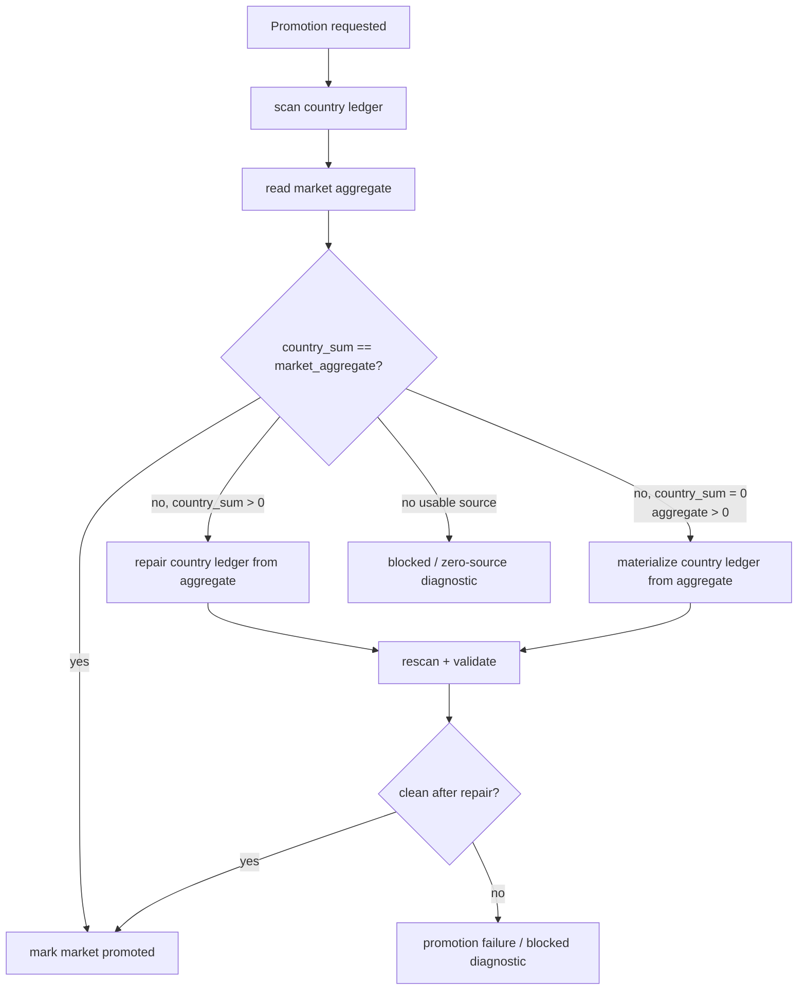

# Q5 — Q8 global logical flow

## Purpose

Q8 refactoring must preserve the post-PR126 business order while reducing duplicated work. This document is the Q8-owned flow standard.

The inherited PR126 Q5 and Q5.1 documents remain source context. They must not be rewritten by Q8 implementation PRs. Q8 owns this document for flow changes made by the optimisation/refactoring stack.

## Current Q8.7 live flow

Q8.7 moves the live market-local owner from the market-center workaround to a once-per-month global market pass.

```txt
monthly_country_pulse
  -> modeu5_run_monthly_stock_cycle_q8_7_owner_switch
     -> readiness / runtime-mode gates
     -> performance and relevance preparation
     -> current-country capacity refresh
     -> monthly seen-market registry
     -> human-relevant full-ledger preparation
     -> Q8.7 global market-local cycle, once per month
          -> every_market_in_world
          -> market runtime accounting mode
          -> detailed markets:
               -> market country cache
               -> country-market capacity refresh
               -> US-00 active-good dispatch
               -> US-10 pending-request dispatch
          -> fallback / blocked markets:
               -> diagnostics only, no ModeU5 stock mutation
     -> country trade-owner cycle
     -> optional audit reconciliation
```

The old market-center owner remains available as a fallback only:

```txt
modeu5_q8_7_live_global_market_owner_disabled
```

When this variable is present, the wrapper falls back to:

```txt
modeu5_run_monthly_promoted_market_local_cycle
  -> every_market_center_in_country
```

## Q8 ordering invariants

```txt
1. Capacity must be prepared before stock admission.
2. US-00 admission facts must be frozen before US-10 consumes same-market stock.
3. US-10 same-market consumption remains non-trade local work.
4. Inter-market vanilla trade remains country-owned and owner-gated.
5. Validation/reconciliation must not compensate for duplicated orchestration.
6. Probes/verifiers must not mutate stock.
7. Q8.7 global market-local ownership may replace the market-center workaround only with a once-per-month guard.
8. Performance Mode relevance is market-level; it must not exclude AI countries that are present inside a human-relevant market.
```

## Flow ownership table

| Phase | Owner | Current surface | Q8 rule |
|---|---|---|---|
| Runtime readiness | country pulse | `modeu5_run_monthly_stock_cycle_q8_7_owner_switch` / `modeu5_run_monthly_stock_cycle` | fail closed when runtime not ready. |
| Country prep | country | capacity/relevance/monthly registries | may prepare caches, not repeat market-local mutation for each country. |
| Runtime mode / accounting gate | central configuration surface | `modeu5_prepare_market_runtime_accounting_mode`, `modeu5_promote_market_to_detailed_accounting` | centralise Normal/Performance/Deactivated policy and promotion readiness. |
| Promoted-market local | Q8.7 global market owner | `modeu5_run_monthly_q8_7_global_market_local_cycle_once` -> `every_market_in_world` | process each market-local mutation surface once per month. |
| Fallback local owner | market-center country | `modeu5_run_monthly_promoted_market_local_cycle` -> `every_market_center_in_country` | rollback/comparison only; same business branch internals. |
| US-00 | present country inside detailed market | PR7.1 active-good dispatch | run before US-10 for all present-country admission facts. |
| US-10 local | present country inside detailed market | PR7.1 pending-request dispatch | same-market consumption only; keep after US-00. Q8.2 sparse pending index remains deferred. |
| Q8.6 verifier | debug/audit verifier surface | `modeu5_run_market_sliced_verifier_candidates` | bounded candidate-market verification only; no stock mutation or repair. |
| Trade | country | country-owned trade pass | inter-market only; owner-gated; no direct stock writes. |
| Validation | audit/debug/reconciliation surface | optional monthly/audit helpers | bounded, diagnostic, or repair after divergence. |

## Mermaid flow — current Q8.7 owner

```mermaid
flowchart TB
    %% Q8-owned Q5 flow after the live Q8.7 owner switch.
    %% Loop nesting is semantic: it defines who owns mutation.
    %% The detailed market-local branch is inside the every_market_in_world loop body.

    subgraph COUNTRY["Loop: monthly_country_pulse / current country"]
        direction TB
        A["monthly_country_pulse"] --> B["modeu5_run_monthly_stock_cycle_q8_7_owner_switch"]
        B --> READY{"modeu5_stock_runtime_ready_trigger?"}
        READY -->|no| CLOSED["runtime not ready<br/>fail closed / diagnostics only"]
        READY -->|yes| P0["modeu5_prepare_performance_mode_human_relevant_markets"]
        P0 --> P1["modeu5_run_monthly_capacity_refresh_for_current_country"]

        subgraph COUNTRY_PREP["Country-owned preparation before market-local owner"]
            direction TB
            P1 --> CP0["every_market_present_in_country"]
            CP0 --> CP1["modeu5_recalculate_country_market_capacity_from_prepared_pool_shared"]
            CP1 --> CP2["store country-market capacity/cache records"]
        end

        CP2 --> P2["modeu5_prepare_monthly_market_seen_registry"]
        P2 --> P3["modeu5_prepare_human_relevant_full_ledger_markets"]
        P3 --> SW{"modeu5_q8_7_live_global_market_owner_enabled_trigger?"}
        SW -->|no<br/>modeu5_q8_7_live_global_market_owner_disabled| OLD["fallback owner:<br/>modeu5_run_monthly_promoted_market_local_cycle"]
        SW -->|yes| G0["modeu5_run_monthly_q8_7_global_market_local_cycle_once(country)"]

        OLD --> OLD_LOOP["every_market_center_in_country<br/>rollback/comparison only"]

        subgraph GLOBAL_CYCLE["Q8.7 global market-local owner"]
            direction TB
            G0 --> STAMP{"month stamp already processed?<br/>modeu5_q8_7_live_global_owner_month_stamp"}
            STAMP -->|yes| SKIP["modeu5_note_q8_7_live_global_owner_skip_run"]
            STAMP -->|no| GM0["modeu5_reset_q8_7_live_global_owner_metrics"]
            GM0 --> GM1["modeu5_prepare_monthly_promoted_market_live_dispatcher_metrics"]
            GM1 --> GM2["modeu5_note_q8_7_live_global_owner_run"]
            GM2 --> WORLD_ENTRY["every_market_in_world"]

            subgraph WORLD_LOOP["Loop body: every_market_in_world"]
                direction TB
                WORLD_ENTRY --> W0["save_temporary_scope_as:<br/>modeu5_market + modeu5_market_country_cache_market"]
                W0 --> W1["modeu5_q8_7_run_global_market_local_owner_market(country, market)"]
                W1 --> W2["modeu5_mark_monthly_market_seen"]
                W2 --> W3["modeu5_prepare_market_runtime_accounting_mode(market)"]
                W3 --> W4{"market runtime trigger"}
                W4 -->|modeu5_market_runtime_use_detailed_accounting_trigger| LOCAL["modeu5_run_promoted_market_live_local_branch_market_all_goods(country, market)"]
                W4 -->|modeu5_market_runtime_use_vanilla_fallback_trigger| MF["modeu5_note_us00/us10_vanilla_fallback_market<br/>no ModeU5 stock mutation"]
                W4 -->|modeu5_market_runtime_blocked_trigger| MB["modeu5_note_runtime_blocked_market"]

                subgraph LOCAL_DETAIL["Detailed market-local branch — still inside this market iteration"]
                    direction TB
                    LOCAL --> L0["modeu5_pr71_prepare_active_good_metrics"]
                    L0 --> L1["modeu5_prepare_promoted_market_country_cache(market)"]
                    L1 --> L2["modeu5_rebuild_countries_present_in_market"]
                    L2 --> L3["every_in_global_list(modeu5_countries_present_in_market)<br/>capacity + US-00 pass"]
                    L3 --> L4["modeu5_prepare_promoted_country_market_capacity"]
                    L4 --> L5["modeu5_pr71_process_us00_monthly_market_active_goods"]
                    L5 --> L6["US-00 facts frozen for all present countries"]
                    L6 --> L7["every_in_global_list(modeu5_countries_present_in_market)<br/>US-10 pass"]
                    L7 --> L8["modeu5_pr71_process_us10_monthly_market_pending_goods"]
                    L8 --> L9["modeu5_note_promoted_market_live_local_market_processed"]
                end

                L9 --> WORLD_DONE["finish current market iteration"]
                MF --> WORLD_DONE
                MB --> WORLD_DONE
            end

            WORLD_DONE --> GM_DONE["every_market_in_world exhausted"]
        end

        OLD_LOOP --> TRADE0["modeu5_run_monthly_country_trade_owner_cycle"]
        SKIP --> TRADE0
        GM_DONE --> TRADE0

        subgraph TRADE["Country-owned trade branch"]
            direction TB
            TRADE0 --> T1["every_trade from country scope"]
            T1 --> T2["inter-market trade only<br/>from_market != to_market"]
            T2 --> T3["delegate effects to stock handlers"]
        end

        T3 --> AUDIT{"modeu5_audit_enabled_trigger?"}
        AUDIT -->|yes| R1["modeu5_run_monthly_stock_reconciliation_once"]
        AUDIT -->|no| END["end country monthly cycle"]
        R1 --> END
    end
```



## Promotion / migration repair boundary

Promotion happens inside the market runtime accounting mode. Promotion is allowed only if the detailed country ledger can be made consistent with the market aggregate.

The current exception rule is expressed as **different**, not only as `country_sum > market_aggregate`:

```txt
if country_sum == market_aggregate:
  promote normally

if country_sum > 0 and country_sum != market_aggregate:
  market aggregate is source/cap
  rebuild country stocks from the aggregate
  validate
  promote only if repaired country_sum == market_aggregate

if country_sum == 0 and market_aggregate > 0:
  materialize country stocks from the aggregate
  validate
  promote only if materialized country_sum == market_aggregate
```



The aggregate is the cap/source for this promotion exception. The repair path must not inflate the aggregate from stale country stocks.

## Q8.0 baseline decision

Q8.0 adds no runtime flow change. It creates this Q8-owned flow contract for future stacked PRs.

## Q8.1 update — no flow-order change

Q8.1 gates PR7.1 metrics only.

```txt
US-00 active-good guard still runs.
US-10 pending-request guard still runs.
Heavy helper calls remain controlled by the existing business gates.
Only the temporary PR7.1 metric writes are gated.
```

Therefore Q8.1 does not change the Q5 phase order.

## Q8.3 update — refined capacity preparation internals

Q8.3 preserves the Q5 ordering:

```txt
country capacity preparation / promoted-market country-market capacity refresh
before
US-00 admission
before
US-10 same-market consumption
before
country-owned trade / validation / reconciliation
```

The refined capacity step is:

```txt
modeu5_calculate_country_storage_capacity_pool
  -> if country/month stamp missing or stale:
       modeu5_calculate_country_storage_capacity_pool_raw
       modeu5_store_country_storage_capacity_pool_cache
  -> else:
       modeu5_load_country_storage_capacity_pool_cache

modeu5_apply_country_storage_capacity_pool_to_current_market
  -> still reads current market merchant capacity
  -> still writes country-market capacity maps
```

The promoted-market dispatcher semantics are unchanged: it still gets a refreshed country-market capacity record before US-00, but the country-wide pool facts may be reused for that country during the same month.

## Q8.2 / Q8.5 implementation update

Q8.2 is deferred.

Rejected live flow shape:

```txt
promoted-market local cycle
  -> market country cache
  -> country-market capacity refresh
  -> US-00 active-good dispatch for all present countries
  -> US-10 pending-request dispatch
       -> aggregate all-goods country-market pending pre-scan
       -> if pending exists: existing per-good US-10 pending dispatcher
       -> if no pending exists: skip generated per-good US-10 dispatcher
```

Reason:

```txt
If most country-market pairs have at least one pending request, the aggregate pre-scan adds work before the existing per-good dispatcher.
Q8.2 should instead become a later sparse pending-index design written when requests are created.
```

Q8.5 preserves the same flow position for market-country work-cache rebuilds:

```txt
confirmed topology/lifecycle producer
  -> modeu5_mark_market_country_cache_dirty
  -> modeu5_market_country_cache_dirty_markets scheduling list
  -> modeu5_repair_dirty_market_country_caches_if_needed
  -> modeu5_rebuild_countries_present_in_market for dirty markets only
```

The dirty repair path is scheduling/repair flow only. It does not authorize a durable `market -> countries_present_in_market` cache and does not change stock mutation order.

## Q8.6 implementation update

Q8.6 adds a debug/audit-only verifier flow:

```txt
modeu5_run_market_sliced_verifier_candidates
  -> modeu5_prepare_market_sliced_verifier_candidates
     -> copy dirty markets from modeu5_market_country_cache_dirty_markets
     -> copy promoted markets from modeu5_promoted_markets_this_cycle
  -> for each candidate market only:
       modeu5_rebuild_countries_present_in_market
       record pass/fail counters
```

Boundary:

```txt
- no stock mutation;
- no stock repair;
- dirty market scheduling list is not cleared;
- no live dispatcher is replaced.
```

## Q8.7 live implementation update

Q8.7 is no longer proof-only in this PR. The live market-local owner is now:

```txt
modeu5_run_monthly_q8_7_global_market_local_cycle_once
  -> monthly stamp guard
  -> every_market_in_world
  -> modeu5_prepare_market_runtime_accounting_mode
  -> detailed markets run the existing market-local branch
  -> fallback/blocked markets record diagnostics only
```

The old market-center owner remains available only via the fallback variable. This is a rollback/comparison surface, not the default Q8 flow.

#160's Performance Mode boundary still applies:

```txt
human-relevant market
not human-country-only
```

Consequence for Q5:

```txt
Live market-local ownership has changed.
Trade position is unchanged.
US-00 before US-10 ordering is unchanged.
Validation/reconciliation position is unchanged.
Performance Mode detailed processing is market-level once the market is relevant.
AI countries inside a human-relevant market remain part of the market-local surface.
```

## Delta summary

| Area | Before Q8.7 live switch | HEAD after Q8.7 |
|---|---|---|
| Market-local owner | `every_market_center_in_country` workaround. | `every_market_in_world` once per month behind `modeu5_run_monthly_q8_7_global_market_local_cycle_once`. |
| Fallback owner | N/A for Q8.7. | Old market-center owner retained behind `modeu5_q8_7_live_global_market_owner_disabled`. |
| US-10 no-request country-market | Enters generated per-good US-10 wrapper surface; Q8.2 aggregate pre-gate deferred. | Unchanged. |
| US-10 positive request country-market | Per-good wrappers check pending maps and call heavy helper only for requested goods. | Unchanged. |
| US-00 ordering | Runs before any US-10 pass. | Unchanged. |
| Dirty market-country cache | Guarded `modeu5_repair_dirty_market_country_caches_if_needed` exists. | Unchanged; Q8.6 copies dirty candidates but does not clear the dirty list. |
| Market-sliced verifier | Debug/audit runtime verifier slice exists, bounded to dirty/promoted candidate markets. | Unchanged. |
| Performance Mode relevant-market boundary | Human-relevant market is the boundary; AI-controlled countries inside such markets remain in market-local scope. | Unchanged and now consumed by the live global market-local owner. |
| Promotion mismatch repair | Conservative promotion failure when country sum exceeds market aggregate. | Market aggregate is source/cap; non-zero differing country ledger is rebuilt to the aggregate, logged as blocked/migration repair, then promotion proceeds only after validation. |
| Durable per-market country-list cache | Not confirmed. | Still not confirmed; no durable `market -> countries_present_in_market` cache is introduced. |
