# Q5 — Q8 global logical flow

## Purpose

Q8 refactoring must preserve the post-PR126 business order while reducing duplicated work. This document is the Q8-owned flow standard.

The inherited PR126 Q5 and Q5.1 documents remain source context, especially for the current guarded-dispatch diagram. Q8 owns this document for changes made by the new optimisation/refactoring stack.

## Current post-PR126 flow baseline

```txt
monthly_country_pulse
  -> modeu5_run_monthly_stock_cycle
     -> readiness / runtime-mode gates
     -> performance and relevance preparation
     -> current-country capacity refresh
     -> monthly seen-market registry
     -> human-relevant full-ledger preparation
     -> promoted-market local cycle
          -> market country cache
          -> country-market capacity refresh
          -> US-00 active-good dispatch
          -> US-10 pending-request dispatch
     -> country trade-owner cycle
     -> optional audit reconciliation
```

## Q8 ordering invariants

```txt
1. Capacity must be prepared before stock admission.
2. US-00 admission facts must be frozen before US-10 consumes same-market stock.
3. US-10 same-market consumption remains non-trade local work.
4. Inter-market vanilla trade remains country-owned and owner-gated.
5. Validation/reconciliation must not compensate for duplicated orchestration.
6. Probes/verifiers must not mutate stock.
7. A future global market-local pass must prove equivalence before replacing the market-center owner workaround.
```

## Q5.1 / future Q5.2 placement

Q5.1 is a flow checkpoint and belongs with Q5 context, not inside Q8 future-optimisation findings.

If Q5.2 is added later, it should be a Q5 flow checkpoint or subsection before Q8 implementation notes. It should clarify current flow, not become a separate optimisation track.

## Flow ownership table

| Phase | Owner | Current surface | Q8 rule |
|---|---|---|---|
| Runtime readiness | country pulse | `modeu5_run_monthly_stock_cycle` | fail closed when runtime not ready. |
| Country prep | country | capacity/relevance/monthly registries | may prepare caches, not repeat market-local mutation for each country. |
| Promoted-market local | market-local logical owner, market-center workaround in current implementation | `modeu5_run_monthly_promoted_market_local_cycle` | process each promoted market once according to the chosen owner rule. |
| US-00 | present country inside promoted market | PR7.1 active-good dispatch | run before US-10 for all present-country admission facts. |
| US-10 local | present country inside promoted market | PR7.1 pending-request dispatch with Q8.2 aggregate gate | same-market consumption only; skip per-good dispatch when no country-market request exists. |
| Trade | country | country-owned trade pass | inter-market only; owner-gated; no direct stock writes. |
| Validation | audit/debug/reconciliation surface | optional monthly/audit helpers | bounded, diagnostic, or repair after divergence. |

## Q8.0 baseline decision

Q8.0 adds no runtime flow change. It creates this Q8-owned flow contract for future stacked PRs.

## Q8.1 update — no flow-order change

Q8.1 gates PR7.1 metrics only.

```txt
US-00 active-good guard still runs.
US-10 pending-request guard still runs.
Heavy helper calls remain controlled by the existing business gates.
Only the temporary PR7.1 metric writes are gated.
```

Therefore Q8.1 does not change the Q5 phase order.

## Q8.3 update — refined capacity preparation internals

Q8.3 preserves the Q5 ordering:

```txt
country capacity preparation / promoted-market country-market capacity refresh
before
US-00 admission
before
US-10 same-market consumption
before
country-owned trade / validation / reconciliation
```

The refined capacity step is:

```txt
modeu5_calculate_country_storage_capacity_pool
  -> if country/month stamp missing or stale:
       modeu5_calculate_country_storage_capacity_pool_raw
       modeu5_store_country_storage_capacity_pool_cache
  -> else:
       modeu5_load_country_storage_capacity_pool_cache

modeu5_apply_country_storage_capacity_pool_to_current_market
  -> still reads current market merchant capacity
  -> still writes country-market capacity maps
```

The promoted-market dispatcher semantics are unchanged: it still gets a refreshed country-market capacity record before US-00, but the country-wide pool facts may be reused for that country during the same month.

## Q8.2 / Q8.4 / Q8.5 / Q8.6 / Q8.7 probe update

PR #150 contains all five remaining probes in one test-package PR and does not change the Q5 flow.

```txt
modeu5_q8_probe_us10_pending_gate
modeu5_q8_probe_helper_inventory
modeu5_q8_probe_dirty_cache_lifecycle
modeu5_q8_probe_market_sliced_verifier_candidate
modeu5_q8_probe_global_market_iterator_exposure
```

The aggregate event entry point is:

```txt
event modeu5_q8_probe_debug.1
```

Runtime validation attached on 2026-07-06 confirms the probe layer passed through this Q8-specific event.

The full revalidation event is not required for this Q8 probe PR:

```txt
event modeu5_revalidate_debug.1   # not required for #150
```

Q5 phase order remains unchanged. No gameplay flow change is authorised by #150 until a later implementation PR proves equivalence and updates this document again.

## Q8.2 / Q8.5 implementation update

Q8.2 preserves the phase order and changes only the internal US-10 local dispatch gate:

```txt
promoted-market local cycle
  -> market country cache
  -> country-market capacity refresh
  -> US-00 active-good dispatch for all present countries
  -> US-10 pending-request dispatch
       -> Q8.2 aggregate country-market pending gate
       -> if pending exists: existing per-good US-10 pending dispatcher
       -> if no pending exists: skip generated per-good US-10 dispatcher
```

The US-00-before-US-10 invariant is unchanged. Q8.2 does not move consumption earlier and does not alter the stock resolver.

Q8.5 preserves the same flow position for market-country work-cache rebuilds:

```txt
confirmed topology/lifecycle producer
  -> modeu5_mark_market_country_cache_dirty
  -> modeu5_market_country_cache_dirty_markets scheduling list
  -> modeu5_repair_dirty_market_country_caches_if_needed
  -> modeu5_rebuild_countries_present_in_market for dirty markets only
```

The dirty repair path is scheduling/repair flow only. It does not authorize a durable `market -> countries_present_in_market` cache and does not change stock mutation order.

## Mermaid flow delta — before this PR vs HEAD

Source for the before-state is `docs/audits/pr126/Q5.1_current_global_flow.md`. That document records the PR144 + Q4.1/PR7.1 global flow before the Q8.2/Q8.5 implementation.

### Before this PR — Q5.1 / PR144 + Q4.1 / PR7.1

```mermaid
flowchart TB
    subgraph LOOP_COUNTRY["Loop: monthly_country_pulse / current country"]
        A["monthly_country_pulse"] --> B["modeu5_run_monthly_stock_cycle"]
        B --> P0["performance / relevance preparation"]
        P0 --> P1["current-country capacity refresh"]
        P1 --> P2["monthly market seen registry"]
        P2 --> L0["modeu5_run_monthly_promoted_market_local_cycle"]

        subgraph LOOP_MARKET_CENTER["Loop: every_market_center_in_country"]
            L0 --> L1["prepare market runtime accounting mode"]
            L1 --> L2{"market runtime mode"}
            L2 -->|detailed| L3["modeu5_run_promoted_market_live_local_branch_market_all_goods"]

            subgraph LOOP_MARKET_LOC["Loop: every_location_in_market"]
                L3 --> M0["rebuild countries_present_in_market"]
            end

            subgraph LOOP_COUNTRIES_CAP_US00["Loop: countries_present_in_market / fused capacity + US-00"]
                M0 --> D1["refresh country-market capacity"]
                D1 --> U1["modeu5_pr71_process_us00_monthly_market_active_goods"]
                U1 --> U2["generated per-good US-00 active-good guard"]
                U2 --> U3{"produced or previous US-00 state?"}
                U3 -->|yes| U4["heavy US-00 helper"]
                U3 -. no .-> U5["skip heavy US-00 helper"]
            end

            subgraph LOOP_COUNTRIES_US10["Loop: countries_present_in_market / US-10 pass"]
                U4 --> S0["modeu5_pr71_process_us10_monthly_market_pending_goods"]
                U5 --> S0
                S0 --> S1["generated per-good US-10 pending wrapper"]
                S1 --> S2{"pending same-market request?"}
                S2 -->|yes| S3["heavy US-10 helper"]
                S2 -. no .-> S4["skip heavy US-10 helper"]
            end

            S3 --> LEND["record local market processed"]
            S4 --> LEND
            L2 -->|vanilla fallback| F1["record fallback / no ModeU5 mutation"]
            L2 -->|blocked| F2["record blocked"]
        end

        LEND --> T0["modeu5_run_monthly_country_trade_owner_cycle"]
        F1 --> T0
        F2 --> T0
        T0 --> T1["country-scope every_trade / inter-market only"]
        T1 --> R0["optional audit reconciliation"]
    end
```



Before-state interpretation:

```txt
US-10 still had a per-good pending guard, but a no-request country-market still entered the generated per-good US-10 wrapper surface.
Dirty market-country repair existed as a probe/consumer surface, but the guarded if-needed runtime consumer was not yet part of the Q8 implementation contract.
```

### HEAD after Q8.2 / Q8.5

```mermaid
flowchart TB
    subgraph LOOP_COUNTRY["Loop: monthly_country_pulse / current country"]
        A["monthly_country_pulse"] --> B["modeu5_run_monthly_stock_cycle"]
        B --> P0["performance / relevance preparation"]
        P0 --> P1["current-country capacity refresh"]
        P1 --> P2["monthly market seen registry"]
        P2 --> L0["modeu5_run_monthly_promoted_market_local_cycle"]

        subgraph LOOP_MARKET_CENTER["Loop: every_market_center_in_country"]
            L0 --> L1["prepare market runtime accounting mode"]
            L1 --> L2{"market runtime mode"}
            L2 -->|detailed| L3["modeu5_run_promoted_market_live_local_branch_market_all_goods"]

            subgraph LOOP_MARKET_LOC["Loop: every_location_in_market"]
                L3 --> M0["rebuild countries_present_in_market"]
            end

            subgraph LOOP_COUNTRIES_CAP_US00["Loop: countries_present_in_market / fused capacity + US-00"]
                M0 --> D1["refresh country-market capacity"]
                D1 --> U1["modeu5_pr71_process_us00_monthly_market_active_goods"]
                U1 --> U2["generated per-good US-00 active-good guard"]
                U2 --> U3{"produced or previous US-00 state?"}
                U3 -->|yes| U4["heavy US-00 helper"]
                U3 -. no .-> U5["skip heavy US-00 helper"]
            end

            subgraph LOOP_COUNTRIES_US10["Loop: countries_present_in_market / US-10 pass"]
                U4 --> S0["modeu5_pr71_process_us10_monthly_market_pending_goods"]
                U5 --> S0
                S0 --> G0["Q8.2: modeu5_pr71_prepare_us10_pending_request_gate"]
                G0 --> G1{"any positive pending request for this country-market?"}
                G1 -->|yes| S1["generated per-good US-10 pending wrapper"]
                G1 -. no .-> S_SKIP["skip generated per-good US-10 dispatch"]
                S1 --> S2{"pending same-market request for this good?"}
                S2 -->|yes| S3["heavy US-10 helper"]
                S2 -. no .-> S4["skip heavy US-10 helper"]
            end

            S3 --> LEND["record local market processed"]
            S4 --> LEND
            S_SKIP --> LEND
            L2 -->|vanilla fallback| F1["record fallback / no ModeU5 mutation"]
            L2 -->|blocked| F2["record blocked"]
        end

        LEND --> T0["modeu5_run_monthly_country_trade_owner_cycle"]
        F1 --> T0
        F2 --> T0
        T0 --> T1["country-scope every_trade / inter-market only"]
        T1 --> R0["optional audit reconciliation"]
    end

    subgraph DIRTY_CACHE["Q8.5 dirty market-country cache scheduling"]
        D0["topology / lifecycle producer"] --> D2["modeu5_mark_market_country_cache_dirty"]
        D2 --> D3["modeu5_market_country_cache_dirty_markets"]
        D3 --> D4["modeu5_repair_dirty_market_country_caches_if_needed"]
        D4 --> D5["modeu5_rebuild_countries_present_in_market for dirty markets"]
    end
```



HEAD interpretation:

```txt
Q8.2 adds a country-market aggregate gate before the generated per-good US-10 wrapper surface.
No-request country-market pairs now skip generated per-good US-10 dispatch entirely.
Positive request country-market pairs still use the existing generated per-good wrappers and heavy helper gates.
Q8.5 adds a guarded dirty repair consumer while keeping modeu5_countries_present_in_market as a rebuilt current-market work cache.
```

## Delta summary

| Area | Before this PR | HEAD after this PR |
|---|---|---|
| US-10 no-request country-market | Enters generated per-good US-10 wrapper surface; each good checks its own pending map. | Runs Q8.2 aggregate gate first; skips generated per-good US-10 dispatch if no positive pending request exists. |
| US-10 positive request country-market | Per-good wrappers check pending maps and call heavy helper only for requested goods. | Same behaviour after the aggregate gate passes. |
| US-00 ordering | Runs before any US-10 pass. | Unchanged. |
| Dirty market-country cache | Dirty writer/consumer existed and was probed. | Guarded `modeu5_repair_dirty_market_country_caches_if_needed` is now part of the runtime contract. |
| Durable per-market country-list cache | Not confirmed. | Still not confirmed; no durable `market -> countries_present_in_market` cache is introduced. |
