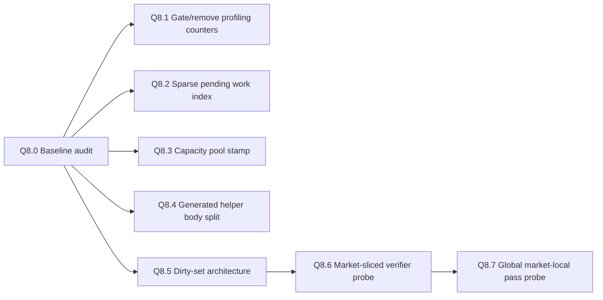

# Q8 — implementation backlog

This backlog translates the PR126 Q8 findings into a stacked implementation track. It deliberately starts with audits and probes. Do not collapse this backlog into one broad runtime PR.

## Stack overview



## Current implementation state

```txt
Q8.0 — MERGED INTO MASTER TRACK: baseline checkpoint.
Q8.1 — IMPLEMENTED: PR7.1 debug/profile metric writes are gated.
Q8.2 — DEFERRED: aggregate all-goods pending pre-gate is not live; future design should be sparse pending index.
Q8.3 — IMPLEMENTED: country capacity-pool stamping.
Q8.4 — PROBED ONLY: helper inventory bridge passed; body-helper split remains blocked.
Q8.5 — IMPLEMENTED IN STACKED PR: guarded dirty market-country cache repair consumer.
Q8.6 — PROBED ONLY: candidate market-slice list passed; no live verifier yet.
Q8.7 — PROBED ONLY: every_market_in_world exposed in test package; no gameplay dispatcher replacement.
```

## Q8.1 / F3 — Gate or remove PR7.1 profiling counters

### Goal

Stable main should not pay unconditional per-good debug/profile counter writes in the monthly hot path.

### Implemented shape

```txt
modeu5_pr71_metrics_enabled_trigger
  -> debug capture or audit runtime only
```

Normal runtime skips temporary PR7.1 metric writes. Business guards still run.

### Guardrails

```txt
- Do not remove counters needed for economic correctness.
- Do not let metrics affect business logic.
- Keep validation events able to prove considered vs processed work when profiling is enabled.
```

### Exit criterion

```txt
Normal mode has no unconditional per-good debug/profile metric writes in the hot path.
Profile/debug mode still emits comparable validation counters.
```

## Q8.2 / F2 — US-10 pending-request scheduling

### Goal

Avoid entering unnecessary generated US-10 work for country-market pairs or goods with no queued same-market consumption request.

### Deferred shape

The aggregate pre-gate is not live:

```txt
modeu5_pr71_process_us10_monthly_market_pending_goods
  -> all-goods aggregate pending pre-scan
  -> if any pending request exists:
       generated per-good US-10 pending wrappers
```

Reason:

```txt
If most country-market pairs have at least one pending request, the aggregate pre-scan duplicates work before the existing per-good dispatcher.
```

### Preferred next implementation shape

```txt
At request-write time:
  add country-market or country-market-good to a sparse pending work list

At monthly US-10 time:
  iterate only pending work items
  process requests
  clear the sparse pending list
```

### Guardrails

```txt
- Preserve US-00 before US-10 ordering.
- Sparse supplier lists remain candidate narrowing after a good/request is selected.
- Do not change stock resolver semantics.
- Do not remove per-good literal pending maps.
- Do not add all-goods pre-scans to default runtime without profiling proof.
```

### Exit criterion

```txt
A future implementation avoids no-request work without adding an all-goods pre-scan to most country-market pairs.
```

## Q8.3 / F1 — Capacity pool stamping

### Goal

Avoid recalculating a country-wide capacity pool once per country per promoted market.

### Implemented shape

```txt
modeu5_calculate_country_storage_capacity_pool
  -> monthly country-scope stamp
  -> raw pool calculation only when missing/stale
```

Market-specific trade-capacity contribution is still refreshed per country-market.

### Guardrails

```txt
- Do not reuse a pool across countries.
- Do not skip market-specific trade-capacity contribution.
- Keep country-market capacity refresh before US-00.
- Persist or classify every new stamp/cache in PERSISTENT_STATE_AUDIT.
```

### Exit criterion

```txt
Validation proves the same country-wide pool is calculated at most once per country per month while country-market capacity records remain correct.
```

## Q8.4 / F4 — Split guarded helpers from body helpers

### Goal

Avoid paying duplicate guard layers after PR7.1 generated dispatch has already proven an active-good or pending-request gate.

### Current status

```txt
Probe passed.
Implementation remains blocked until caller inventory is complete.
```

### Guardrails

```txt
- Do not remove public guarded helpers until all callers are proven safe.
- Do not call a body helper without the required wrapper guard.
- Use the canonical goods registry; no private goods list.
```

### Exit criterion

```txt
Runtime validation shows equivalent economic results with fewer repeated guard checks on processed goods.
```

## Q8.5 / F5 + F9a — Dirty-set architecture for derived caches

### Goal

Move from broad speculative rebuilds to explicit dirty-country / dirty-market / dirty-country-market rebuild consumers where the underlying cache model supports it.

### Implemented shape

```txt
modeu5_mark_market_country_cache_dirty
  -> modeu5_market_country_cache_dirty_markets
  -> modeu5_repair_dirty_market_country_caches_if_needed
  -> modeu5_repair_dirty_market_country_caches
```

Boundary:

```txt
modeu5_countries_present_in_market remains a rebuilt current-market work cache.
modeu5_market_country_cache_dirty_markets remains scheduling state only.
No durable per-market country-list cache is introduced.
```

### Guardrails

```txt
- `countries_present_in_market` remains a work cache, never source of truth.
- Dirty sets are scheduling state only.
- Do not introduce nested maps or runtime-built names.
- Do not depend on market-scope variables.
```

### Exit criterion

```txt
A dirty producer/consumer path exists for confirmed topology hooks, without claiming durable per-market country-list storage.
```

## Q8.6 / F9c — Market-sliced verifier probe

### Goal

Prove a market-first verifier can check relevant/promoted/candidate markets without blind world-location scanning.

### Current status

```txt
Probe passed.
No live verifier is implemented yet.
```

### Guardrails

```txt
- No live gameplay dependency.
- No stock mutation.
- Prefer candidate-list slicing in Performance Mode.
- Do not assume stable market ordering until proven after save/reload and monthly tick.
```

### Exit criterion

```txt
The probe proves deterministic coverage and market-level dirty skip before any verifier becomes live.
```

## Q8.7 / F7 — Native global market-local pass

### Goal

Replace the market-center ownership workaround with a structural market-owned pass if the engine supports safe once-per-month global/none scope execution.

### Current status

```txt
Probe passed in the test package with count=129.
No gameplay dispatcher replacement is implemented.
```

### Guardrails

```txt
- Preserve ordering: country prep -> market-local -> country trade -> validation.
- Do not call `every_trade` from market scope.
- Do not process market-local mutation once per country present.
- If no safe global monthly entry point exists, keep the market-center workaround.
```

### Exit criterion

```txt
A future PR can switch live market-local work only after equivalent economic results and reduced work-shape counters are proven.
```

## Rejected or postponed ideas

```txt
- Rich per-location persistent records.
- Nested variable maps.
- Runtime-generated map names.
- Broad monthly every_location_in_the_world rebuilds as a normal runtime solution.
- Fusing US-10 into the US-00 pass if it breaks all-countries US-00 before any US-10 consumption.
- Q8.2 all-goods aggregate pre-scan as default runtime optimisation.
```
