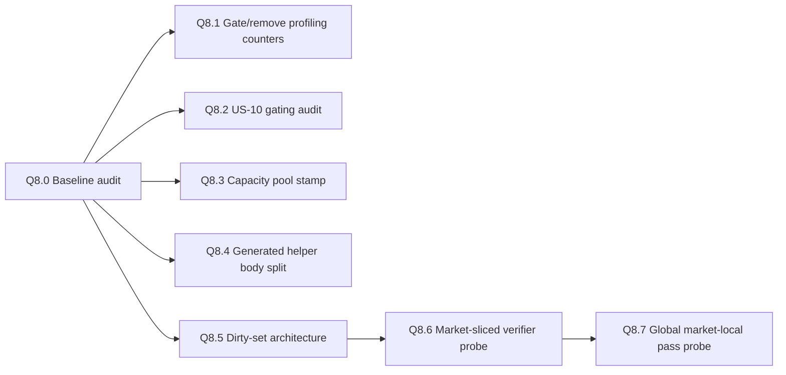

# Q8 — implementation backlog

This backlog translates the PR126 Q8 findings into a stacked implementation track. It deliberately starts with audits and probes. Do not collapse this backlog into one broad runtime PR.

## Stack overview



## Q8.1 / F3 — Gate or remove PR7.1 profiling counters

### Goal

Stable main should not pay unconditional per-good debug/profile counter writes in the monthly hot path.

### First PR shape

```txt
Audit unconditional PR7.1 counters.
Classify each as business, validation, or debug/profile.
Gate debug/profile counters behind an existing or new profiling trigger.
```

### Guardrails

```txt
- Do not remove counters needed for economic correctness.
- Do not let metrics affect business logic.
- Keep validation events able to prove considered vs processed work when profiling is enabled.
```

### Exit criterion

```txt
Normal mode has no unconditional per-good debug/profile metric writes in the hot path.
Profile/debug mode still emits comparable validation counters.
```

## Q8.2 / F2 — Verify US-10 aggregate pending-request gating

### Goal

Do not add another US-10 scheduler unless the audit proves no-request country-market pairs still enter generated dispatch.

### First PR shape

```txt
Trace same-market request creation -> pending map write -> generated per-good guard.
Add debug-only counters if needed.
Classify state as Already implemented / Partially implemented / Not implemented.
```

### Guardrails

```txt
- Preserve US-00 before US-10 ordering.
- Sparse supplier lists remain candidate narrowing after a good/request is selected.
- No stock mutation in the probe.
```

### Exit criterion

```txt
The PR proves whether an aggregate has-any-pending-request gate is needed before generated US-10 dispatch.
```

## Q8.3 / F1 — Capacity pool stamping

### Goal

Avoid recalculating a country-wide capacity pool once per country per promoted market.

### First PR shape

```txt
Add a monthly country capacity-pool stamp.
Refresh country-wide pool once per country per monthly cycle or dirty lifecycle event.
Refresh market-specific contribution per country-market as before.
```

### Guardrails

```txt
- Do not reuse a pool across countries.
- Do not skip market-specific trade-capacity contribution.
- Keep country-market capacity refresh before US-00.
- Persist or classify every new stamp/cache in PERSISTENT_STATE_AUDIT.
```

### Exit criterion

```txt
Validation proves the same country-wide pool is calculated at most once per country per month while country-market capacity records remain correct.
```

## Q8.4 / F4 — Split guarded helpers from body helpers

### Goal

Avoid paying duplicate guard layers after PR7.1 generated dispatch has already proven an active-good or pending-request gate.

### First PR shape

```txt
Inventory generated helper callers.
Keep legacy public helpers guarded.
Generate internal body helpers only for call surfaces that already passed the guard.
```

### Guardrails

```txt
- Do not remove public guarded helpers until all callers are proven safe.
- Do not call a body helper without the required wrapper guard.
- Use the canonical goods registry; no private goods list.
```

### Exit criterion

```txt
Runtime validation shows equivalent economic results with fewer repeated guard checks on processed goods.
```

## Q8.5 / F5 + F9a — Dirty-set architecture for derived caches

### Goal

Move from broad speculative rebuilds to explicit dirty-country / dirty-market / dirty-country-market rebuild consumers.

### First PR shape

```txt
Add debug/probe dirty-set writers for confirmed lifecycle hooks.
Start with location-owner changes where hook exposure is known.
Do not require per-location persistent owner/market maps.
```

### Guardrails

```txt
- `countries_present_in_market` remains a work cache, never source of truth.
- Dirty sets are scheduling state only.
- Do not introduce nested maps or runtime-built names.
- Do not depend on market-scope variables.
```

### Exit criterion

```txt
A probe shows changed ownership/topology marks affected countries/markets/pairs and dirty consumers rebuild only affected derived caches.
```

## Q8.6 / F9c — Market-sliced verifier probe

### Goal

Prove a market-first verifier can check relevant/promoted/candidate markets without blind world-location scanning.

### First PR shape

```txt
Debug-only probe.
Count world markets and candidate markets.
Generate fixed market/candidate slice helpers.
Prove no duplicates / no missing target markets / dirty markets skip location scans.
```

### Guardrails

```txt
- No live gameplay dependency.
- No stock mutation.
- Prefer candidate-list slicing in Performance Mode.
- Do not assume stable market ordering until proven after save/reload and monthly tick.
```

### Exit criterion

```txt
The probe proves deterministic coverage and market-level dirty skip before any verifier becomes live.
```

## Q8.7 / F7 — Native global market-local pass

### Goal

Replace the market-center ownership workaround with a structural market-owned pass if the engine supports safe once-per-month global/none scope execution.

### First PR shape

```txt
Probe-only: confirm `every_market_in_world` from a true global/none monthly surface.
Compare current market-center path vs global market pass counters.
Do not switch live runtime until equivalence is proven.
```

### Guardrails

```txt
- Preserve ordering: country prep -> market-local -> country trade -> validation.
- Do not call `every_trade` from market scope.
- Do not process market-local mutation once per country present.
- If no safe global monthly entry point exists, keep the market-center workaround.
```

### Exit criterion

```txt
A future PR can switch live market-local work only after equivalent economic results and reduced work-shape counters are proven.
```

## Rejected or postponed ideas

```txt
- Rich per-location persistent records.
- Nested variable maps.
- Runtime-generated map names.
- Broad monthly every_location_in_the_world rebuilds as a normal runtime solution.
- Fusing US-10 into the US-00 pass if it breaks all-countries US-00 before any US-10 consumption.
```
