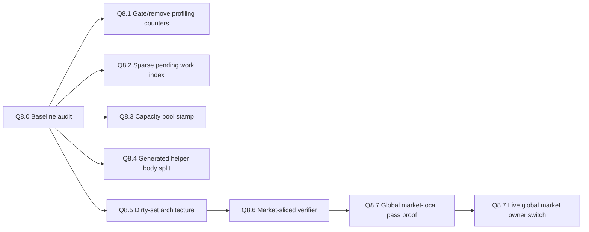

# Q8 — implementation backlog

This backlog translates the PR126 Q8 findings into a stacked implementation track. It deliberately starts with audits and probes. Do not collapse unrelated runtime work into one broad PR.

## Stack overview



## Current implementation state

```txt
Q8.0 — MERGED INTO MASTER TRACK: baseline checkpoint.
Q8.1 — IMPLEMENTED: PR7.1 debug/profile metric writes are gated.
Q8.2 — DEFERRED: aggregate all-goods pending pre-gate is not live; future design should be sparse pending index.
Q8.3 — IMPLEMENTED: country capacity-pool stamping.
Q8.4 — PROBED ONLY: helper inventory bridge passed; body-helper split remains blocked.
Q8.5 — IMPLEMENTED IN STACKED PR: guarded dirty market-country cache repair consumer.
Q8.6 — IMPLEMENTED IN STACKED PR: debug/audit market-sliced verifier over dirty/promoted candidate markets.
Q8.7 — LIVE SWITCH IN THIS STACKED PR: market-local owner moves from market-center workaround to a once-per-month global market pass, with fallback retained.
```

## Q8.1 / F3 — Gate or remove PR7.1 profiling counters

Implemented. Normal runtime skips temporary PR7.1 metric writes. Profile/debug mode still emits comparable validation counters.

Guardrails:

```txt
- Do not remove counters needed for economic correctness.
- Do not let metrics affect business logic.
- Keep validation events able to prove considered vs processed work when profiling is enabled.
```

## Q8.2 / F2 — US-10 pending-request scheduling

Deferred.

The aggregate all-goods pre-gate is not live because it can duplicate work before the existing per-good dispatcher. Preferred future shape remains a sparse pending work list written at request-write time and consumed by monthly US-10.

Guardrails:

```txt
- Preserve US-00 before US-10 ordering.
- Sparse supplier lists remain candidate narrowing after a good/request is selected.
- Do not change stock resolver semantics.
- Do not remove per-good literal pending maps.
- Do not add all-goods pre-scans to default runtime without profiling proof.
```

## Q8.3 / F1 — Capacity pool stamping

Implemented.

Country-wide capacity-pool calculation is stamped once per country/month while market-specific trade-capacity contribution is still refreshed per country-market.

Guardrails:

```txt
- Do not reuse a pool across countries.
- Do not skip market-specific trade-capacity contribution.
- Keep country-market capacity refresh before US-00.
- Persist or classify every new stamp/cache in PERSISTENT_STATE_AUDIT.
```

## Q8.4 / F4 — Split guarded helpers from body helpers

Probe passed. Implementation remains blocked until caller inventory is complete.

Guardrails:

```txt
- Do not remove public guarded helpers until all callers are proven safe.
- Do not call a body helper without the required wrapper guard.
- Use the canonical goods registry; no private goods list.
```

## Q8.5 / F5 + F9a — Dirty-set architecture for derived caches

Implemented.

```txt
modeu5_mark_market_country_cache_dirty
  -> modeu5_market_country_cache_dirty_markets
  -> modeu5_repair_dirty_market_country_caches_if_needed
  -> modeu5_repair_dirty_market_country_caches
```

Boundary:

```txt
modeu5_countries_present_in_market remains a rebuilt current-market work cache.
modeu5_market_country_cache_dirty_markets remains scheduling state only.
No durable per-market country-list cache is introduced.
```

## Q8.6 / F9c — Market-sliced verifier

Implemented as debug/audit verifier only.

```txt
modeu5_run_market_sliced_verifier_candidates
  -> build modeu5_market_sliced_verifier_candidate_markets from dirty/promoted inputs
  -> for each candidate market:
       modeu5_rebuild_countries_present_in_market
       record pass/fail counters
```

Guardrails:

```txt
- Debug/audit gate only.
- No live gameplay dependency.
- No stock mutation.
- No stock repair.
- Dirty list is copied as input, not consumed.
- Do not assume durable per-market country-list storage.
```

## Q8.7 / F7 — Native global market-local pass

### Goal

Replace the market-center ownership workaround with a structural market-owned pass while preserving the PR126 monthly ordering and stock mutation contracts.

### Proof stack completed before this PR

```txt
#155 — native every_market_in_world market-local pass proof.
#158 — global market dispatcher shadow probe and PERF-14/revalidate2 cleanup.
#159 — Normal Mode global market pass vs market-center workaround shadow comparison.
#160 — Performance Mode relevant-market shadow, workshape shadow, no-op dispatcher shadow, and human-relevant-market trigger clarification.
```

### Live implementation shape in this PR

```txt
modeu5_run_monthly_stock_cycle_q8_7_owner_switch
  -> country preparation stays under monthly_country_pulse
  -> modeu5_run_monthly_q8_7_global_market_local_cycle_once
       -> every_market_in_world
       -> existing market-local live branch
  -> modeu5_run_monthly_country_trade_owner_cycle
  -> optional audit reconciliation
```

The mutating market-local branch remains:

```txt
modeu5_run_promoted_market_live_local_branch_market_all_goods
```

That helper still performs:

```txt
for each country present in market:
  refresh capacity
  run US-00 active-good dispatcher

then:
  for each country present in market:
    run US-10 pending-good dispatcher
```

### Fallback

The old market-center owner remains available through:

```txt
modeu5_q8_7_live_global_market_owner_disabled
```

When present, the wrapper calls the old:

```txt
modeu5_run_monthly_promoted_market_local_cycle
```

### Guardrails

```txt
- Preserve ordering: country prep -> market-local -> country trade -> validation.
- Do not call every_trade from market scope.
- Do not process market-local mutation once per country present.
- Keep the old market-center owner as a fallback path for validation.
- Keep US-00 for all present countries before any US-10 same-market consumption.
- Keep Performance Mode scoped to human-relevant markets, not human countries only.
```

### Exit criterion

```txt
A runtime validation pass must compare the new global owner and the fallback market-center owner from the same save, then document equivalent economic results and reduced/equivalent work-shape counters.
```

## Rejected or postponed ideas

```txt
- Rich per-location persistent records.
- Nested variable maps.
- Runtime-generated map names.
- Broad monthly every_location_in_the_world rebuilds as a normal runtime solution.
- Fusing US-10 into the US-00 pass if it breaks all-countries US-00 before any US-10 consumption.
- Q8.2 all-goods aggregate pre-scan as default runtime optimisation.
- Moving every_trade into a market-scope Q8.7 pass.
```
